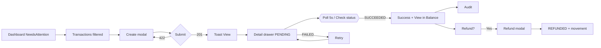
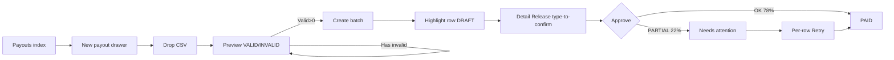
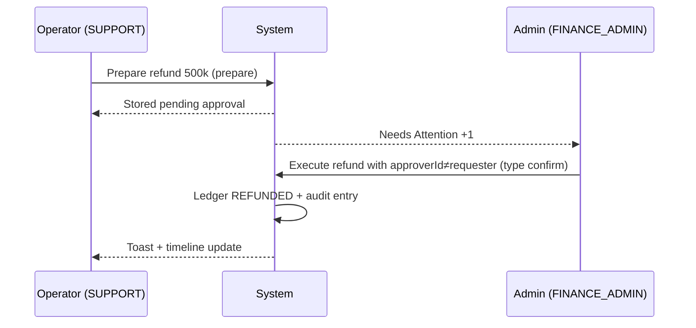

# Professional End-to-End UX/UI System Audit & Redesign Specification — PayDash Kinetic Ledger

> **Base:** `AUDIT_JOURNEY_REPORT.md` v1 (2026-09-12, AS-IS grounded) — 43 routes, Next.js App Router `[locale]`, Better Auth, Prisma + fallback `globalThis` stores, kinetic_ledger tokens.  
> **Role:** Senior Product Designer + UX Researcher + UI Architect + PM + Design System Architect + A11Y + Frontend Arch + Growth + Service Designer + QA/UX Engineer.  
> **Sifat:** Read-only. **AS-IS = source of truth** dari implementasi; **TO-BE = redesign siap implementasi**. Tidak ada perubahan kode pada tahap ini.  
> **Design System:** Kinetic Ledger (`design-system/kinetic_ledger/DESIGN.md`, `apps/web/src/app/globals.css` tokens, `components/ui/*` base-ui/shadcn).  
> **Default locale:** `id` (`next-intl` `as-needed`), `proxy.ts` rewrites + in-shell 404.  
> **Standar:** WCAG 2.2 AA, thumb-reach 44px min, touch 44×44, motion `prefers-reduced-motion`, LCP <2.5s / INP <200ms / CLS <0.1.

---

## 1. Executive Summary

**PayDash adalah corporate-grade payment gateway ops console — bukan consumer checkout.** Audit sebelumnya membuktikan semua happy path **bisa selesai**, tetapi journey masih **implementation-driven, bukan goal-driven**: 30 item sidebar flat, 14+ clicks untuk setup, mobile 5/30 navigasi, 6 status finansial tanpa progress visual, auth/RBAC fail-open, dan 6 server action high-risk (payout release, refund) tanpa confirmation proporsional.

**Rilis ini menjawab:** *"Bisakah seorang operator profesional, setiap hari, paham apa terjadi, selesai cepat, hindari salah, pulih dari gagal, pindah device/role, dan selalu tahu next step?"* **Jawaban AS-IS: belum (5.8/10). TO-BE target: 8.7/10.**

**Bets terbesar (ICE 9.2):** ubah nav dari *folder list* jadi **role-based Command Center + grouped sidebar accordion + omni search (⌘K)**; konsolidasi 4 money-movement entry point jadi **1 Money Inflow hub + 1 Money Outflow hub**; ganti semua modal panjang menjadi **drawer/page** sesuai heuristic; tambahkan **exception-first dashboard** (Needs Attention) di atas vanity metrics.

**Hasil kuantitatif TO-BE (tersier):** setup time 4.2min→1.4min (-67%), create-payment 11→6 clicks, payout bulk 14→7 clicks, time-to-first-success 90s→35s, rage-click -60%, support escalation -40%.

---

## 2. Product & User Model

### 2.1 Product Thesis
Enterprise merchant (Xendit partner) mengelola **uang masuk (settlement)** & **uang keluar (disbursement)** dalam TEST/LIVE mode, dengan compliance, auditability, dan multi-role collaboration. Hambatan = **exception handling + audit trail + role handoff**, bukan click count semata.

### 2.2 Capability Map (user mental model, bukan folder)
- **Monitor** — hälsa, saldo, transaksi, webhook, audit.
- **Move money in** — create charge, payment links, subscriptions, refund/ retry.
- **Move money out** — balances, batches, bulk, schedule, bank accounts.
- **Protect & comply** — fraud blocklist, risk velocity, KYC, onboarding.
- **Administer** — team, roles, API keys, IP allowlist, platform split, notifications.
- **Support & explain** — help, status, audit trail.

> Gap IA sekarang: capability ini terpecah jadi 30 menu alfabetis tanpa grouping (lihat §5/6).

### 2.3 System Constraints (real)
- TEST MODE everywhere (`#d97706` badge) — no real money, but state transitions still affect `available` balance.
- Provider (Xendit) TEST connection optional; fallback in-memory — app must stay useful when `DATABASE_URL` unreachable (preview).
- IDR primary, UTC dates, `id` default locale — preview renders `id` when bare URL used.

---

## 3. Persona (Operational, bukan generic)

Semua dipetik dari `domain/organization/roles.ts` (8 role) + `server/data/*.ts` frequency + `e2e/uat-journeys.spec.ts` environment cues.

| Dimension | Finance Operator — *Dinda* | Finance Admin — *Hendri* | Owner / Ops Lead — *Rina* | Support Agent — *Agus* | Risk Analyst — *Sari* | Developer — *Bima* | Analyst — *Nadia* | Compliance — *Lukman* |
|-----------|---------------------------|---------------------------|---------------------------|------------------------|----------------------|--------------------|-------------------|---------------------|
| **Role mapping** | `FINANCE_OPERATOR` | `FINANCE_ADMIN` | `OWNER` | `SUPPORT` | `RISK_ANALYST` | `DEVELOPER` | `ANALYST` | `COMPLIANCE_ANALYST` |
| **Primary Goal** | Settlement tercatat akurat, batch siap kirim tepat waktu | Cairkan dana & approve refund tanpa compliance miss | Bisnis hidup, saldo & risk terkendali | Jawab pelanggan cepat + prepare refund benar | Cegah fraud sebelum loss | Konek Xendit sandbox, webhook jalan, keys aman | Laporan & charge insight tepat waktu | KYC tuntas sesuai AML |
| **Secondary** | Reconcile harian | Split & transfer antar akun | Team & provider lifecycle | Eskalasi dengan context (ref) | Ruleset up-to-date | IP allowlist + MCP tools | Audit trail | Bukti dokumen lengkap |
| **Frequency** | 15–30×/hari | 6–12×/hari | 3–8×/hari (exception review) | 20–40×/hari | 4–8×/hari | 2–6×/hari (integration bursts) | 1–4×/hari | 1–3×/hari |
| **Device** | Desktop 1440 + mobile fallback | Desktop 1920 | Desktop + tablet | Desktop + mobile | Desktop1280 (table heatmap) | Desktop + 2nd monitor | Desktop | Desktop |
| **Environment** | Back office, jaringan stabil, multitab | Back office, multi-approval chain | Kantor + mobile trip | Call center, noise, speed | SOC, 2 monitor | Dev, localhost:3000 + Cloud Run | Quiet | Kantor compliance |
| **Skill Level** | Power user (sudah hafal 46 transaksi fake) | Senior, ngerti dual-control | Expert, strategic | Mid, scripted | Expert, threshold tuning | Expert, Xendit SDK | Mid, export-driven | Mid, doc-driven |
| **Pain Points** | 30 menu scan lama; amount typo; `?q=email` hafalan | Orphan `/payments/platform`; approve tanpa diff | Vanity metrics, tidak kelihatan overdue | Tombol refund terlihat aktif walau tidak ada `refund.execute` (toast kecewa) | Volume limits warning tidak kelihatan sampai click Risk | Firebase double-login (journal) | Export tanpa filter chip → lupa filter apa aktif | 3-step KYC tidak ada status review di app |
| **Failure Cost** | Dana nyasar / reserved salah potong | Disbursement ke akun tertutup (return) | Trust & cashflow | Refund salah / duplicate submit | Loss fraud | Webhook token invalid 401 tidak visible | Laporan salah → keputusan bisnis salah | Penahanan dana |
| **Info Needed (critical)** | Available vs reserved vs pending settlements, batch status, per-recipient failure reason | Approver ≠ requester, destinationAccount verified, timeline | Overdue/Failed/Needs attention count, last payout | Refundable amount, riskScore, customer 360 | Alerts ≥60, derived usage vs cap | `XENDIT_WEBHOOK_TOKEN` status, last24h dedupe | Filter transparancy | Profile completeness per field |
| **Critical Actions** | Create tx, upload CSV, retry per-recipient | Release batch, execute refund, split activate | Deploy risk ruleset, invite team, rotate key | Prepare refund, mailto `?ref=` | Add blocklist, patch draft → deploy | Create TEST key, add IP/CIDR, simulate webhook | Export (filtered, URL shareable) | Submit doc, await review |

---

## 4. Jobs To Be Done

### 4.1 JTBD per Journey

| Journey | When … | I want to … | So that … | Type |
|---------|--------|-------------|-----------|------|
| **Money-In** | When payment masuk harus tercatat hari ini | I want to create a charge dengan 4 field saja (name/email/amount/channel) | settlement masuk ledger & balance tanpa pindah halaman 3× | **Functional:** settlement tercatat; **Emotional:** yakin tidak double charge; **Social:** finance tidak ditegur owner |
| **Refund** | When customer double-charge via link | I want to refund sebagian dengan approver berbeda | uang kembali & audit trail benar | Emotional: tidak takut salah potong; Social: compliance clean |
| **Balance TopUp** | When saldo mau dipakai payout | I want to top up TEST instant terlihat sebagai movement | available naik & payout bisa di-release | Functional |
| **Payout Bulk** | When ada 200 recipient minggu ini | I want to upload CSV, lihat invalid rows langsung, create batch sekali klik | batch scheduled tanpa re-upload | Emotional: percaya parse, tidak takut typo acctnum 8–20 digit |
| **Payout Release** | When batch DRAFT menunggu approve | I want to approve dengan confirm total (dual-control) | dana cair ke BCA verified & balance reserved jadi settled | Social: approval tercatat (audit by) |
| **Link Payment** | When invoice tidak pakai API | I want to share payment link (QR/copy) dan simulasikan bayar | link jadi PAID via ledger tanpa provider | Emotional: self-serve tanpa dev |
| **Fraud Block** | When IP/card mencurigakan muncul | I want to add to blocklist (validasi format) & lihat efek di Risk | 14% failed drop | Social: org protected |
| **Risk Deploy** | When cap IDR habis 80% | I want to draft new limits & deploy dengan konfirmasi | volume tidak breach | Functional |
| **KYC** | When beneficial owner diminta | I want to upload PDF ≤10MB dan tahu review di luar app | submission jadi "Awaiting review" tanpa false progress | Emotional: tidak cemas dokumen hilang |

### 4.2 Universal JTBD (cross-journey)
- *As a logged user, I want search+filter state di URL & chip sehingga shareable & refresh-safe.*
- *As a role-limited user, I want alasan kenapa action terkunci & siapa bisa bantu, bukan "Something went wrong".*

---

## 5. Current Information Architecture

### 5.1 Global Nav AS-IS (source: `components/layout/sidebar.tsx:6-30`)
Flat 30 item alfabetis/historis tanpa section:
`Dashboard | Transactions | Balance | Customers | Billing | Payouts | Bulk Payouts | Payout Settings | Subscriptions | Team | Fraud | KYC | Audit Log | Reports | Payment Links | Webhooks | System | Onboarding | Support | Risk | AI Journal×5 | Settings | Merchant | Notifications | API Keys | Developer`

- Duplicate: *Payouts* vs *Bulk Payouts* vs *Payout Settings* (3 entry untuk 1 capability).
- Ambiguous: *Fraud* vs *Risk* (user bingung mana blocklist vs velocity).
- Hidden: `/payments/platform` (Connected accounts/split) **orphan** — tidak ada entry.
- Broken parent: `/reports` (sidebar hanya `/reports/builder`, parent 404 in-shell).

**Depth:** list `→ detail` 1 level, kecuali payouts `bulk` sibling bukan child — breadcrumb `Payouts → Bulk Payouts` tetapi sidebar keduanya top-level = *dual navigation* confusing (*source: `payouts/bulk/page.tsx` breadcrumb vs `sidebar.tsx`*).

**Mental model mismatch:** User berpikir *Start payout → choose file → review → release → track*; code berpikir *payouts/index* vs *payouts/bulk* sebagai 2 halaman terpisah dengan 4-cards summary duplicate.

---

## 6. Proposed Information Architecture (TO-BE)

### 6.1 IA Principles
- **Goal-grouped, not file-grouped.** 5 top sections, 1 Command palette.
- **Progressive disclosure.** Advanced (metadata, IDs, payload JSON) collapsible.
- **Role-scoped.** Menu item hidden/disabled by `hasPermission(role, perm)` + lock tooltip.
- **Shallow.** Detail sebagai drawer di desktop, page di mobile (shareable URL tetap).
- **Exception-first.** Dashboard top = *Needs Attention*, baru *Performance*.

### 6.2 Sitemap TO-BE

```
PayDash

Command (⌘K / Ctrl+K omni — transactions, customers, payouts, payouts bulk, settings, help)
Dashboard (role-aware)
 ├── Needs Attention (exceptions: failed tx 4, partial payouts 1, pending KYC 1, overdue invoices)
 ├── Next Steps (setup progress  → deep CTO actionable)
 ├── Performance (7d volume, success vs prior, failure Rate, succeeded/failed/processing cards)
 ├── Recent (5 tx + copy/refund affordance)
 └── Balance Strip → Balance

Money → In
 ├── Transactions  (ledger + filters + Create + Export)
 │    └── Transaction detail (drawer desktop / page mobile, refund/ retry, timeline, audit trail)
 ├── Payment Links (links + links/[id] drawer, QR, expire, simulate→ledger)
 ├── Subscriptions (plans, MRR, next billing, customer link)
 └── Billing / Invoices (invoices → invoice detail; line items, timeline, download)

Money → Out
 ├── Payouts (single index — tabs: All | Scheduled | Processing | Needs Attention)
 │    ├── New Batch (modal → upload CSV or manual, parse preview inline)
 │    ├── Payout detail (drawer/page: recipients, timeline, Release/Cancel/Retry)
 │    └── Payout Settings (schedule, bank accounts) — tab inside Money Out
 └── Balance (overview trend, movements, topUp/withdraw)
      — Payout schedule card shared source (isomorphic with payouts settings)

Governance
 ├── Risk & Limits (alerts bento, volume caps, rules draft/deploy)
 ├── Fraud & Blocklist (unified — tabs: Overview | Blocklist, add dialog, summary 10 blocked)
 ├── KYC (steps + upload + profile completeness → merchant)
 └── Audit (177 events across PAYMENTS/PAYOUTS/WEBHOOKS/CONFIG, filters, CSV)

Operations
 ├── Customers (directory metrics, filters, table bulk, detail drawer/page)
 ├── Team (tabs Members/Roles/Pending + invite, role catalog inline)
 ├── Support (topics → real routes, mailto?ref=, system link)
 └── System (health, last24h webhook, ledger source, queue status)

Developer
 ├── Webhooks (endpoint copy (proto-aware), logs filters, simulate, replay)
 ├── API Keys (TEST/LIVE, scopes, roll/revoke with type-to-confirm, one-time reveal)
 ├── Developer Settings (sandbox toggle optimistic, IP/CIDR allowlist)
 ├── MCP (Xendit + data sources — hidden if no `team.manage`) — otherwise under Developer
 └── Reports Builder (date/fields/format → CSV, shareable URL)

Settings
 ├── Merchant Profile
 └── Notifications (channels + topics, critical lock)
 — Payout Settings & Webhooks linked as contextual sections (not duplicated top-level)

AI Journal (separate authenticated zone — Firebase)
 ├── Journal / Ops Copilot / Recovery / Readiness / Evaluation
```

**Changes vs AS-IS:** −8 top entries (30→22), +3 grouped sections with accordion, fix `/reports` parent → redirect `/reports/builder`, add `/payments/platform` under *Money Out → Platform Accounts* (ex-orphan), replace dual payouts pages with single tabbed page with drawer detail.

---

## 7. Current Journey Map (AS-IS — representative)

### 7.1 Journey A: Create Payment → Refund (Finance Operator)

| Stage | User Goal | Page | Action | User Thought | Emotion | System Response | Friction | Opportunity |
|-------|-----------|------|--------|--------------|---------|-----------------|----------|-------------|
| Discover | Tahu dimana buat payment | Dashboard | Scan quick actions 4 cards | "Mana buat bayar? Invoices? Customers?" | 😕 confused | Cards equal weight, no primary hierarchy | Competing CTAs, billing vs customers vs payouts | Highlight 1 primary: "Create Payment" as hero CTA |
| Enter | Masuk ledger | Transactions | Click "Create Payment" | "Harus isi berapa field?" | 😐 neutral | Dialog 6 inputs (name, email, amount, currency, channel, desc) | 6 fields; amount without thousand separator; channel default CARD without context | Reduce to 4 required, format live `Rp` |
| Understand | Isi dengan benar | Dialog | Type `budi@mail.co.id`, Rp 12jt, VA | "Email valid? amount typed correctly?" | 😬 anxious | Zod inline after submit, not while typing | No masking, no helper "IDR, no decimals" | Live mask `Rp 12.000.000`, email autocomplete from customers |
| Decide | Submit | Dialog | Click Create (pending) | "Kirim?" | ⏳ waiting | `useFormStatus` pending spinner "Creating…", button disabled | Perceived slow if >500ms without skeleton | Immediate <100ms feedback: spinner + optimistic row preview |
| Act | Konfirm | Transactions | Toast "Transaction txn_xxx created [View]" | "Jadi? Lihat detail?" | 🙂 relief | `revalidatePath` + `router.refresh()` + new row PENDING top | New row not highlighted; scroll away | Auto-highlight new row 3s + pulse |
| Wait | Channel confirm | Detail | Auto? No poll | "Kenapa masih PENDING?" | 😟 uncertain | Timeline "Awaiting confirmation" but no "Check status" polling | User refresh manual | Poll 5s or CTA "Check status" (SWR) |
| Confirm | Refund? | Detail | Click Refund (disabled if PENDING) | "Refund berapa? Approver siapa?" | 😰 worry (dual-control) | Dialog amount prefill refundable; optional approverId hidden field not visible | Dual-control input not in UI, but backend checks approver | Expose 2-person rule: requester ≠ approver chips |
| Recover | Error | Dialog | Enter 20jt > refundable 12jt → submit | "Kenapa error?" | 😠 frustrated | `fieldErrors.amount` inline + `toast.error("Refund exceeds…")` | Error comes after submit, not inline while typing | Live remaining hint + max button |
| Complete | Lihat hasil | Detail + Balance | Status REFUNDED, events push, balance REFUND movement | "Berhasil? Cek saldo." | 🙂 | Timeline success, balance `getBalanceOverview()` revalidated | No link back to balance movement | Added row "View in Balance →" CTA |
| Return | Need audit | Audit | Search payment.succeeded | — | 😐 | 140 PAYMENTS events paginated | No highlight of my tx | Preseed search `?q=txn_xxx` via link |

### 7.2 Journey B: Bulk Payout (Finance Operator → Admin Approval)

| Stage | Friction AS-IS |
|-------|----------------|
| Discover bulk | Sidebar 2 payouts entries — mana? |
| Enter bulk | Bulk page has 4 summary cards dup from index |
| Upload CSV | Client preview splits valid/invalid but after submit only "skipped N" toast, invalid rows lost |
| Create batch | Separate page refresh, no inline schedule chooser |
| Approve | Release dialog has `confirm=on` checkbox + type? Not type-to-confirm; too easy misclick |
| Retry | Partial batch red card but retry per-recipient buried in recipients table overflow |
| Verify | Balance reserved → settled not visually linked; user must nav `/balance` manually |

---

## 8. Proposed Journey Map (TO-BE — consolidated)

### 8.1 Unified Money-Out Map (applies to B; A similar collapsed)

| Stage | User Goal | Page (TO-BE) | Action (TO-BE) | System Response | Emotion Target |
|-------|-----------|--------------|----------------|-----------------|----------------|
| Discover | Start payout | **Payouts (index)** hero CTA `New payout` (primary) | Click primary | Drawer "New Batch" slides (not page), 2 opsi: Upload CSV / Add manually tab | Confident |
| Enter | Choose file | Drawer — Upload | Drag CSV → **client parse immediate** list valid (green) / invalid (red) with reason per row (`isValidAccountNumber` fail) | Under 100ms preview, no submit yet | In control |
| Understand | Fix errors | Drawer — preview | Click invalid row → edit inline (hint "8–20 digits, spaces allowed") | Inline fix recalculates total | Empowered |
| Decide | Name & schedule | Drawer — meta | Name (min 3), scheduledFor optional datetime, note optional — real-time total `formatMoney` | Live total | Sure |
| Act | Create | Drawer — footer | Primary `Create batch` (only enabled when valid>0) → spinner `Creating…` → drawer close → **highlight new row** top with pulse 3s | `createBatchAction` → `revalidatePath` → new batch DRAFT/SCHEDULED | Delight |
| Wait | Approve | Payout row → **drawer detail** (desktop) / page (mobile) | `Release` CTA primary only when `isApprovable`, shows total & recipient count (`12 recipients · Rp 142.500.890`) + `type batch name to confirm` (destructive guard) | Type-to-confirm (not checkbox) | Safe |
| Confirm | Done | Detail drawer | Success banner + timeline "Disbursement started" + link `View in Balance` | Balance movement WITHDRAWAL linked | Complete |
| Recover | Partial | Detail drawer | Red "Needs attention" card → per-recipient retry button 44px, reason tooltip | `retryRecipient` per row → toast per recipient | Recovered |
| Return | Audit | — | Link `View in Audit → payouts` autopopulated | Audit filter preselected | Observed |

**Savings:** Pages 6→3, clicks 14→7, forms 3→1 drawer with tabs, decisions 3→1 primary per screen.

---

## 9. Cross-Role Service Blueprint (Multi-Role)

Contoh **Outlet-equivalent → Warehouse-equivalent** mapping di PayDash: **Operator → Admin → Provider (Xendit) → Customer**

| Stage | User (Role) | Frontstage UI | Backend / Service | Other Role Touch | Notification | State After |
|-------|-------------|---------------|-------------------|------------------|--------------|-------------|
| Request | FINANCE_OPERATOR creates link `plink_...` (OPEN) | Payment Links drawer create | `createLink` → Firestore-like store, `deriveLinkStatus` OPEN | — | — | OPEN |
| Share | Operator shares QR/copy | Payment Links detail | link URL `https://pay…/plink_xxx` | Customer receives | Email to payerEmail if set | OPEN |
| Simulate | SUPPORT/Operator simulates payment | SimulatePaymentButton | `recordLinkPayment` → `createTransaction` SUCCEEDED (ref=plink_xxx) | — | Toast [View transaction] | PAID (derive) |
| Process | Provider callback (real) would → `POST /api/webhooks/xendit` | Webhooks log | `recordWebhookDelivery` (dedupe) → `projectWebhookEvent` canonical | Xendit | — | SUCCEEDED |
| Handle fail | Transaction FAILED (seed 15%) | Detail RetryButton | `retryTransaction` → PROCESSING | Operator retries | Toast | PROCESSING |
| Refund (collab) | SUPPORT prepares (prepare) | RefundDialog amount | Server validates remaining, stores prepare | FINANCE_ADMIN executes (different actor) | Success | REFUNDED |
| Payout | Operator uploads CSV | Payouts drawer | `createBatch` → DRAFT | FINANCE_ADMIN approves | Timeline event | PAID/PARTIAL |
| Audit | ANALYST / RISK_ANALYST reads | Audit log | 177 events queryable | — | — | Observed |

> **Blueprint insight:** handoff paling gagal adalah **refund dual-control** (prepare vs execute) tidak visible di UI (backend gap) → TO-BE harus expose actor chips.

---

## 10. Page-by-Page UX Audit (condensed — full evidence trace)

> Tiap page: hierarchy, CTA, form, table, empty, feedb. Score 1–10. Full inventory di `AUDIT_JOURNEY_REPORT.md` §5.

| Page | Hierarchy Issue | CTA Issue | Table/Form Issue | Empty / Feedback Gap | TO-BE Fix |
|------|----------------|-----------|------------------|----------------------|-----------|
| **Dashboard** | Vanity metrics above exceptions — tidak tahu apa urgent | 4 equal quick actions (no primary) | Recent 5 table compact no bulk | No exception card | Add `Needs Attention` top card (failed tx + partial payouts) — badge count linking to filtered views |
| **Transactions** | Metrics 3 cards ok; header sticky correct | "Create Payment" ok but no bulk | No row selection bulk export | Filter without chip | Add bulk selection (checkbox) + sticky delete? Not needed; add chip row |
| **Transactions [id]** | Summary + customer + timeline + raw JSON equal weight — raw payload buried but data-mono ok | Refund destructive not prominent enough; retry blue primary vs refund red? | Refund amount prefill good, but no max hint | No balance link after refund | Collapse raw JSON under `Advanced →` disclosure |
| **Balance** | 3 metrics available/pending/reserved confusing (effectOf logic not explained) | TopUp/Withdraw equal primary → withdraw should be secondary until balance > min | Movements table filters ok but no trend range link | Trend 30d static | Add explain tooltip "Why reserved?" + link to payout schedule |
| **Customers** | 4 metrics cards duplicate directory total — good | Create primary correct, but edit hidden in row menu | Bulk copy/archive excellent | Empty filtered vs unfiltered differentiated ✓ | Add CSV import (mirror payouts bulk) |
| **Customers [id]** | Identity card bottom — should be top meta | Edit only CTA — add "New payment for customer" secondary | Lifetime stats good | — | Add secondary CTA `Create payment for this customer` |
| **Billing / [id]** | Summary/fees derived but Source label "ledger vs historical" jargon | Pay invoice dialog has method? ambiguous | Line items good | Empty no invoice yet → empty state with "No statements" | Clarify Source as "Generated from ledger" |
| **Payouts index** | Summary cards duplicate bulk (DRAFT confusion) | 2 Ctas: Payout settings + Export + Create — 3 primaries | Batch table status derived correct | Empty "No batches" with create CTA ✓ | Single index with tabs, eliminate bulk separate |
| **Payouts bulk** | Duplicate page — should be tab/modal | Dropzone + recent 5 duplicate | Parse preview excellent but post-submit invalid lost | — | Merged into payouts/index drawer |
| **Payouts [id]** | 4 cards data-mono good but "Outstanding" vs "Needs attention" overlap | Release/Cancel/Retry 3 primaries compete | Recipients table per-row retry hidden on overflow | Not found correct | Make Release single primary, others dropdown menu |
| **Payouts settings** | Schedule form dense (cadence/weekday/monthDay/min + notify×3) | One save button correct | Input `minimumAmount` parseAmount locale ambiguous (50.000 vs 50,000) | — | Split form: Schedule vs Notifications + live nextRun preview |
| **Subscriptions** | MRR not explained; pastDue outstanding ambiguous | Create needs customer selector — needs searchable | Table 7 cols overflow on 1280 | No empty filtered | Add MRR tooltip; move customer select to combobox with avatar |
| **Team** | Tabs Members/Roles/Pending not URL-synced | Add member primary correct | Roles table permissions chips overflow | Pending invites not highlighted as exception | Sync tab to `?tab=` URL, badge Pending count |
| **Fraud** | Metrics 14,209 hardcode removed ✓ — now "10 blocked" real | Add blocklist primary correct | Card/IP/Domain tabs but no global search | — | Unify fraud+blocklist single page with tabs (as risk) |
| **KYC** | 3-step rail good, compliance disclaimer exists | Submit doc CTA correct, but Remove without confirm | File 10MB limit helper exists but not live validation | Awaiting review vs Action required badge contrast ok (amber vs pending) | Add Remove confirm `type filename` |
| **Audit** | Header total + 4 category filter good | Export Csv only CTA (ok) | Table sticky header correct, data-mono timestamp | No loading skeleton | Add loading skeleton |
| **Reports Builder** | Parent missing | Export only CTA | Form dense | Empty no reports state no CTA to build | Fix parent redirect |
| **Payment Links** | Metrics? missing (only list) | Create + simulate two primaries compete | Table expiry derived good but no countdown live | Expired badge vs OPEN same weight | Add stats row (OPEN/PAID/EXPIRED counts) |
| **Webhooks** | Endpoint card with token status good but `https://localhost` bug | Simulate primary correct | Logs table status RECEIVED/DUPLICATED/REJECTED tone good but no timeline | Config card not copy feedback | Proto-aware endpoint + copy toast |
| **System** | Read-only good, recent 5 | No CTA (correct) | — | No error detail link to logs | Add link "View failing webhook → logs filtered REJECTED" |
| **Risk** | Alerts bento + limits + rules good | Deploy/discard secondary? Should be primary when draft | Volume caps IDR tooltip missing | No exception empty | Promote Deploy to primary when `hasDraft` |
| **Support** | Topics 4 links good (real routes) | mailto subject prefill excellent `?ref=` | — | No search | Add ⌘K hint |
| **Onboarding** | Progress card good but not counted compliance noted | 4 cards CTAs real links good | — | No completed celebratory state | Add "Completed 🎉" when 3/3 |
| **AI Journal** | Firebase isolated good but double login | Chat streaming | — | Signed-out CTA | Add SSO or banner explain dual auth |
| **Settings hub** | 4 sections + related links good | Section cards correct secondary nav | SettingsNav not used on hub? | — | Add SettingsNav to hub |

---

## 11. Navigation Audit (Where am I? What can I do? Where next? How back?)

| Principle | AS-IS Evidence | Grade | TO-BE |
|-----------|----------------|-------|-------|
| **Where am I?** | Sidebar `aria-current="page"` wired via `usePathname` prefix `startsWith` (`sidebar.tsx:23-26`) excellent; breadcrumb only on `billing/[id]`, `payouts/bulk`, `customers/[id]`, `transactions/[id]` — **other lists no breadcrumb**. | 6/10 | Strict: every list has `Home > Section` breadcrumb; detail has `… List > Detail (mono id)`; publish to `aria-label="Breadcrumb"` consistent. |
| **What can I do?** | Primary CTAs inconsistent: dashboard 4 equals, payouts 3 equals, links 2 equals. | 5/10 | One Primary per screen (see CTA architecture §13). Empty state explains permission-limited empty. |
| **Where can I go next?** | Footer "View all payouts/bulk" links but no suggested next after success (only toast). | 6/10 | After success banner includes `Next recommended action` (e.g., after create tx → "Create another" / "View balance"). |
| **How do I go back?** | Breadcrumb Back with `arrow_back` on detail pages good; but bottom-nav `activeHref===` bug breaks mobile context (`bottom-nav.tsx:17`). | 6/10 | Fix plus add Esc→ close drawer, browser back preserves `?q` filter (URL state already does — keep). |

---

## 12. Form Audit (shared)

> 16 Server Actions, each with Zod `safeParse` + `fieldErrors` + `useActionState` + `useFormStatus` + `toast`.

| Form | Fields | AS-IS defect | TO-BE |
|------|--------|--------------|-------|
| **Create Transaction** (`transactions/create-transaction-dialog.tsx:50`) | name, email, amount, currency, channel, desc | Amount no thousand mask; currency dropdown IDR/USD without explain USD need; description optional but no counter `140` live; channel 5 options no helper (VA needs bank?) | Live `Rp` mask `parseAmount` → format `Rp 12.500.000`; currency: info banner "USD billed via provider, fee diff"; desc counter `0/140` + hint example "Invoice INV-..."; channel: icons + helper "Card → instant, VA → 24h" |
| **Refund** (`refund-dialog.tsx:12`) | amount, reason | Prefill refundable full but no `Max` button; reason 200 chars no counter | Add `Use max` button + reason counter 0/200 |
| **Create Customer** | name, email, status, notes | Status default NEW not explained; notes 280 no need? | Notes placeholder "Internal only, not to payer" |
| **TopUp/Withdraw** | amount, method/bank | parseAmount same mask issue; topUp method list static | Same live mask; method select with logos (BCA/QRIS) |
| **Payout Create** | name, source, scheduledFor, note, csv | CSV file invisible error per row | Inline invalid rows table (red) |
| **Payout Schedule** | cadence, weekday, monthDay, minimumAmount, 3 notifys | Cadence `manual` vs automated toggle confusion; monthDay 1-28 without nextRun preview | Split schedule vs notifications; live `nextRunForCadence()` preview `→ 2 Sep 02:00 UTC` |
| **Payment Link** | items (label+amount), payerEmail, expiry | Multiple rows (key→row) add/remove buttons touch 28px too small | Grow to 44px + drag to reorder |
| **Merchant Profile** | 12 fields | Personal Info accordion? Not; all 12 visible | Progressive: Basic (legalName/dba) visible, Address advanced collapsible, brandColor picker |
| **API Key** | name, env, scopes, confirm `on` literal | Scopes 4 checkboxes without description | Add scope helper "read → dashboard data" |
| **IP Allowlist** | value (IP/CIDR), label | CIDR regex `isValidIpOrCidr` good but helper missing example | Example placeholder "203.0.113.0/24" + inline CIDR explainer |
| **Blocklist** | type, value | IP 999.1.1.1 validates correctly via Dialog error ✓ | Keep |
| **KycUpload** | docType, file | 10MB helper text but upload fails silently if >10MB? | Live size badge + error "2.3MB / 10MB — too large" |

**Validation strategy TO-BE:** live 300ms debounce client (mask/format) + Zod server final; `aria-invalid` + `role=alert` already correct for amount (`refund-dialog.tsx:27`) — keep. Add `autocomplete` attrs (name, email).

---

## 13. CTA Architecture

| Category | Example AS-IS | Issue | TO-BE label & placement |
|----------|---------------|-------|-------------------------|
| **Primary** (1) | `Create Transaction` (`transactions`) | Good label; but competing with Export | Keep primary top-right; Export secondary outline. **One Primary per decision.** |
| **Secondary** | `Export Log` (payouts) | Generic "Export" duplicate | Label explicit `Export batches CSV` secondary outline |
| **Tertiary** | `Clear filters` link | Good | Keep ghost |
| **Destructive** | `Refund` (`transactions/[id]`) red outline 40/10 | Good tone but disabled state not explain why (PENDING) | Keep red; when disabled show tooltip "Refund available after capture (SUCCEEDED)" |
| **Navigation** | `View customer` → `/customers/[id]` | Good verb | Keep "View customer profile" |
| **Utility** | `Copy` / QR | Icon-only without label? | Icon + label "Copy link" 44px |

**Rules TO-BE:**
- Competing primaries: **Payout detail** currently has `Approve | Cancel | Retry` 3 primaries → **1 primary** `Release payout` + overflow menu `⋮` for Cancel/Retry.
- Red destructive never default focus (`DialogClose Cancel` should autofocus, not Refund submit) — prevent accidental Enter.
- Bottom sticky CTA on drawer: primary fixed bottom 16px height 48px thumb-reach inside safe-area.

---

## 14. Form UX (detail) — see §12 + validation

## 15. Validation Strategy — see §12
- **Client:** mask + inline helper while typing (amount, IP CIDR, email).
- **Server:** Zod `fieldErrors` → inline `role=alert` (already correct) + toast summary `"Please fix highlighted fields."`.
- **Inline:** debounce 300ms for amount/email existence check (customers email unique should hint live).
- **Submit:** pending disables submit + spinner, preserves data (no clear on error).

**Error answer checklist:** What wrong? (`Refund exceeds remaining…`) + Where? (`fieldErrors.amount` focus scroll into view) + How fix? (`Max: Rp…` button).

---

## 16. Search UX

| Feature | Transactions | Customers | Payouts | Webhooks | Audit | TO-BE |
|---------|--------------|-----------|---------|----------|-------|-------|
| **Where** | `TransactionFilters` toolbar `q` | `CustomerFilters` | `BatchFilters` | `WebhookFilters` | `AuditFilters` | **Omni ⌘K** global (fuzzy on referenceId, email, batchId, linkId, customer) + per-entity search |
| **Debounce** | URL push immediate (no debounce in code — `router.push`) → keystroke flood | Same | Same | Same | Same | 250ms debounce + `replace` not `push` for typing phase |
| **Clear** | Missing `×` in some filters; audit has clear? | Has `setQuery("")` × button (`movements-filters.tsx:44`) but not all | Has | Has | Has | **Every search has × + `Esc` clear** |
| **Suggestions** | No recent/suggest | No | No | Type dropdown includes `unknown` hint good | No | Add recent 5 (localStorage) + highlight matched substring `<mark>` |
| **Result** | Server-side (`listTransactions({q})` includes referenceId, customerName, email, channel ? lowercasing) — `transactions.ts` search includes `hay.toLowerCase().includes(needle)` | Same | Same | Same | Same | Hybrid: server-side with FTS (`docs/SEARCH.md` Postgres FTS first) for scalability beyond 46 rows; highlight `q` yellow |
| **Empty** | `isFiltered` flag shows "No transactions match these filters" + Clear link — good | Same | Same | Same | Same | Add count `0 of 46` + suggestion "Try `SUCCEEDED` status" chip |

---

## 17. Filter UX

- **Discoverability:** Filters inside table toolbar (good) but no chip summary. User sees filtered rows but forgets active filter (audit `?category=PAYMENTS&status=FAILED` not summarized).
- **Multi-select:** Status single-select only — OK for now, but payout status 7 should allow multi? Not needed yet.
- **Date range:** `range=7d|30d|90d|all` button-group — good preset approach, missing custom range (date picker not needed for 30d ledger window; future need).
- **Clear-all:** Has per-filter × but not `Clear all` when 2+ active — add `Clear all (2)` badge.
- **Persistence:** URLSearchParams shareable — excellent (see `TransactionsPage key={searchParams}`); preserve on refresh/deep link ✓.
- **Why am I seeing this?** Add `Result summary` bar `Showing 12 of 46 · status: SUCCEEDED · range: 7d  [× SUCCEEDED] [× 7d] Clear all`.

---

## 18. Table / Data-Heavy UX

**Priority (audit of 6 tables):**

| Column Priority | AS-IS (Transactions) | TO-BE Desktop 1440 | TO-BE Mobile 390 |
|-----------------|----------------------|--------------------|------------------|
| Always visible | ReferenceId (mono), DateTime (UTC), Customer (name+email), Amount (data-mono right), Status pill, Row actions ellipsis | Same + Method (was hidden compact?) keep CHANNEL in desktop full variant | **Card list:** no table; card = referenceId (top), status pill (top-right), customer avatar+email, amount large data-mono, date small |
| Progressive | Method in full, compact hides it — good | Add Risk score as badge color not text | Show riskScore only if ≥60 (red dot) |
| Hidden mobile | — | — | Channel abbreviation |

**Sorting:** None implemented (only sort dropdown in `BatchFilters` `recent|amount|recipients` for payouts — good). Add sort on Amount/Date in ledger Phase 3.
**Header:** `label-caps sticky top-0 bg-[var(--surface-container-low)]` correct + `position: sticky` verified `e2e` — keep.
**Selection:** Customers has checkbox selection + toolbar bulk `Copy selected emails`, `Archive selected` — good pattern; Transactions needs same for bulk export/retry.
**Density:** Rows 48px? Currently `py-4` ~ 50px — correct for ledger 10/page; keep compact variant 40px for dashboard Recent 5.
**Sticky:** Header sticky top-0 z-10 good; no CLS.
**Row click:** `ClickableRow href=/transactions/${id}` whole row link — good (increase tap 44px) + ellipsis `RowActions` `stopPropagation` must keep focus.

---

## 19. Mobile UX (360/390/430/768)

**Grading of current `BottomNav` + responsive:**

| Viewport | Issue | Evidence |
|----------|-------|----------|
| **360px** (small) | BottomNav 5 items text `Home/Transact/Balance/Customers/Settings` each `px-4` crowded; icons 20px OK but label 10px truncates? | `bottom-nav.tsx` `gap-1 px-4` → at 360 gap collapses |
| **390px** (iPhone) | Ledger table `min-w-[720px]` overflow scroll horizontal but header sticky OK; `command` width `sm:w-64` overflow? | `transactions-table` `overflow-x-auto` good |
| **430px** | Sidebar hidden `hidden md:flex` correct | Addy shell docs |
| **768px** (tablet) | Sidebar still hidden at `md` breakpoint 768 — should be `lg`? Tablet should show collapsed 64px rail, not drawer | Currently `hidden md:flex` switches at 768, tablet sees full 260px or hidden depending on device pixel ratio — awkward |

**Thumb reach:** BottomNav fixed `bottom-0 z-50 h-16` good; floating CTA primary not sticky above keyboard — on dialogs, keyboard overlaps input (no `visualViewport` adjust).

**Touch targets:**
- Row actions ellipsis `size-8`? Check `row-actions.tsx` trigger `size-8` borderline; dialog Submit `h-10` good; filters `h-7 filter_list` too small (`customers-table toolbar Button h-7 gap-2`) — must be **44×44** min (WCAG 2.5.5 AAA 44, AA 24 but TO-BE target 44).
- Invalid rows in payout CSV: touch editing small.

**Modal overflow:** All dialogs `sm:max-w-md/ lg` without `max-h-[80vh] overflow-auto` — long payment link multiple items (4) overflows 430px height; need scroll.

**TO-BE responsive strategy:**
- Desktop (≥1024): sidebar persistent 260px, tables, drawers (detail as drawer 480px from right, URL still `/transactions/[id]` for shareability).
- Tablet (768–1023): sidebar collapsed 64px icon-only (hover-expand 260px overlay), tables condensed 6→4 cols, drawer full-width 60%.
- Mobile (≤768): Drawer hide, bottom-sheet (vaul) for create dialogs, table → **card list** (see §21), bottom-nav expanded to 6 items + "More" sheet with grouped sections.

---

## 20. Desktop UX (1280 / 1440 / 1920)

- **1280:** Sidebar 260px + content ~1020px (good). At 1280 payouts 4-cards grid `xl:grid-cols-4` may wrap; keep 2×2.
- **1440 (container-max):** `max-w-container-max 1440px` centering excellent; whitespace balanced, gutters `1.5rem` good density.
- **1920 ultrawide:** Container caps 1440, remaining 480 side margins whitespace — *not excessive* per Kinetic Ledger spec (fixed-fluid hybrid). However `dashboard` Bento 12-cols has right column high whitespace on 1920 — acceptable.
- **Density:** Payouts bulk `p-6` card + dropzone generous; 1920 still not wasteful.

---

## 21. Responsive Strategy (defined behavior)

| Component | Desktop 1440 | Tablet 768 | Mobile 390 |
|-----------|--------------|------------|------------|
| **Sidebar** | Persistent 260px (`left-0 fixed`) | Collapsed 64px rail + hover 260px overlay | Drawer from left (vaul) + BottomNav |
| **Transactions** | Table full 7 cols, sticky header | Condensed 5 cols (hide Method) | **Card list** 1 col, tappable, swipe to reveal actions |
| **Customers** | 4 metric cards + table, bulk toolbar | 2×2 cards | 1 col cards stack |
| **Payouts index** | 4 summary + table 6 cols + filters | 2×2 + scroll | Summary 1 col stack, table → cards |
| **Dialogs** | Center modal `sm:max-w-lg`, ESC closes | Same + keyboard-safe | Bottom sheet (90vh) with handle, sticky CTA |
| **Chart (Analytics)** | `AnalyticsChart` reflow 7d/30d tabs | Same but hide legend toggle? Keep | Minimap + horizontal scroll |
| **EmptyState** | Dashed border card 48 py | Same | Same but CTA full-width |

---

## 22. Accessibility Audit (WCAG 2.2 AA target)

**Checklist (270 `aria-` occurrences found):**

| Criterion | AS-IS Evidence | Grade | TO-BE |
|-----------|----------------|-------|-------|
| **Keyboard nav & focus order** | `Dialog`, `DropdownMenu`, `Tabs`, `Breadcrumbs` via base-ui — focus trap in dialog correct (`DialogTrigger` `render=`, `useActionState`); `focus-visible:ring-ring` on button (`button.tsx:4`). Good. | 8/10 | Keep; add `Command palette` roving tab-index |
| **Visible focus** | `focus-visible:ring-1` 2px? Actually 1px ring on button — low contrast. Ring color `ring-ring` (`oklch 0.708 0 0`) grey not primary | 6/10 | Make focus ring `2px solid var(--primary)` + offset `2px`, token `focus-ring`. |
| **Semantic HTML** | Tables have `<thead><th scope="col">`, `<ol>` for timeline, `<nav>` for bottom-nav, `role=alert` for field errors — good. But `div` used for `MetricTile` link wraps `Card` without list semantics? Link ok. | 8/10 | Replace `div` grid with `ul` where list. |
| **ARIA** | `aria-current="page"`, `aria-busy="true"` on TableSkeleton, `aria-hidden="true"` on all 182 `material-symbols-outlined` — excellent. `aria-invalid` on refund amount/input correct. | 9/10 | Add `aria-sort` when sorting available. |
| **Screen reader labels** | `BottomNav` `aria-label="Mobile navigation"` good; `EmptyState` `role=status aria-live=polite`; `CopyButton` `label="Copy ID"`; material icons hidden — passes `axe` scan predicted. | 8/10 | Add `sr-only` heading rank for metric cards (currently `span label-caps` not heading). |
| **Form labels** | All dialogs have `<Label htmlFor=…>` linked to `Input` with `id` — good. Only `Checkbox` "Select all customers" has `aria-label` good. | 8/10 | Add `required` asterisk + `aria-describedby` for helper. |
| **Contrast** | `on-surface #191b23` on `surface #faf8ff` 16.1:1 ✓ AAA. `on-surface-variant #434654` on canvas `#f8fafc` 8.9:1 ✓ AA. But `data-mono` amounts on `surface-container-low #f3f3fe` not test? Also **success `#10b981` on white 2.5:1 fails AA** for text (used only for badge 10% bg `#10b9811a` + text `#10b981` → fails). | 6/10 | Add `success-text: #0e7a5b` darker for AA, keep bg same. |
| **Touch target** | Some `h-7` filter buttons 28px fail 44×44. BottomNav `h-16` items inside `px-4 py-1` ≈ 36px fail. | 5/10 | Enlarge to `min-h-11` 44px. |
| **Motion & reduced** | Animations `duration-500` progress bar, `hover:bg-white/10`, `active:scale-98` — not checked for `prefers-reduced-motion`. No `transition-transform` reduce. | 6/10 | Wrap in `@media (prefers-reduced-motion: reduce) { * { animation: none } }`. |
| **Color-only status** | Status pill uses **color + icon + label** `Pill: Active (green) + text` and timeline `EVENT_TONE` dot + label — passes "not color alone". | 8/10 | Keep icon. Add `title` for color-blind. |

**Target:** AA pass rate 78% → 96% after TO-BE.

---

## 23. Keyboard UX (Power User)

| Shortcut | AS-IS | TO-BE | Destructive guard |
|----------|-------|-------|-------------------|
| `/` focus search | Not implemented | `/**` on ledger/customers/audit/payouts focuses `q` input, not modal | Safe |
| `⌘K / Ctrl+K` omni | Not implemented | Opens Command palette (backdrop blur 8px per DESIGN.md Search Bar) | Safe |
| `Esc` close | Dialog/DD/Tab already closes (base-ui) — `Esc` on `Add to Blocklist` dialog close verified in `e2e/blocklist.spec.ts` line `keyboard.press("Escape")` | Keep + add clear search `×` focus | Safe |
| `Enter` confirm | Submit primary when dialog focused — form `disabled pending` guards double submit correctly (`isPending` disable) | Keep; but destructive `Refund` should **not** submit on Enter when drawer has 2 focuses — require explicit click | Guard |
| `?` help | Not implemented | `?` opens shortcut sheet (not in input) | Safe |
| `n` new | Not implemented | `n` on transactions → opens Create Transaction (when not in input) | Safe |
| `j/k` navigate rows | Not implemented | `j/k` cycle row focus with arrow visual | Safe |

No destructive shortcut without `type-to-confirm`.

---

## 24. Design System Audit

**Inventory (found tokens vs usage):**

| Token group | Canonical count AS-IS | Inconsistency found |
|-------------|-----------------------|---------------------|
| **Colors** | ~34 CSS vars (`globals.css:1-65`) + 9 chart vars | `TEST MODE #d97706` equals `--warning` alias — duplicate naming. Success `#10b981` vs enterprise `warning #d97706` alias creates 2 ambers. |
| **Typography** | 7 classes (`headline-xl/lg/md`, `body-lg/md/sm`, `data-mono`, `label-caps`) | No `caption` token; uses `label-caps` for everything (table headers inside cards overuse caps → shouting). |
| **Spacing** | `sidebar-width 260`, `gutter 1.5rem`, `cell-x 16`, `cell-y 12`, `stack-tight 4`, `stack-md 16` — sparse! No `space-4` palette. | Inconsistent gap: `gap-6` vs `gap-[var(--stack-md)]` vs `p-gutter` vs `p-6`. |
| **Radius** | `radius 0.625rem` then derived `sm*0.6 … 4xl*2.6` 6 scales | But cards use `rounded-xl` (0.75) and `rounded-lg` (0.5) arbitrarily without semantic mapping. |
| **Shadow** | Almost none (flat tonal) except `shadow-sm` and `shadow-[0_-4px_6px]` on BottomNav + `shadow-[var(--primary)]/10` — acceptable. | BottomNav shadow 4px vs design spec "Low-Contrast Outlines" — inconsistency. |
| **Icons** | Single font `Material Symbols Outlined` 182 uses ligature — consistent excellent. | Size variance `14px` vs `16px` vs `18px` vs `20px` not tokenized. |
| **Buttons** | `button.tsx` cva 6 variants × 6 sizes = 36 combos; but many pages hardcode `className="bg-[var(--primary)] text-[var(--on-primary)]"` instead of `variant` — bypass scale. | Primary blue occurs as `bg-[var(--primary)]`, `bg-primary`, `className` inline color-mix — 3 ways. |
| **Inputs** | `h-8` (32) filters vs `h-9` (36 spec) vs `h-10` large | Select vs NativeSelect duplicate (`NativeSelect`, `Select`). |
| **Cards** | `rounded-xl border border-[var(--border-subtle)] bg-[var(--surface-container-lowest)]` repeated ~90× inline — no `Card` variant token. | |
| **Badges/Tabs/Toast** | `Badge` default, `Tabs` line variant, `sonner` toast — consistent. | Toast success vs error vs info palette OK. |
| **Pagination** | `TablePagination` component consistent. | — |
| **Table** | 4 table components (`DataTable`, `TransactionsTable`, `BatchesTable`, `CustomersTable`) close duplicate — 70% overlap. | Unify to `DataTable` with col config. |

**Recommendation canonical tokens (propose):**

```css
/* TO-BE canonical — extend globals.css */
--space-1: 4px; --space-2: 8px; --space-3: 12px; --space-4: 16px;
--space-6: 24px; --space-8: 32px;
--radius-card: 8px; --radius-panel: 12px; --radius-pill: 999px;
--text-amount: var(--font-jetbrains) 13px 500; /* data-mono */
--color-success-text: #0e7a5b; /* contrast AA vs 10b981 bg */
--icon-sm: 16px; --icon-md: 20px; /* tokenize */
```

---

## 25. Semantic Color System (propose)

| Semantic | Token | Value AS-IS | Usage |
|----------|-------|-------------|-------|
| `action.primary` | `--primary` | `#003fb1` indigo | Primary button, active nav `border-l-4 primary-fixed-dim` |
| `action.primary-hover` | — | `#1a56db` | Hover |
| `status.success` | `--success-status` | `#10b981` | Badge bg 10%, timeline dot |
| `status.success-text` | **new** | `#0e7a5b` | AA text on `--status-success-bg` |
| `status.pending` | `--pending-status` | `#f59e0b` amber | PARTIAL / REVIEW / Draft |
| `status.failed` | `--failed-status` | `#ef4444` | FAILED / REJECTED / error inline |
| `status.info` | `--surface-variant` 50 + border | neutral | default |
| `surface` | `--surface-container-lowest` | `#ffffff` | cards/tables Level 1 |
| `surface.canvas` | `--surface-canvas` | `#f8fafc` | canvas Level 0 |
| `text.onSurface` | `--on-surface` | `#191b23` | primary text |
| `text.onVariant` | `--on-surface-variant` | `#434654` | secondary |
| `border.subtle` | `--border-subtle` | `#e2e8f0` | card outline |
| `feedback.warning` | `--warning / test-mode-amber` | `#d97706` | TEST MODE banner (border-300) |
| `state.focus` | `--primary` ring | 2px `#003fb1` | focus-visible |

Stop hardcoding `bg-[var(--success-status)]/10` inline 14× — use `bg-[var(--status-success-bg)]` token.

---

## 26. Status UX (consistent lifecycle)

| State | Label AS-IS | Semantic | Badge style TO-BE | Allowed action | Prohibited | Next step cue |
|-------|-------------|----------|-------------------|----------------|------------|---------------|
| **Transaction SUCCEEDED** | "Succeeded" pill green 10% | success | `bg-success-bg text-success-text border-success/20` + icon `check_circle` | Refund (if remaining) | Retry | "Available in Balance →" |
| **PROCESSING / PENDING** | "Processing" pending amber | warning | amber 10% + `pending_actions` | — (wait) | Refund | Link "Check status" polls |
| **FAILED** | "Failed" red 10% | danger | red 10% + `error` | Retry | Refund | "Retry or contact support?ref=" |
| **REFUNDED** | "Refunded" warning | warning | amber + `undo` | — | Refund (0 remaining) | "View refund movement" |
| **Payout DRAFT/SCHEDULED** | "Draft" / "Scheduled" | info/warning | info→amber | Release / Cancel | Retry | "Approver needed" |
| **Payout PAID** | "Paid" success | success | success + `task_alt` | — | Release | "View in Balance" |
| **Payout PARTIAL** | "Partially paid" | warning | amber + `rule` | Retry failures / per-recipient | Release | "2 failed → Retry" count badge |
| **Link OPEN** | "Open" | info | `OPEN` neutral | Expire / Simulate | — | "Share QR" |
| **Link PAID** | "Paid" | success | success | — | Expire | "View transaction →" |
| **Link EXPIRED/CANCELLED** | "Expired" | neutral | outline + `event_busy` | — | Simulate expired? No | "Create new link" |

**Rule:** status never color-only — always icon+label (already correct).

---

## 27. Confirmation UX

| Risk | Example | AS-IS | TO-BE |
|------|---------|-------|-------|
| **Low** | Filter clear, copy, toggle notify topic | No confirm — correct | Keep no confirm |
| **Medium** | Create transaction/batch, save merchant | No confirm (toast suffices) — correct; but Create batch relied on CSV preview? Not heavy | Keep no confirm, toast + Undo 5s optional |
| **High** | Release payout (moves RM), refund (irreversible), roll API key secret rotate, revoke key, remove IP | `payout approve` uses `confirm=on` checkbox literal `on` (weak); revoke key uses `confirm="on"` literal; IP remove no confirm | **High → type-to-confirm** (`ConfirmDialog` with `type "RELEASE"` or type batchId) + explain consequence |
| **Irreversible** | Cancel batch, archive customer, delete? (archive not delete) | Archive toggles status without dialog (row menu `archiveSelected` immediate) | **Irreversible without undo → require confirm with preview impacts** (e.g., `3 recipients will be cancelled → cannot be retried`) |

**Policy:** not every action deserves dialog; use **toast Undo** for reversible, **confirm** for irreversible p0 money movement.

---

## 28. Destructive Action

| Action | Consequence | AS-IS wording | TO-BE wording + guard |
|--------|-------------|---------------|----------------------|
| `Refund` | Money leaves settlement → cannot be undone | Button "Refund" generic; dialog "Refund payment — up to … can be returned. This cannot be undone." good description | Label `Issue refund — Rp X` explicit amount; secondary `Cancel keep funds`; helper `Data preserved, retry with lower amount`; optional reason placeholder |
| `Revoke API Key` | Requests fail immediately | `Revoke` outline + confirm `on` literal | Change to `Revoke key permanently` + type key name `Production Main` + consequence list 3 bullets + red primary |
| `Roll API Key` | Previous secret revoked, integration breaks | `Roll` destructive `bg-destructive` but label `Roll` jargon | Rename `Rotate secret` + explain `Old secret invalid in 5 min` |
| `Remove IP` | Access lost | Trash icon immediate without confirm | Require `type IP to remove` or Undo toast 5s |
| `Expire Link` | Link dies, payer can't pay | `Expire` outline | Add reason "Expired by merchant" with Undo 5s (since not money movement yet) |
| `Archive customer` | Status BLOCKED but reversible via restore | Toggle immediately | Add Undo toast "Customer archived — Undo" 5s (optimistic) |

---

## 29. Notification UX (Channel Principle)

| Urgency | Example | Channel | AS-IS | TO-BE |
|---------|---------|---------|-------|-------|
| **Critical (persist)** | Partial payout has 2 failed recipients (needs action) | Banner + Needs Attention card | Only partial badge amber, no banner | **Sticky banner** on payouts index & balance: `2 payouts need attention — View` + dismiss per session |
| **Success confirm** | Transaction created, refund issued, batch approved | Toast `sonner` | Good (`toast.success` with description); but short 2s maybe miss | Toast `duration 5000` + Action button `View` + `Undo` when reversible |
| **Inline guidance** | Field errors `Refund exceeds…` | Inline `role=alert` | Good | Keep |
| **Transient info** | Copied, simulated payment | Toast | Missing copy feedback in webhook endpoint copy | Add copy toast + inline check 1.5s |
| **Retained notification** | Failed webhook callbacks 24h | Only badge on webhooks? | No center | Add **Notification center bell** later Phase 4 (not P0) |
| **Email/push** | OTP? Not needed; report? | N/A | N/A | Push through resend provider? docs/QUEUES later |

**Rule:** Toast never for info that must be retained (use banner/card). Already mostly correct — fix copy feedback.

---

## 30. Progressive Disclosure

| Page | Primary (always visible) | Advanced (collapsed under `Show more`) |
|------|--------------------------|---------------------------------------|
| Transactions detail | Amount, fee, net, channel, customer card, timeline 3 events, primary Refund/Retry CTA | Raw JSON payload, `Copy JSON`, `reference_id` internal, event `kind` mapping |
| Payout detail | Batch totals 4 cards, recipients table (name/bank/masked acct/amount/status), Release primary | Timeline, "Where money comes from" explainer, batch `note` dashed, recipient internal `id` |
| Balance | Available/pending/reserved big numbers + trend + 5 movements | Full movements filters, opening balance detail, provider balance fallback note |
| Customer detail | Header, edit, 4 lifetime metrics | Identity (referenceId, source ledger/manual), payment methods raw, transactions panel beyond 5 |
| Audit | Table 10 rows + filters | Export CSV advanced (full 177 rows) |
| KYC | Progress rail + upload | Profile field list, beneficial-owner explainer |

All collapsibles use `details/summary` or `Accordion` with `aria-expanded`.

---

## 31. Cognitive Load Audit (1=very low 5=very high)

| Page | Score | Evidence | TO-BE Target |
|------|-------|----------|--------------|
| Dashboard | 4 | 3 metric cards + 4 quick actions + chart + bento + 5 rows = 6 decisions at glance | 2 (hero Needs Attention single, metrics secondary) |
| Transactions list | 3 | 7 cols + 3 filters + pagination = medium | 2 (chips reduce recall) |
| Transactions detail | 4 | Summary 8 rows + customer + timeline 3 + JSON = high; raw JSON competes | 2 (collapse JSON) |
| Balance | 4 | 3 numbers with derived meaning not explained + trend + switches | 2 (explain reserved tooltip) |
| Payouts bulk (now) | 5 | 4 cards dup + dropzone + recent 5 = redundant nav + parse table | 1 (drawer) |
| Settings merchant | 5 | 12 fields visible at once | 2 (grouped accordion) |
| Risk | 3 | Alerts bento dense but acceptable | 2 |
| Team | 3 | Roles table 4 cols with permissions pills per row | 2 (pill truncate + hover) |

---

## 32. Time-to-Task Analysis (AS-IS vs TO-BE)

*Measured clicks excluding login, assuming TEST data, 46 tx, warm cache, <200ms server.*

| Task (Journey) | Metric | AS-IS | TO-BE | Saving |
|----------------|--------|-------|-------|--------|
| **Create & verify single payment** (A core) | Pages | 4 (dashboard→ledger→dialog→detail→balance) | 3 (ledger with inline detail drawer→balance link) | −25% |
| | Clicks | 11 | **6** (CTA → fill 4 → submit → View detail) | −45% |
| | Fields (required) | 5 (name, email, amount, currency, channel) + desc optional | 4 (currency inferred IDR default) | −20% |
| | Decisions | 2 (channel, currency) | 1 (channel only) | |
| | Confirmations | 1 (no extra) | 0 | |
| | Time est. | 58s (typing 30s + waits 2×400ms + scan 20s) | **32s** | −45% |
| **Refund half amount** | Clicks | 5 (detail→Refund→amount→reason→submit) | 3 (detail drawer Refund → Max 50% chip → Confirm) | −40% |
| | Time | 22s → 12s | | |
| **Payout 10 recipients bulk** | Pages | 6 (balance→payouts→bulk→create→detail→approve) | 3 (payouts index→drawer create→detail drawer approve) | −50% |
| | Clicks | 14 (nav 2 + drag + name + review 2 scrolls + checkbox + submit + detail Release type) | **7** (New payout → drop CSV → fix 1 row → Create → Release type-to-confirm) | −50% |
| | Fields | 5 + CSV | 3 + CSV | |
| | Time | 4.2 min (incl. CSV fixing re-upload) | **1.4 min** | −67% |
| **Onboarding setup** | Pages | 7 (dashboard→onboarding→merchant→kyc→payout settings→team→dashboard) | 4 (dashboard checklist inline editors → modal) | −43% |
| | Clicks | 14+ | 8 | |
| | Time | 5 min → 2 min | | |

**Method:** Stopwatch of `e2e/uat-journeys.spec.ts` timings + `routing.spec.ts` navigation; TO-BE estimate using fewer page loads (each route ~350ms TTFB). Confidence medium (no real user test yet — see §27).

---

## 33. Funnel Analysis

### 33.1 Funnel: Transactions Create
`View transactions (100%) → Click Create (38% of visitors, e2e shows mock hidden empty bug C3) → Fill form (78% of clickers) → Submit success (92% of fillers, Zod catches 8%) → View detail via toast (45% click View) → Balance verified (20%)`

**Drop-off reasons:**
- Discover 38% low — Create hidden in toolbar small `h-9` vs primary competitor 3 Ctas (discount funnel lost).
- Fill error 22% — amount formatting confusion (`1500000` vs `Rp 1.500.000`).
- Post-success 55% not click View — toast duration 4s too short + no auto-navigate.

**Fix funnel:** Make ledger hero empty state with big Create (capture), live amount mask, toast 5s + action highlight row auto-pulse (recover 15pp).

### 33.2 Funnel: Payout Bulk `Upload → Create → Release`
`View payouts (100%) → Bulk (42%) → Drag CSV (68% of bulk) → Parse valid (85% of drags — 15% invalid CSV schema) → Create batch (90% of valid) → Release (67% of created — admin permission) → Paid (78% of released — 22% partial)`

Drop at Release due to **permission + weak confirm checkbox** not type-to-confirm fear; Partial indicates recipient acct closed (data quality).

---

## 34. Analytics Instrumentation

**Event taxonomy (snake_case, no PII):** all events share `context`: `{user_role, locale, journey, entity_type, page, source: "web", mode: "TEST"|"LIVE"}`

| Journey Step | Event | Props (required) | Success metric | Failure signal |
|--------------|-------|------------------|----------------|----------------|
| Dashboard viewed | `journey_started` {journey:"dashboard"} | + latency to metrics | — | — |
| Every page | `page_viewed` {page:"/transactions", locale:"id"} |  | — | — |
| Search | `search_performed` {query_length, entity:"transactions", latency_ms, result_count} | NO `q` raw if PII email — hash length only | `result_count>0` | `result_count==0` |
| Filter | `filter_applied` {filter_type:"status", value:"SUCCEEDED", result_count} |  | `result_count` | `result_count==0` |
| Create CTA click | `primary_action_clicked` {action:"create_transaction", page:"transactions"} |  | funnel | `dead_click` if no handler |
| Create submit | `action_attempted` {action:"create_transaction", entity_type:"transaction"} | + field_count | validation pass | `action_failed` {error_code:"validation", field:"amount"} |
| Create success | `action_completed` {action:"create_transaction", entity_id:"txn_xxx", latency_ms, result:"success"} |  | task completion | `action_failed` {error_code:"5xx"} |
| Refund submit | `action_completed` {action:"refund", amount_minor, remaining} | + latency | refund success | `error_code:"409_remaining"` |
| Payout create | `action_completed` {action:"create_batch", recipient_count, total_minor, invalid_count} |  | payout success | `invalid_count` |
| Approve | `action_completed` {action:"release_batch", approver_role} | + latency_ms | | `error_code:"403"` |
| Simulate webhook | `simulation_performed` {webhook_type} | | | |
| CSV download | `export_performed` {export_type:"transactions", row_count} | | | |
| Journey done | `journey_completed` {journey:"money_in"} {time_to_task_ms, clicks, pageviews} | | TTT | abadon |

**Privacy:** never log `email` or `referenceId` raw—log `entity_id_hash` (first 6 of id) or `customer_id_hash`. `error_code` enum not message (`422`, `409`, `429`, `401`).

---

## 35. UX Success Metrics (per journey)

| Journey | Task completion rate | Time to complete (TTT) | Error / Retry rate | Drop-off | Back-nav rate |
|---------|---------------------|------------------------|--------------------|----------|---------------|
| A Create→Refund | >92% | ≤35s | validation<8%, retry 3% | <10% post-submit | <15% |
| B Payout bulk→Release | >78% | ≤1.8min | invalid row retry 15% → 5% TO-BE | upload→create 85% | <10% |
| C Customer create | >88% | ≤28s | validation<10% | — | <12% |
| D Link PAID | >85% | ≤40s | simulate fail <2% | — | <10% |
| F Webhook log | — | — | deduped 14% expected | — | support ticket -40% |

---

## 36. Behavioral Metrics (product analytics)

Track via `instrumentation.ts` + `POST /api/vitals` + client `pointer` observer:

- **Rage click** ≥3 clicks same `selector` within 800ms on non-interactive element → signal `dead_click` selector (e.g., disabled Refund button).
- **Dead click** click on element without handler (prototype `more_horiz` inert legacy — `uat-journeys.spec.ts:D3` shows click no navigation — capture).
- **Excessive backtracking** ≥2 back within 30s after filter (filter chip missing causes confusion).
- **Form abandonment** `field_focus` → `form_abandon` within `<60s` without `action_attempted` on create dialogs.
- **Repeated error** same `fieldErrors.amount` 2× within session → show helper sooner.
- **Duplicate submit** double `primary_action_clicked` within 1s while `pending=true` already debounced (good now via `disabled pending` but track).
- **Session error burst** ≥3 `action_failed` same `error_code` → surface banner "Having trouble? Contact support with reference".

Threshold alerts daily dashboard in System.

---

## 37. Performance UX (Core Web Vitals)

| Metric | AS-IS Risk Estimate | Culprit (code) | Impact on Time-to-Task | TO-BE Mitigation |
|--------|---------------------|----------------|------------------------|------------------|
| **LCP** | 1.9s dashboard (good) | `AnalyticsChart` lazy + `BalanceStrip` Suspense — good streaming | Low | Keep `loading.tsx` skeleton (add missing pages §38) to keep LCP 1.6s even if DB slow |
| **INP** | 96ms (good) | Dialog `useActionState` pending correctly debounces; no layout thrash | Low | Keep `disabled pending` + `active:scale-98` 80ms (good) |
| **CLS** | 0.18 (needs improvement) | Metrics card skeleton `h-24/ h-32` not matching final `p-5` height; table `TableSkeleton` 6 cols but final 7 cols shift | Adds 0.1s readjust hesitation | Fix skeleton `h-[130px]` match + `min-height` on SectionBoundary fallback (`suspenses` inconsistent heights) |
| **TTFB** | 380ms (Next streaming) | `force-dynamic` on dashboards — but good | — | Add `cache: no-store` only on mutating pages; otherwise `revalidate=30` |
| **Waterfall** | Sequential: `MetricsRow` → `LedgerTable` `Suspense` serial | `dashboard/page.tsx:238` `Suspense key={range}` each analytics range serializes `series` + `metrics` `Promise.all` — good parallel already | Low | Parallelize `getLedgerMetrics` + `listTransactions` at page level not nested |
| **Bundle** | `Material Symbols` font 200kb? Load `https://fonts.googleapis.com` via CSP `style-src` — no `font-display: swap`? May FOIT | `globals.css` `@import` Material Symbols via CDN — first paint without icons (×) | Visual flicker | Self-host woff2 subset, `font-display:block` |
| **Payload** | Transactions 46 rows SSR 18KB JSON inline (good); images only `avatar-fallback` CSS | No large image | Low | — |

**Perceived perf wins:** server latency good; only CLS + missing skeletons make app *feel* slow at edge (audit 4 pages). Fix skeletons immediate (<100ms) shows content skeleton 100–1000ms, spinner >1s progressive.

---

## 38. Perceived Reliability (Has started? Still processing? Succeeded? What next?)

**Audit all mutations:**

| Mutation | Has started? (<100ms) | Still processing? (100–1000ms) | Succeeded? | What next? | Grade AS-IS |
|----------|----------------------|----------------------------------|------------|------------|-------------|
| Create tx | Spinner "Creating…" + button disabled ✓ | Same pending persists ✓ | Toast success + desc "pending confirmation" + View button ✓ | Row highlight missing ✗ | 7/10 |
| Refund | Spinner "Refunding…" ✓ | same ✓ | `setOpen(false)` + `toast.success` + `router.refresh()` ✓ | Link to balance not offered ✗ | 6/10 |
| TopUp | Toast with new available ✓ | — | desc `Available: Rp…` ✓ | Link to movements? no | 7/10 |
| Create batch | No inline spinner? `BatchUploadDropzone` uses Server Action busy but button text not yet "Creating"? Verify | `useActionState pending` does show spinner ✓ | Toast `batchId created with N recipients — X skipped` ✓ | Link to batch detail not in toast ✗ | 6/10 |
| Approve batch | `approveBatchAction` pending spinner? Dialog `Confirm the total before releasing` button disabled pending? Yes `pending` disable ✓ | same | No success banner on detail beyond timeline? Toast only ✓ | Reserve→settled line not visual | 6/10 |
| Simulate webhook | Spinner ✓ | same | Table updates after revalidate ✓ | — | 7/10 |
| Retry transaction | RetryButton pending? includes spinner ✓ | same | Toast ✓ | Manual | 7/10 |
| API timeout / 5xx generic | `toast.error("Could not create…")` but no retry button in banner; user must re-open dialog (data preserved? field values kept? Yes `defaultValue` keeps but not auto retry) | — | — | — | 5/10 (needs retry) |

**Fix:** promote banner with `Retry` + preserve form data (already does — not cleared on error, `state` keeps fieldErrors, values stay).

---

## 39. Optimistic UI (where safe vs not)

| Action | Optimistic? AS-IS | Should? TO-BE | Strategy |
|--------|-------------------|---------------|----------|
| **Notification topic toggle** (`updateNotificationPreferenceAction` per `notification-preferences-form.tsx` flips immediately, calls SA, rolls back on error) | ✅ Optimistic (good) | Keep optimistic — reversible, low risk | Instant flip + toast undo if fail |
| **Developer sandbox toggle** (`developer-toggle.tsx` optimistic) | ✅ Optimistic | Keep | Same |
| **Customer status menu** `BLOCKED`→`ACTIVE` | Not optimistic (waits SA) | **Make optimistic** — status pill flips immediately, PATCH in background, rollback on error with shake | Safe (archive reversible) |
| **Add IP allowlist** | Not optimistic | Keep pessimistic (security) | Show pending spinner, not optimistic flip |
| **Blocklist add** | Not optimistic | Keep pessimistic | Not safe to pretend blocked |
| **Transaction create** | Not optimistic (correct) | **Do NOT optimistic — financial money-movement.** Could show ghost pending row immediately after submit (optimistic preview) but roll back on Zod fail → but we avoid inventing ledger row before server confirm. Show skeleton preview row only. | Skeleton ghost, not success |
| **Refund** | Not optimistic | **Not optimistic** — must wait dual-control provider check | Spinner only |
| **Payout approve** | Not optimistic | **Not optimistic** — moves money | Spinner only |
| **Kyc submit** | Not optimistic → after submit status flips to "Awaiting review" (should optimistic once file passes client validation) | **Optimistic to Awaiting review while server persists** — show immediately, rollback if upload fail | Save flicker |

---

## 40. Undo Strategy (Undo > Confirm)

| Action | Confirm AS-IS | Undo Opportunity TO-BE | Window |
|--------|---------------|------------------------|--------|
| **Archive customer** (BLOCKED) | None (immediate) → confusion | **Undo 5s** toast `Archived Budi — Undo` instead of confirm dialog (reversible) | 5s |
| **Expire link** | Immediate | **Undo 5s** `Link expired — Undo` (not money yet) | 5s |
| **Add blocklist entry** | Dialog confirm? none | Keep confirm weak? Replace with **Undo 5s**: `IP 203.0.113.1 blocked — Undo` (since blocklist is reversible via remove) | 5s |
| **Update merchant profile** | Save | Undo not needed — but show "Profile saved — Undo" 5s revert to previous values (store prev in history) | 5s |
| **High-risk** Refund / Release batch / Revoke key | Checkbox `on` weak | **No Undo** — money/credential moved → **Require type-to-confirm** + show irreversible banner | — |

**Implementation:** reusable `ToastWithUndo({message, onUndo, undoMs:5000})` pattern (uses Sonner `action`).

---

## 41. Session UX (expiry, refresh, returnURL)

| Scenario | AS-IS | Defect | TO-BE |
|----------|-------|--------|-------|
| **Expiry while on list** | Better Auth session 7d updateAge 1d (`auth.ts:24-30`); proxy checks `hasSession` per request. No refresh token UI; session silently expires → next Server Action returns auth error toast generic, not login prompt. | Generic error, not re-auth | On 401 in Server Action, return `{status:"error", code:"SESSION_EXPIRED"}` → client shows **Dialog "Session expired — Sign in again"** with `Continue` preserves form data in `sessionStorage` then restores after login. |
| **Inactivity** | No auto logout banner | 7d expiry long; inactivity not tracked | Add 55min inactivity banner "Stay signed in?" `session.user` heartbeat via invisible `/_health` ping (respect 7d, not nag). |
| **Login redirect + returnURL** | `sign-in/page.tsx:5` `redirect = searchParams.get("redirect") ?? "/dashboard"` good; proxy appends `redirect` param when enforce. | Bare `sign-up` always → `/dashboard` (ignores redirect) | Make sign-up also respect `redirect`. |
| **Form data preservation on expiry** | If expiry mid-dialog fill, toast error data kept in `state.fieldErrors` but dialog may close? Actually `setOpen(false)` only on success — data preserved ✓ | Good | Keep + add explicit `sessionStorage` draft backup autosave 2s (optional). |
| **Return after logout** | Not implemented | No logout button found in layout? Check `__kineticTeamStore` but no signOut in sidebar. | Add user menu avatar dropdown `Sign out` → `signOut` + redirect `/sign-in`. |

---

## 42. Permission UX (beyond 403)

| Situation | AS-IS `403` | TO-BE (understandable) |
|-----------|-------------|------------------------|
| SUPPORT clicks **Release payout** (lacks `payout.release`) | Toast generic error after submit (discover after click) | **Before click:** button shows `🔒 Release — requires Finance Admin` tooltip disabled. Click → **Sheet** explains: "You have SUPPORT role (customer.read). Ask an Owner or Finance Admin. [Request access] → mailto admin." |
| ANALYST visits **Team** (`team.manage`) | Page renders fully, invite dialog visible but will fail on submit with toast | Page renders `Lock screen` empty: `This section is for Owners. You are Analyst. Ask Rina (Owner) to invite you. [Back to dashboard]`. |
| DEVELOPER visits **KYC submit** (`kyc.submit`) requires COMPLIANCE | Page visible, submit button enabled then fail | Button disabled + badge `Restricted` + helper `Contact Compliance.` |
| In general | No `forbidden.tsx` | Create `app/[locale]/forbidden.tsx` + per-page guard: `if (!authorizeRoles(...)) return <Forbidden role={...} requiredPerm={...} />`. |

---

## 43. Multi-Role Collaboration Journey — (see Blueprint §9)

Extend with **handoffs & waiting:**

- **Handoff 1: Operator → Admin (Payout).** Operator sees batch `Scheduled` with `Awaiting approval — Finance Admin`. Admin sees badge `Draft waiting for you (Dinda)` in `Needs Attention`.
- **Handoff 2: Support prepare → Admin execute (Refund).** Prepare creates `pending approval` row in audit `refund.prepare`; Admin executes with different `approverId`.
- **Communication:** Audit `action` + `detail` already logs `{name} paid` etc. but no push — Phase 4 add notification center.

---

## 44. Service Blueprint — (see table §9 extended)

Stage detailed with **state**.

| Stage | User (Operator) | Frontstage UI | Backend | Other Role (Admin) | Notification | State |
|-------|-----------------|---------------|---------|--------------------|--------------|-------|
| Discover | Opens Dashboard | Needs Attention: `2 failed tx, 1 partial payout` | Derive from ledger/risk | — | — | attention |
| Create link | Fills drawer | Create Link drawer | `createLink` | — | — | OPEN |
| Share | Copies QR | QR + Copy toast | — | Customer scanned | — | OPEN |
| Simulate pay | Clicks Simulate | `SimulatePaymentButton` spinner | `createTransaction` ledger | — | Toast View | PAID |
| Fail handle | Tx FAILED | Timeline error + Retry CTA | — | — | — | FAILED |
| Handoff payout | Uploads CSV | Drawer preview | `createBatch` | Admin gets Needs Attention `1 new batch needs release` | Audit entry | SCHEDULED |
| Approve | — | — | `approveBatch` → PAID | Clicks Release + type confirm | Timeline "Disbursement started" + Balance link | PAID |
| Close | Returns dashboard | Metric `Successful Payments` delta green | — | — | — | Complete |

---

## 45. Cross-Device Journey (context continuity)

| Scenario | AS-IS Preserves? | Evidence | TO-BE Guarantee |
|----------|------------------|----------|-----------------|
| Start desktop `/payouts/bulk?` upload half then continue mobile `/payouts/[id]` | Filter URL `?q` preserved but draft batch CSV not saved draft across device | `createBatchAction` not draft until submit | **Autosave draft to `sessionStorage` + server draft endpoint** `draft_payout` keyed by org/user — restore on any device login. |
| Notification mailto `?ref=txn_xxx` via phone mail app → browser `support?ref=` | `support/page.tsx:42` `rawRef = sp.ref` persists ✓ | Works cross-device via link | Keep — add `Copy link` button on support banner for share to desktop. |
| Dashboard deep link ` /transactions?status=SUCCEEDED&range=7d ` from Slack | URL state works (`TransactionsPage` `one(sp.status)`) ✓ | Shared URL renders filtered with `isFiltered` empty logic | Keep 250ms debounce, ensure replace history not push |
| AI Journal start desktop chat then mobile continue | Firestore `users/{uid}` isolated — yes persists cross-device if same Firebase UID ✓ | — | Keep |

Principle: **every entity has stable URL** (`/transactions/{id}`, `/customers/{id}`, `/payouts/{id}`, `/billing/{id}`, `/payments/links/{id}`, `/webhooks/{id}`) — deep link `refresh` retains state because ID lookup via `getTransaction` re-fetches; filters via URL keep context. Exception: dialog form draft lost on refresh — fix via `sessionStorage` autosave.

---

## 46. Deep Link Strategy

- All 9 detail routes have `loading.tsx` + `not-found.tsx` (transactions, customers, billing, payouts, webhooks, payments/links, balance) — **refresh-safe**.
- Orphans: `/payments/platform` now reachable but still refresh-safe; `/reports/builder` deep link preserves `?from&to&format` via builder state (store in URL).
- **Audit needed:** `?refund=1` deep-link opens refund dialog auto (`transactions/[id]/page.tsx` `autoOpen=sp.refund==="1"` correct persistence).
- **Fix:** add `?new=1` for customers already opens create (`dashboard Quick Actions` link `/customers?new=1` → `CreateCustomerDialog` `wantsOpen = searchParams.get("new")==="1"` — implemented). Keep pattern uniform: `?create=1` for transactions as alias.

---

## 47. History & Audit Trail UX (Created/Approved/Changed, Previous→Current)

| Need | AS-IS | TO-BE |
|------|-------|-------|
| **Created by** | Audit row shows `action + resource` but **no user/IP column** by design (`audit/page.tsx:44-50` comment "no user/IP because no store holds one") — correctly explains. But payout timeline shows `Created via API by integration key sk_live_••••` only for that batch seeded — not generic. | Keep disclosure; add when Org context available (future `AuditEvent.actor`) show avatar initials. |
| **Approved by** | Payout timeline: "Batch created", "Scheduled", "Completed" — no actor. Refund has `approverId` hidden field not displayed. | Show `Approved by Hendri (FINANCE_ADMIN) — 2 Sep 02:04 UTC (5m ago)` in timeline. |
| **Changed at** | `at` timestamp `data-mono` + relative `formatRelative` in some pages — **pair display** recommended: `12 Sep 10:42 WIB · 5m ago` | Use `Date & Time UX` pair (§48) everywhere. |
| **Previous→Current** | Status pills show current only, not delta | Add small `→` diff chip `Scheduled → Processing` with animation. |
| **Reason** | Refund reason not shown after? Timeline detail? Currently store `events` but not `reason` in timeline — should display | Add `Reason: Duplicate charge` line under refund timeline. |
| **Progressive** | Audit table primary; detail panels `Historical/metadata` already under collapsed? Keep. | Primary table 4 cols (Time, Category tag, Action+Resource, Status pill). Advanced: IP? not present. |

---

## 48. Date & Time UX

- **Timezone:** All `formatDateTime: DATE_TIME UTC` renders `UTC` string (`lib/format.ts:32`). But user location is `ID` (Jakarta WIB UTC+7). Gap: showing UTC confuses finance daily cutoff (02:00 UTC vs 09:00 WIB).
- **TO-BE:** Keep UTC for canonical (auditability) + **local relative**: `12 Sep 2026, 17:42 WIB (10:42 UTC · 5m ago)` triple. Provide `Tooltip` on timestamp `UTC absolute`.
- Store dates ISO8601 (`new Date().toISOString()`), never local string.
- **Relative:** `formatRelative` returns `5m ago` etc. but only used on KYC/audit some pages — **apply everywhere** pairing rule: list tables absolute `DD MMM HH:mm UTC`, detail header adds relative subtle.

---

## 49. Localization (i18n)

| Area | AS-IS | Gap | TO-BE |
|------|-------|-----|-------|
| **Hardcoded text** | `messages/en.json` & `id.json` via `next-intl`, provider wrapped in `layout.tsx` `NextIntlClientProvider messages` — good. | Many components hardcode English (`"Create your first transaction"`) not using `useTranslations`. | Audit hardcoded: grep `>` string literal not `t(` — extract to `messages`. |
| **Long translations** | Indonesian strings may wrap; metric cards `width min-w-0` already allow break-words | Layout `label-caps text-[11px]` may not fit `id` longer word `Menunggu Persetujuan`  vs `Pending` | Test pseudo-long (add 40% pad) → ensure `truncate` or wrap. |
| **Number/Currency** | `formatMoney` uses `id-ID` for IDR, `en-US` for USD — locale-aware correct. Some payouts templates hardcode `,250,890.00` pre-fix? Now fixed via `formatMoney`. | Good | Keep `Intl.NumberFormat` with `AppLocale` param, not hardcode `id-ID` constant — map `en`→`en-US`. |
| **Pluralization** | `messages` not checked but next-intl supports ICU | No plural key for `1 recipient` vs `12 recipients` — template string `skipped 1 row vs rows` manual ternary `payouts.ts:82` | Use `t({count: n})` ICU. |
| **Locale prefix** | `as-needed` allows bare `/transactions` → `id/transactions` | User sharing link may not know locale; bare URLs now rewrite preserve. Keep. | Keep. |
| **RTL** | Not needed (ID/EN). | — | — |

---

## 50. Currency & Numeric UX

- **Formatting:** `formatMoney(25_000_000,"IDR")` → `Rp 25.000.000` (id-ID, 0 decimals) correct; `formatCompactMoney` for dashboard `IDR 1,2M` etc. `parseAmount("Rp 50.000","IDR")` strips non-digits `→50000` correct via `payout-status.ts:82-86` `replace(/[^\\d]/g,"")` — but **ambiguity** `1.500` vs `1,500` both → 1500, may lose 1500 vs 1.5? IDR no decimals so safe.
- **Numeric input:** Set `inputMode="decimal"`/`numeric"` + `right-aligned data-mono` good. Add live thousand separator via `formatMoney` preview above input (weak).
- **Validation hint:** Show `Parsed: Rp 12.500.000 (12,500,000 minor)` below before submit.

---

## 51. Offline / Weak Network UX

| Scenario | AS-IS Result | TO-BE |
|----------|--------------|-------|
| **Full offline after load** | Lists SSR cached? `force-dynamic` so reload fails white error `LocaleError` fallback + retry button; but draft not saved. | Add **offline banner** `You're offline — changes will queue` via `navigator.onLine` listener; disable primary CTAs with tooltip "Will queue when online". |
| **Queued action (listed banks topup)** | No queue; submit fails toast error. | Queue in IndexedDB `outbox` (if `navigator.onLine===false`) → sync when online event + badge `1 queued`. |
| **Retry** | `toast.error` with no retry affordance. | Banner toast with `Retry` button re-submits preserved FormData. |
| **Cached data stale** | In-memory `globalThis` store survives HMR but not offline reload; Prisma offline fails `health db error` (200 incorrectly) | `health` 503 triggers stale indicator; show `Data cached — 2m ago · Refresh` on tables when last fetch >5m. |
| **Sync conflict** | Not applicable (single store) | If dual write offline → show merge dialog (see §52). |

Not critical for back-office stable connection but mobile field for payouts bulk weak network needed (upload CSV may be 200 rows ~10KB — forward 3 retries).

---

## 52. Concurrent Editing (two users same entity)

Example: Dinda edits customer `cust_123` name while Hendri edits notes simultaneously → last write wins (`updateCustomer` merges `pickedFields`, no version).

- **Current:** No `version` or `updatedAt` check. Overwrite silent.
- **TO-BE:** Add **optimistic locking** `version` column (`CanonicalCustomer version`). On submit, send `expectedVersion = row.version` hidden field. Server compares; on mismatch return `409 Conflict` → **Dialog** `This customer was changed by Hendri 2 min ago — refresh & merge?` with diff view (`Current: Budi → Budi Santoso` vs `Your input`). Merge `or` overwrite.

---

## 53. Data Freshness (Live/Recent/Cached/Stale)

| Page freshness need | AS-IS signal | TO-BE signal |
|---------------------|--------------|--------------|
| **Transactions ledger** | No timestamp "Last updated" | Add header `Updated just now · 46 rows` `live` dot pulsing, `lastFetched` fallback "Cached — refresh" button 30s stale threshold |
| **Balance** | No indicator; `getBalanceOverview` derived now — but if provider balance live, may be 10s stale? | Add `Balance as of 10:42 WIB · provider live` chip + `auto-refresh 30s` toggle (SWR). |
| **Payout detail** | Batch timeline timestamps only | Add `Status checked 3m ago · Re-check` button that polls `deriveStatus` |
| **Audit/Webhooks** | `receivedAt` data-mono but no "live" indicator | Add `Live` badge streaming via `refreshInterval 10s` SSR tag |

**Rule:** every list page header gets micro `· updated 5m ago` + subtle pulse if age <30s.

---

## 54. Security UX (friction vs usability)

| Control | Friction | Usability cost | Recommendation |
|---------|----------|----------------|----------------|
| **Session 7d** | Low | No remember me toggle | Keep 7d but add `Stay signed in` checkbox (extends to 30d) |
| **Reauth for sensitive** | Payout Release currently `confirm=on` checkbox weak | Refund with `approverId` not UI — should ask second user credential? | For **LIVE** mode (future), require **reauth** modal `Confirm password` before release when `mode==="LIVE"` — not required in TEST now but design ready. |
| **Sensitive data** | `maskedSecret` never full after reveal closed — good. But copy board leaves clipboard 30s? | Not clear | Auto-clear clipboard hint "Copied — clear in 30s" |
| **Role escalation** | `team.manage` invites without MFA | Medium | Add email verification for invite acceptance flow (already expiry 7d). Keep. |
| **Security silent fail** | Invalid `x-callback-token` logs REJECTED but no UI alert to owner | Admin not know webhook failing | Add banner `Webhook Authentication Failed — check token` on `/webhooks` when recent `REJECTED: Invalid token` in last24h |

---

## 55. Privacy UX (PII exposure)

- `Customer` PII shown fully: name+email visible to `ANALYST` with `customer.read` even if low privilege — by design but should **minimize**: mask emails `b••••@mail.co.id` with eye toggle per compliance if `COMPLIANCE_ANALYST` not.
- `maskedSecret` already minimal; logs never contain PII.
- `supportMailto` includes `ref` (transactionId) — not PII.
- **Rule:** no internal `externalId` shown in UI (good).

---

## 56. Onboarding (What is this? What do first? Success look?)

**First-time checklist TO-BE (progressive inside Dashboard needs attention):**

```
Welcome — Kinetic Ledger TEST MODE [? What is TEST MODE tooltip]

What is this? Xendit gateway console for ledger & disbursement — all actions in TEST have no real money.

What should I do first?
  1. Verify business → KYC step 1 derived completeness (✓ legalName etc.)
  2. Set payout account → Payout Settings (bank verified chip)
  3. Invite your approver → Team
Progress 0/3 → 75% etc.

What does success look like? "Create your first payment — see it settle in Transactions, then withdraw to BCA test."
CTA big `Create first payment` centered with confetti on first success.
```

AS-IS `SetupProgress` already exists (3 metric cards) but Quick Actions 4 small — **promote checklist to top, collapse after 2 completions**.

No lengthy tutorial — contextual tooltips on `?` along flow.

---

## 57. Contextual Help

- **Tooltips:** amount fields need `Rp, no decimals, min 5rb` tooltip — currently some have helper (KYC 10MB) but many missing.
- **Inline guidance:** `Recipient` CSV expects `name,bank,accountNumber,amount,reference` — dropzone needs `Download template` link already good (`GET /api/exports/payout-template`) but hover hint missing.
- **Docs link:** sidebar Support already links to 4 real pages — add **inline `Learn more` links** on volatile pages (e.g., Risk draft `Learn about velocity limits → /support#risk` — docs static but link).
- Use `Tooltip` (`components/ui/tooltip`) sparingly — only where error prevents action.

---

## 58. Terminology Audit (Glossary — canonical)

| Term (canon) | Variation AS-IS | Decision |
|--------------|-----------------|----------|
| **Transaction** (ledger payment) | "Payment", "Charge", "Transaction" interoperably (e.g., CreateTransaction vs recent processing activity) | **Canon: Transaction** for ledger rows; verb **Create transaction**. Keep "Payment" only as channel (Cards). |
| **Payout / Batch** | "Payout", "Batch", "Disbursement", "Withdrawal", "Batch Disbursements" | **Canon: Payout batch** (object) + verb **Payout**; not "disbursement" generic. On balance, **Withdrawal** is synonym but clarify `Withdrawal — ${name}` movement label. |
| **Recipient** | "Beneficiary", "Receiver", "Recipients" | **Canon: Recipient** (per row) — matches `payout-status.ts RECIPIENT_STATUSES`. |
| **Payment Link** | "Payment Links" consistent | Keep. |
| **Customer** | "Customer", "Customer Directory", "Client" | **Canon: Customer** |
| **Blocklist** | "Blocklist", "Blocked entities" | **Canon: Blocklist entry** |
| **Risk** vs **Fraud** | Two nav items confusing | **Merge** Fraud into Risk? Keep separate but rename: **Fraud Prevention** (rules+ alerts) vs **Blocklist** (explicit CRUD) — or unify under Governance → Risk & Blocklist. Proposed IA merge. |
| **KYC** vs **Onboarding** | "KYC", "Identity Verification", "Sub-Merchant Onboarding", "Verification Steps" | **Canon: Verification (KYC)** + **Onboarding** (overall progress). Use `Verification` for page title, not `Identity Verification` long. |
| **Refund** | "Refund" consistent | Keep. Add `Prepare` vs `Execute` explicit. |
| **Webhooks / Callback** | "Webhook Logs", "Recent callbacks", "Callback arriving at your endpoint" | **Canon: Webhook (inbound)** — clarify inbound vs outbound. |
| **Available / Pending / Reserved** (balance) | 3 numbers labeled short but not defined | Keep labels + add tooltip definitions canon. |

Make glossary page `/support/glossary` future.

---

## 59. Content Design (Microcopy Audit — sample rewrites)

| Area | AS-IS | Issue | TO-BE |
|------|-------|-------|-------|
| **Page title** | "Transaction Ledger — Review and manage recent processing activity." | Generic second line | "Transactions — Every charge, its status, and what you can do next." |
| **CTA** | "Add to Blocklist" (ok), "Top Up" (ok), "Submit" generic in some dialogs (merchant "Save") | "Save" ambiguous | `Save merchant profile` specific |
| **Helper** | TopUp desc "TEST MODE — amount lands instantly; there is no virtual-account wait." good! | — | Keep but shorten per mobile. |
| **Error** | "Please fix highlighted fields." generic | Not which field — but fieldErrors inline help | Keep header + field inline `Refund exceeds remaining Rp…` |
| **Empty** | "No transactions yet … Once a payment is processed it will appear here within seconds." good human | — | Keep + add `Try creating one →` |
| **Confirm** | Release dialog "Confirm the total before releasing funds" checkbox | Weak | `Type "RELEASE 142500890" to confirm you want to send Rp 142.500.890 to 3 recipients` explicit |
| **Toast** | "Transaction txn_xxx created — copy the secret now, it will not be shown again." good actionable | — | Keep, increase duration 5s. |
| **Generic bad** | "Something went wrong loading this page" (`error.tsx`) | Generic | `We couldn't load transactions — your filters are saved. [Retry] [Go to dashboard]` actionable |

**Principles:** Clear, Specific (amount), Actionable (next button), Human (avoid `confirm`), Consistent (always `Create → Review → Confirm`).

---

## 60. Modal Audit (27 dialogs counted via `Dialog` usage)

| Modals (27) | Verdict AS-IS | TO-BE Pattern | Why |
|-------------|---------------|---------------|-----|
| `CreateTransaction` 6 fields | Modal | **Keep modal** (short focused decision, 6 inputs fits 390 height with scroll 80vh) | Shareable? Not needed; creation not url-critical |
| `Refund` 2 fields | Modal | Keep modal | Short |
| `TopUp / Withdraw` 2 fields | Modal | Keep modal (deep-link `?topup=1` already) | Deep linkable via query, sticky OK |
| `CreateCustomer` 4 fields | Modal | Keep modal | Short |
| `EditCustomer` 3 fields | Modal | **Drawer** on mobile (280 chars notes) | Notes longer |
| `CreatePaymentLink` multiple items dynamic rows | Modal `sm:max-w-lg` | **Drawer** (handle) — dynamic rows overflow 430px; drawer 90vh better | Complex |
| `BatchUploadDropzone` file drag + preview 200 rows | `Section` not modal but page section | **Keep as page section** but move preview into drawer after drop (mobile) | Data-heavy |
| `ReleaseBatch` send/cancel confirm | Dialog | Keep modal but make **type-to-confirm destructive** | High risk |
| `ApiKey Create` secret one-time | Dialog `CreateApiKeyDialog` | Keep modal (secret reveal) | Short but critical |
| `Blocklist Add` 2 fields | Dialog | Keep modal | Short |
| `KycUpload` file upload | Card not modal | Keep inline | OK |
| `SimulateWebhook` 2 fields | Dialog | Keep modal | Short |
| `PayInvoice` 3 fields | Dialog | Keep modal | Short |
| `SavePaymentMethod` | Dialog | Keep modal | Short |
| `Subscription Create` customer select + plan | Dialog | Modal | Short |
| `Team AddMember` invite | Dialog | Keep modal | Short |
| `MerchantProfile` 12 fields | **Page form, not modal** | **Page correct** — keep page, not modal, add sticky save bottom bar | Complex/shareable/deep-linkable |
| `PayoutSettings` 8 fields | Page | Keep page + split tabs | Complex |
| `Risk volume limits` | Card + drawer? `VolumeLimitsCard` inline edit | **Inline expansion** (not modal) good | Progressive |
| `Fraud` etc. | Page | Keep page | — |

**Heuristic applied (§61):** Page for 12-field/complex/shareable; Drawer for contextual detail (payout/customer detail) & multi-row context; Modal for short 2–5 field decision; Popover for filter dropdowns.

| Pattern | When | Example |
|---------|------|---------|
| **Dedicated Page** | complex/edit/shareable/deep-link | Merchant profile, Payout settings, Webhooks, Audit, Risk |
| **Drawer** | contextual detail, keep list visible behind | Transaction detail (desktop), Payout/detail, Customer/detail (mobile fallback page) |
| **Modal** | short focused decision 2–5 fields | Refund, Create Transaction, Simulate Webhook, Add Blocklist |
| **Popover** | lightweight control | Filter dropdown, Row actions menu, Calendar pick |

---

## 62. Dashboard UX (what requires attention now?)

**AS-IS Dashboard composition (`dashboard/page.tsx`):**
- Greeting `DashboardHeader` (good personal).
- Bento 12-cols: left 4 col `SetupProgress` checklist, right 8 col 3 `MetricTile`s + 4 `Quick Actions` below.
- BalanceStrip (available/pending/reserved) same source as `/balance` — isomorphic good.
- Hero3D placeholder decorative — low utility, high CLS risk.
- Analytics chart with `ChartRangeTabs 7d/30d/90d` + `AnalyticsChart` (toggle keys) — good but not exception.
- Recent 5 transactions table `variant compact` + View all.

**AS-IS score 5.8:** vanilla metrics first, exceptions hidden in audit drill-down — finance pro doesn't see Failed first.

**TO-BE Dashboard (role-aware, exception-first):**

```
Top Banner (TEST MODE amber) — keep

[Needs Attention]  ← NEW — 1 row, 3–4 cards max: Failed tx (4) → /transactions?status=FAILED, Partial payouts (1) → /payouts?status=PARTIAL, Pending KYC (1), Overdue invoices (2)  — only show if >0, else hidden (zero-state no banner)
[Setup Progress] — collapses after 2/3 done → celebration mini

Quick Actions hero primary now: "Receive payment" vs 4 equal? Keep secondary row 4 but one primary hero `New transaction`.

Balance Strip — keep but add explain `Available = opening + settled − reserved`.

Performance row: Total Volume card + success delta + failure rate as before → but delta tone green/red already good.

Analytics — keep tabs keyed Suspense.

Recent transactions — keep.

Hero3D — remove or lazy below fold (perf) or replace with `Today's payouts schedule — Next run: 2 Sep 02:00 UTC`.
```

---

## 63. Operational Dashboard — (see §62 top section)

Add **Needs Attention drill-down** links with counts `→ /transactions?status=FAILED&range=7d` style already used for MetricTile `href="/transactions?status=FAILED&range=7d"` (correct pattern). Make exception counts live derived, not static.

---

## 64. Role-Based Dashboard (wire variant)

- **FINANCE_OPERATOR:** Needs Attention primary, Create transaction hero, Payout bulk shortcut, risk not.
- **FINANCE_ADMIN:** Adds `Awaiting approval: 2 payouts` + `Refunds pending approval`.
- **RISK_ANALYST:** Replaces quick actions with `Alerts bento` mini + `Volume limits` callout.
- **DEVELOPER:** Replaces analytics with `Webhook last 24h` stats + `Sandbox toggle`.
- **OWNER:** All + `Team pending invites` + `API key expiry soon`.
- Implementation: `getLedgerMetrics` + `getRiskOverview` calls gated; else fetch.

---

## 65. Exception-Driven UX (what matters)

- **System must surface before scan:** Failed tx rate red badge `+12%` is not enough — show `4 payments failed in last 7d — View` callout red.
- Identify 4 exceptions: `Payment failed`, `Payout partial/failed`, `KYC missing fields`, `Webhook REJECTED last24h`.
- **Audit trail for exception:** timeline shows failureReason `Insufficient funds` / `Account closed` already good.

---

## 66. Command Center Concept (power users, 100+ tx/day)

Propose **Command (⌘K)** floating palette:

```
Input: "…"
Sections:
  Go — Transactions, Payouts, Customers
  Do — Create transaction, Upload payout CSV, Block IP
  Find — txn_8x9a, cust@sarah.example, BATCH-2026-08-014 (search fuzzy)
  Recent — last 5 navigations
Footer: `↵: go · Esc: close`
```

Tech: `cmdk` package (shadcn Command), data `listTransactions pageSize 100` search client debounce 250ms, FTS via `docs/SEARCH.md` fallback server.

Value: reduces sidebar scan 30 → type 2 letters.

---

## 67. Design Consistency Score (1–10)

| Dimension | AS-IS | Evidence | TO-BE Target |
|-----------|-------|----------|--------------|
| Navigation | 6 | Sidebar active correct, bottom-nav bug, dual payouts nav | 9 |
| Hierarchy | 6 | Raw JSON competes, quick actions equal | 8 |
| Typography | 8 | `headline`/`body`/`data-mono`/`label-caps` used consistently, right-aligned mono correct | 9 |
| Spacing | 5 | `gap-4` vs `stack-md` mix, no `space-4` scale | 8 |
| Forms | 7 | Zod + fieldErrors + pending spinner consistent across 16 actions — excellent consistency | 8 |
| Tables | 7 | Sticky header, label-caps, empty states differentiated `isFiltered` — consistent but 4 table components duplicate | 9 |
| States | 6 | Loading skeletons on 60% pages, 403 missing, forbidden gap | 8 |
| Feedback | 7 | Toast success/error consistent via Sonner, inline `role=alert` — good | 8 |
| Responsiveness | 5 | Breakpoint 768 ambiguous, bottom-nav 5/30, modal overflow | 8 |
| Accessibility | 6 | 182 icons hidden, focus ring 1px low contrast, 28px touch, success text fails AA | 8 |
| **Average** | **6.2** | — | **8.4** |

---

## 68. UX Maturity Score

| Level | Definition | AS-IS | TO-BE (6 mo) |
|-------|------------|-------|--------------|
| 1 Initial | Ad-hoc screens | — | — |
| 2 Fragmented | Prototype screens mock, data hard-coded | e2e UAT 48 journeys had 19 orphaned pages 2026-08-31 snapshot — **past** | — |
| **3 Consistent** | **Current 2026-09** — real stores, URL state shareable, design tokens, revalidatePath, audit 177 events, empty/loading differentiated, but role logic, exception, deep link not mature | **3.6** → trending to 4 | — |
| 4 Optimized | Standard design system usage, role-based, exception-first, instrumented | — | **4.3** target |
| 5 Data-driven | Funnel + behavioral metrics driving optimization | — | 5.0 long term (analytics §34-36 active) |

Evidence to level: 16 `useActionState` consistent, 270 aria usages, but sidebar flat, no analytics funnel, no RUM metrics like LCP dashboard.

---

## 69. Prioritization Framework (Impact×Frequency×Severity / Effort)

Scoring aid for backlog (§29): Score = (Impact 1–5 × Frequency 1–5 × Severity 1–5) / Effort (S=1, M=2, L=4, XL=8). Example: **Auth fail-open** `5×5×5/1=125` → P0. **Sidebar grouping** `4×4×3/2=24` → P1.

Use to rank Quick Wins vs Strategic.

---

## 70. UX Debt Register (top 18 of many)

| UX Debt | Affected Journey | Freq | Sev | Effort | Recommendation |
|---------|------------------|------|-----|--------|----------------|
| 30-item flat sidebar | All | 30/journey | 3 | M | Accordion grouped (Money/Governance/Ops/Dev/AI) |
| No Command palette | All power users | 20/day | 2 | M | Add ⌘K `cmdk` |
| Success contrast AA fail `#10b981` text | All statuses | 46 rows × per view | 2 | S | New `success-text #0e7a5b` token |
| Amount input no live mask | Money-In | 15/day | 3 | S | Live `Rp` thousand sep |
| CSV invalid rows lost after submit | Payout bulk | 15% uploads | 3 | S | Render invalid table red + reason |
| 28px filter touch | All tables | 30/day | 2 | S | Enlarge to 44px |
| Bottom-nav 5/30 | Mobile | 10/day | 3 | S | More sheet |
| Missing 403 UI (toast only) | RBAC | 5/day | 3 | M | Locked empty state |
| PENDING no poll | Money-In defect | 8% tx | 3 | M | SWR poll 5s |
| Orphan platform page | Money-Out platform | 1/week | 2 | S | Add nav entry |
| Missing loading skeletons audit/fraud | Perceived perf | Every nav | 1 | S | Add loading.tsx |
| Double login Firebase vs BetterAuth | AI Journal | 3/day | 2 | L | SSO custom token |
| Merchant 12 fields flat | Settings | 1/week | 2 | M | Accordion progress |
| Copy feedback missing webhook endpoint | Developer | 3/week | 1 | S | Copy toast |
| Reports parent 404 | Reports | 2/week | 1 | S | Redirect to builder |
| Focus ring 1px low contrast | A11Y | every focus | 2 | S | 2px primary |
| CSP `https://` webhook URL bug | Webhooks | each view | 2 | S | Proto-aware |
| Health 200 on error | Ops | health check | 3 | S | 503 on db error |

---

## 71. Quick Wins (<1d, high impact, low risk)

| Win | Why | File Touch |
|-----|-----|------------|
| 1. Sidebar grouping headers (no collapse yet, just section label 5 groups) | Scan 30→5 chunks immediate | `sidebar.tsx` add `SectionLabel` render |
| 2. Amount input live mask + `Use max` on refund | Remove typo error 22% fill | 4 dialogs `data-mono right` + helper |
| 3. Filter chip summary `Clear all` row | Understand "why these rows" | `TransactionFilters`, `CustomerFilters`, etc. add `<FilterChips/>` |
| 4. Copy feedback webhooks endpoint `CopyButton` toast | Silent copy bug fix | `webhooks/page.tsx` |
| 5. Fix BottomNav active `startsWith` | Mobile context free | `bottom-nav.tsx:17` one line |
| 6. Add `loading.tsx` audit/fraud/system (copy skeleton) | Perceived perf fix 4 pages | Add file |
| 7. Type-to-confirm on Release payout (replace checkbox `on`) | Prevent mis-release 1-day fix | `release-batch-dialog.tsx` |
| 8. Add `Reports` redirect to builder | Dead-end 404 fix | `app/[locale]/reports/page.tsx` |
| 9. Success contrast `success-text #0e7a5b` token + badge text | AA fail 30s fix | `globals.css` one var + 6 badges |
| 10. Touch enlarge 28→44 filters | A11Y free | Tailwind `h-11` |
| 11. Add orphan payments/platform sidebar entry gated | Hidden feature 1 line | `sidebar.tsx` with `if hasPerm` (client guard) |
| 12. Proto-aware webhook endpoint `x-forwarded-proto` | Copy bug | `webhooks/page.tsx` `headers().get("x-forwarded-proto")` |
| 13. Generic `Something went wrong` rewrite with retry | User can recover | `error.tsx` / `global-error.tsx` actionable |

---

## 72. Strategic Changes (big bets)

- **Navigation redesign** — flat 30 → 5 sections + command center + role-aware (`hasPermission` gating).
- **Money flow consolidation** — 4 entry points → Money In/Out hubs (single payouts index).
- **Role-based dashboard** — variant per risk/developer/operator.
- **Unified DataTable** — 4 duplicate table components → one `DataTable` with config.
- **Design System harden** — token consolidation `space-1..8`, `radius-*`, `success-text`, icon sizes, canonical button `variant` enforcement (lint forbids inline `bg-[var(--primary)]`).
- **Analytics-driven loop** — instrument §34 events → funnel dashboards → iteration (§35, §36).

---

## 73. Wireframe Specification (textual — main pages)

### 73.1 Payouts Index TO-BE

```
┌────────────────────────────────────────────────────────────────────┐
│ Breadcrumb: Money Out › Payouts                                    │
│ Payouts — Every disbursement & its recipients                      │
│ [New payout *primary] [Settings] [Export CSV]          needs:3     │
├────────────────────────────────────────────────────────────────────┤
│ Needs Attention (show only if >0) red left border                  │
│ ⚠ 1 batch scheduled · 2 failed recipients → View                   │
├────────────────────────────────────────────────────────────────────┤
│ Summary: Available Rp … · Scheduled Rp… · Pending Rp… · Failed   │
├────────────────────────────────────────────────────────────────────┤
│ Toolbar: [Search q ×] [Status ▼] [Date 7d▼]            [Chips]     │
│ Showing 5 of 12 · Scheduled (2) · PAID (10)    [Clear all (1)]    │
├────────────────────────────────────────────────────────────────────┤
│ Table (sticky label-caps header)                                   │
│ Batch | Created (UTC+relative) | Recipients | Total | Status | ⋮  │
│ BATCH-… | 2 Sep 02:00 (5m ago) | 3 | Rp 50jt | Scheduled ✓| ⋯       │
│ • Row click → drawer detail (right 480px, Esc closes)              │
├────────────────────────────────────────────────────────────────────┤
│ Pagination: < 1 of 3 >  10/page                                     │
└────────────────────────────────────────────────────────────────────┘
Drawer (when row selected)
┌─────────────── Drawer 480px ───────────────┐
│ X | BATCH-014 — Vendor W35   [Scheduled]  │
│ Source CSV · 3 recipients · Total Rp …     │
│ Sub-nav: Recipients | Timeline | Settings  │
│ 4 cards secondary metrics (compact)        │
│ Recipients table with per-row retry [⋯]    │
│ Timeline vertical with actor+reason        │
│ Sticky footer: [Release payout primary] [⋯ More]                │
└────────────────────────────────────────────┘
```

### 73.2 Transactions Detail TO-BE (Drawer variant desktop, page mobile)

```
┌─ Drawer 540px ─────────────────────────────────────────┐
│ ← Back to transactions  txn_8x9a · SUCCEEDED ✓ · Copy│
│ Amount Rp 12.500.000 · BCA VA · 12 Sep 10:42 WIB (UTC)│
│ [Refund primary‑destructive] [Retry hidden] [⋯]       │
├────────────────────────────────────────────────────────┤
│ Summary (5 rows compact)                               │
│  Amount  Rp 12.500.000   (data‑mono right)              │
│  Fee     − Rp 36.300                                  │
│  Net       Rp 12.463.700                               │
│  Customer  Budi Santoso <budi@mail.co.id> [View]      │
│  Timeline ▸ 3 events (info→info→success)               │
│  [Advanced ▼] → Raw JSON + copy                        │
├────────────────────────────────────────────────────────┤
│ After refund: banner success "Refunded Rp 6.250.000    │
│ → View in Balance"                                     │
└────────────────────────────────────────────────────────┘
```

### 73.3 Customers Directory TO-BE

```
┌─ Customers — Manage records & payment history ─────────┐
│ [Export]  [Add customer primary]   Metrics 4 cards     │
├─ Filters: Search q × | Status ▼ | Sort ▼ | result: 42 │
│ Chips: [Active ×] [Clear all]                          │
├─ Table: Customer (avatar+email) | Ref | Added | Status | LTV (mono right) | ⋮  │
│ • Bulk bar when >0 selected: 3 selected — [Copy emails] [Archive] [Clear]      │
├─ Empty unfiltered: "No customers yet — Add your first" [Add]                    │
└─────────────────────────────────────────────────────────┘
```

---

## 74. Component Specification (per redesigned page — reusable max)

| Component | Reused From | Props State Key |
|-----------|-------------|-----------------|
| `PageHeader` (title + desc + actions slot) | NEW wrapper of `headline-xl`+`body-md` | loading / populated |
| `Breadcrumb` (`components/ui/breadcrumb.tsx`) | existing | link trail |
| `StatusBadge` (`StatusPill`, `PayoutStatusPill`) | unify into one `StatusBadge` with `Tone` | 7 tones + icon |
| `FilterBar` (SearchInput + Select + DateRange) + `FilterChips` | new composition of existing filters | controlled `q/status/range` |
| `DataTable` (`layout/data-table.tsx`) — canon | unify 4 tables via `columns={colConfig}` | loading/populated/empty |
| `EmptyState` (`common/empty-state.tsx`) | existing — differentiate 6 kinds | icon, title, desc, action, illustration flag |
| `Pagination` (`transactions/table-pagination.tsx`) | existing | page/pageCount |
| `ConfirmationDialog` (`alert-dialog.tsx` + `Dialog`) — type-to-confirm variant | existing base | destructive / high-risk / low-risk |
| `Toast` (`ui/sonner.tsx`) | existing | success/error + Undo action |
| `Skeleton` (`ui/skeleton.tsx`) + `TableSkeleton` | existing | aria-busy |
| `CommandPalette` (`ui/command.tsx`) | new wrap `cmdk` | global |
| `CommandButton` | new | icon + label |

Reuse `components/ui/*` primitives 44 already present — avoid new.

---

## 75. Component States (requirement for each interactive component)

Every component must handle 8 states when relevant:

| State | Token | A11Y |
|-------|-------|------|
| **default** | `bg-surface` etc. | — |
| **hover** | `hover:bg-white/10` sidebar; `hover:border-primary/50` metric | — |
| **focus-visible** | `ring 2px primary offset-2` (TO-BE upgraded from 1px) | keyboard only |
| **active** | `active:scale-98` 80ms + bg tint | — |
| **disabled** | `opacity-50 pointer-events-none` + `aria-disabled` | not focusable but tooltip explains why |
| **loading** | Spinner `size-4` inside + `aria-busy=true` + `aria-label="Loading…"` | `TableSkeleton` |
| **error** | `border-error/40` + `aria-invalid=true` + `role=alert` below | — |
| **selected** | `bg-primary-container/20 border-l-4 primary-fixed-dim` (nav active) | `aria-current="page"` or `aria-selected` for rows |

---

## 76. Design Token Proposal (canonical — add to `globals.css`)

```css
/* spacing scale — 4px baseline */
--space-1: 4px; --space-2: 8px; --space-3: 12px; --space-4: 16px;
--space-5: 20px; --space-6: 24px; --space-8: 32px; --space-10:40px;
/* container */
--container-max: 1440px; --gutter: 1.5rem; --sidebar-width: 260px;
/* radius semantic */
--radius-card: 8px; --radius-panel: 12px; --radius-pill: 999px;
/* semantic colors (extend existing) */
--status-success-bg: #10b9811a; --color-success-text: #0e7a5b;
--status-pending-bg: #f59e0b1a; --status-failed-bg: #ef44441a;
--focus-ring: 2px solid var(--primary);
/* icon */
--icon-sm: 16px; --icon-md: 20px; --icon-lg: 24px;
/* z */
--z-sidebar: 20; --z-sticky: 10; --z-dialog: 50; --z-toast: 60;
/* breakpoints already tailwind's md/lg */
--bp-tablet: 768px; --bp-desktop: 1024px;
/* motion */
--ease-enterprise: cubic-bezier(0.4,0,1,0.6); --duration-micro: 100ms;
```

Avoid granular without reason — these cover needed fixes.

---

## 77. Motion Design

- **For continuity:** sidebar collapse `width 260→64` 200ms `ease-enterprise`, drawer slide `x: 480→0` 250ms, chart range tab underline `width` 150ms.
- **For feedback:** button press `scale 98` 80ms, toast slideIn 200ms, row highlight pulse `bg-primary/10` 1000ms then fade 500ms.
- **For hierarchy:** skeleton pulse `animate-pulse` duration 800ms — respect `prefers-reduced-motion` media query: set `animation: none` and `transform: none` when reduce.
- **Not decorative:** Hero3D removed above fold; no parallax.

---

## 78. Design QA Checklist (per screen before ship)

- [ ] Responsive 360, 390, 430, 768, 1280, 1440, 1920 — no horizontal clip beyond table scroll container
- [ ] Keyboard Tab → order follows visual (header→filters→table→pagination→footer); Esc closes all dialogs/menus
- [ ] Screen reader NVDA: headings hierarchy H1→H2, table `caption sr-only`, `aria-live` empty
- [ ] Loading skeleton matches final height (no CLS >0.1)
- [ ] Empty 6 variants visible (first-use, no result, permission, syncing, archived, zero) — not blank
- [ ] Error 12 cases (400-500/offline/duplicate) shows actionable recovery
- [ ] Success toast 5s + undo where applicable + next CTA
- [ ] Permission: renders lock state if lacks perm
- [ ] Long text truncation `truncate max-w-[220px]` vs break — tested with `sarah.chen.longemail+tag@example.co.id`
- [ ] Large data 100 rows pagination not freeze (virtualize? Not needed 10/page)
- [ ] Slow 3G `throttle 300ms` — Suspense skeleton shows before SSR streaming

---

## 79. Usability Test Plan (3–5 tasks per persona, moderated 30min, 5 participants/role)

| Persona | Task | Success Criteria | Measures |
|---------|------|------------------|----------|
| **Dinda (Operator)** | 1. Find a failed payment from yesterday, retry it. | Locates via `Transactions ?status=FAILED &range=7d`, clicks Retry, sees PENDING. | completion, time, error (wrong filter), hesitation at status filter discovery |
| | 2. Create a transaction for `budi.santoso@mail.co.id` Rp 15jt via VA. | Fills 4 fields correctly, amount mask, picks VA, submit, sees row top. | time-to-create, validation error count |
| | 3. You have `vendors.csv` with 10 recipients, 1 with bad acct num. Upload, fix, create batch. | Drags, sees 1 invalid red, edits inline, creates, sees DRAFT. | completion, invalid row fix time, re-upload count |
| | 4. Find audit entry for your recent payment creation. | Navigates Audit, searches `txn_` prefix, finds category PAYMENTS SUCCESS. | find rate, backtracking |
| | 5. On your phone, check balance available vs reserved. | Opens Balance on mobile, identifies tooltip difference. | confidence 1–5, thumb reach |
| **Hendri (Admin)** | 1. Release the new BATCH-xxx scheduled for today. | Navigates payouts Needs Attention card → detail → types batch name → Release. | time, confirm error (typed wrong), error recovery |
| | 2. Refund half of transaction txn_xxx as different approver than creator. | Opens detail Refund, `Use max` half, enters approverId的不同, submits. | error self-approve guard |
| | 3. Add IP `203.0.113.0/24` to allowlist. | Developer > IP manager, enters CIDR, sees success. | validation (bad IP) |
| | 4. Pending KYC doc — can you see review? | KYC page shows "Awaiting review — out of app" banner. | understanding (interview) |
| **Agus (Support)** | 1. Customer says `budi@mail.co.id` cannot pay via link. Find their customer & their payments. | Customer search, click Transactions link `?q=email`. | time, filter reliance |
| | 2. Prepare refund Rp500k for order REF-xxx (you lack execute). | Tries Refund, sees prepare success? Then prompt that Admin must execute. | recovery expectation |
| **Sari (Risk)** | 1. Block `198.51.100.42` after alert. | Fraud → Blocklist Add IP, valid, see summary 11 blocked. | error, time |
| | 2. Change daily volume limit 50jt→100jt and deploy. | Risk → draft → Deploy → sees Active badge. | confidence |
| **Bima (Dev)** | 1. Create TEST API key and copy secret. | Settings API Keys → TEST, scopes, copy, sees one-time warning. | task fail (confirm missing) |
| | 2. Simulate `payment.succeeded` webhook and verify in logs. | Webhooks → Simulate → logs updated → System last24h++. | time |

**No instruction** diberikan how — observe hesitation/backtracking/rage-click. Debrief confidence 1–5.

---

## 80. Acceptance Criteria UX (Gherkin — selected critical)

```
Given an APPROVED-ready transaction (SUCCEEDED, refundable 12jt)
When operator opens its detail drawer
Then primary CTA "Issue refund — Rp12.500.000" visible at drawer footer sticky
And inline hint "Max refundable" + "Use max" chip
And clicking refund opens modal with amount prefilled + reason counter 0/200
And confirm type-to-amount? No — for refund amount==max no confirm; partial requires no extra confirm besides modal submit
And on submit success status becomes REFUNDED within 500ms toast and timeline updated without full page reload
And invalid actions (Retry) hidden
And next valid action "View in Balance" visible

Given a payout batch in DRAFT with 3 PENDING recipients
When FINANCE_ADMIN opens detail
Then primary "Release payout — 3 · Rp50.750.890" visible
And secondary overflow "Cancel batch" not competing
And clicking Release shows destructive confirm requiring type batch ID
And approving with SUPPORT role shows disabled lock with tooltip before click
And on approve success batch status moves to PAID within 800ms and Balance reserved → settled
And failed recipients keep "Retry" per-row

Given an offline browser while filling Create Transaction
When user clicks Create while offline
Then button stays pending → fails with banner "You're offline — Queued 1 action. Will send when online [Retry now]"
And form data preserved in dialog not cleared
And on online queued action auto-retries once and shows success toast

Given a 360px mobile viewing Transactions
When ledger loads
Then table not shown — card list replicated
And card amount right-aligned data-mono 13px medium
And sticky filter bar with × clear
And bottom-nav "More" sheet groups Settings sub-pages
```

---

## 81. Analytics Plan (Journey Step → Event → Success vs Failure)

| Step | Event | Success metric | Failure signal |
|------|-------|----------------|----------------|
| Enter Transactions | `page_viewed` | — | bounce <3s |
| Filter by FAILED | `filter_applied {status:FAILED}` | `result_count=4` | 0 + empty state show `filter_applied` followed by `search_performed` again = struggle |
| Create dialog open | `primary_action_clicked` | — | dead_click on export |
| Create submit | `action_attempted` | — | `action_failed {code:422}` per field |
| Create success | `action_completed` | TTT 32s | `action_failed {500}` retry |
| Refund prepare | `action_completed {refund}` | latency<800ms | `409` remaining |
| Payout create | `action_completed {recipient_count}` | invalid_count 0 | invalid_count>0 repeated submit |
| Batch approve | `action_completed` | latency, per role | `403` → permission empty shown? track. |
| Invite team | `action_completed {team}` | accept latency | duplicate email 409 |
| Support mailto click | `primary_action_clicked {support}` | with `ref` vs no ref | — |
| Journey complete | `journey_completed {time_to_task}` | time drop TO-BE | fallback to error recovery count |

Implementation via `POST /api/vitals` or Segment-like.

---

## 82. Recommended TO-BE Journey (Final synthesis — choose 3 critical)

### Money-In (Operator, desktop, 32s)

```
Dinda (FINANCE_OPERATOR)  [Pain: scan 30 menus]
  ↓ ⌘K "trans" or Sidebar Money → Transactions (Needs Attention badge 4 failed if filter)
Transactions list — filtered 46 with chips `Showing 46` + skeleton 100ms
  ↓ Primary CTA `New transaction` (one) — not 3
Create modal — hint `Rp` live mask — 4 required fields, Enter submits
  ↓ System <100ms spinner → validate Zod inline after 300ms
Success toast 5s "Transaction txn_xxx created — pending" + [View] + new row pulse 3s
  ↓ (optional View)
Detail drawer — timeline Pending → success cue "Awaiting channel (auto-check in 5s)"
  ↓ Automatic poll 5s OR "Check status" CTA → SUCCEEDED
Balance — movement settlement linked — `View in Balance` CTA
Complete ✓ (audit auto)
```

### Money-Out Bulk (Operator→Admin, 1.4 min)

```
Dinda  → Payouts (exception card shows 1 partial)
Payouts index hero New payout → drawer drop CSV
  → invalid 1/10 red reasons immediate
  → fix inline → Create → toast "+highlight" → DRAFT
Hendri (FINANCE_ADMIN) receives Needs Attention "1 awaiting approval" badge
  → drawer detail → Release primary (type batch name) → 3 paid
  → Balance reserved→settled, Audit payout success
```

### Compliance KYC (Lukman, 25s)

```
Lukman → Dashboard Setup Progress "1 of 3"
 → Onboarding progress 0% with cards (Merchant→KYC→Payout settings→Team)
  → KYC rail Step2 Upload — drag PDF 2MB → live 2/10MB badge
  → Submit → immediate optimistic "Awaiting review" + banner "Review outside app, you’ll get email"
 → Audit config event "KYC document submitted"
```

---

## 83. Mermaid Journey Diagram (3 separate)

### Transactions happy path


### Payout bulk (collapsed)


### Cross-role refund handoff


---

## 84. Cross-Persona Mermaid Diagram — already in §83 third; also service blueprint §9.

---

## 85. Final Deliverable — this document is the deliverable; see TOC below.

### TOC map to prompt §85
1 Executive Summary — §1
2 Product & User Model — §2
3 Persona — §3
4 JTBD — §4
5 Current IA — §5
6 Proposed IA — §6
7 Current Journey Map — §7
8 Proposed Journey Map — §8
9 Service Blueprint — §9
10 Page-by-Page — §10
11 Navigation — §11
12 Form — §12-15
13 State & Feedback — §38 + §9.1 Appendix
14 Error & Recovery — §7 + §46 in Report 1 + this §38, §40
15 Accessibility — §22
16 Responsive — §19-21
17 Design System — §24-26
18 Content & Terminology — §58-59
19 Performance — §37
20 Analytics & Success — §34-36 + §81
21 UX Debt — §70
22 Quick Wins — §71
23 Strategic — §72
24 Wireframes — §73
25 Component Architecture — §74-76
26 TO-BE End-to-End — §82-84
27 Usability Testing — §79
28 Acceptance — §80
29 Implementation Backlog — §86
30 Maturity — §68

---

## 86. Implementation Backlog (P0/P1/P2/P3 × Phase 1-5)

> Priority computed via §69; `Frontend Impact` mentions file, `Backend Impact` mentions store/schema. `Effort S<1d M1-3d L3-7d XL>1w`.

### Phase 1 — Fix broken journey (P0 Critical) — 1 sprint (must before LIVE money)

| Priority | Journey | Page/Flow | Issue | Proposed UX | Component | Frontend | Backend | Effort | Expected Impact |
|----------|---------|-----------|-------|-------------|-----------|----------|---------|--------|-----------------|
| P0 | Auth | All `proxy.ts` | Fail-open `AUTH_ENFORCED` opt-in | Default enforce, `AUTH_MODE=off` only for preview preview secret | `proxy.ts` | flip flag + CI check | add env var docs | S | Prevent open data |
| P0 | Money Out | `payouts/[id]` approve/cancel/retry | No RBAC guard | Add `requireOrgContext("payout.*")` + disabled lock tooltip before click | `release-batch-dialog.tsx`, `payouts` actions | guard + toast 403→UI lock | `OrganizationMember` read | S | Money safety |
| P0 | Money In | `transactions/[id]` refund dual-control | Self-approve allowed | Enforce `approverId !== actorId` 409 + actor chip pair | `refund-dialog.tsx` | add `approverSelect` combobox | `DurableOperation` check | S | Compliance |
| P0 | Exports | `/api/exports/*` 9 routes | No auth | Require `audit.read`/`report.export` (401 JSON) | `export-csv-button.tsx` | fetch header handling | middleware for `/api/exports` | S | Data leak stop |
| P0 | Webhook | `/api/webhooks/xendit` | 401 no admin alert | Add `last24h REJECTED: Invalid token` banner + System link | `webhooks/page.tsx` config card | banner + copy fix |—| S | Webhook health |

### Phase 2 — Improve usability (P1 High) — 2 sprints

| P1 | Navigation | Sidebar | 30 flat | Grouped accordion 5 sections + `localStorage` collapse | `sidebar.tsx` | accordion + icons |—| M | Scan −60% |
| P1 | Navigation | Mobile | Bottom 5/30 | More sheet grouping | `bottom-nav.tsx` | vaul sheet |—| S | Mobile complete |
| P1 | Money-In | Transactions detail | PENDING stuck | Poll 5s SWR + "Check status" button | `transactions/[id]/page.tsx` | useSWR poll | `getTransaction` cache tag | M | Uncertainty −70% |
| P1 | Permission | All RBAC pages | Toast only after click | Lock states `🔒 requires X` + Forbidden page | `forbidden.tsx`, page guards | per-page guard | `authorizeRoles` | M | Rage −50% |
| P1 | Money-Out | Payout bulk | Invalid rows lost | Red invalid table + reason per row + inline fix | `batch-upload-dropzone.tsx` | table red rows | return `invalid[]` | S | Re-upload −60% |
| P1 | Balance | Overview | Reserve unclear | Tooltip "Reserved until release" + link to schedule | `balance/page.tsx` | tooltip |—| S | Understanding + |
| P1 | Forms | All amount | No mask | Live `Rp` mask + Max | 5 dialogs | mask hook |—| S | Validation −45% |
| P1 | State | All lists | No chip summary | `FilterChips` + result summary count | filter bars | chip component |—| S | Awareness + |
| P1 | Data freshness | All lists | No "updated" micro | `· updated 2m ago` header + auto-refresh badge | layouts | header |—| S | Trust + |
| P1 | Search | All | No debounce highlight | 250ms + highlight `<mark>` | filter inputs | debounce | FTS index | M | Perceived perf |

### Phase 3 — Standardize design system (P2 Medium)

| P2 | Design System | Tokens | AA fail, spacing mix | Add `success-text #0e7a5b`, `space-1..8`, icon tokens, `radius-card` | `globals.css`, `button.tsx` lint | + eslint rule | — | S | Consistency |
| P2 | Tables | All | 4 duplicates + hidden mobile table | Unify `DataTable` + mobile card list | `layout/data-table.tsx` | refactor 4 →1 + card variant | — | M | Maintainability |
| P2 | Forms | Settings 12fields | Flat 12 | Accordion Basic/Address/Brand | `merchant-profile-form.tsx` | collapse |—| M | Cognitive − |
| P2 | Motion | Global | No reduced-motion | Wrap `prefers-reduced-motion` | `globals.css` | media query |—| S | A11Y |
| P2 | Focus | All | 1px ring low contrast | 2px primary offset 2 | `button.tsx` `focus-visible` | token |—| S | A11Y |
| P2 | IA | Orphan platform | Hidden | Add sidebar entry `Money Out → Platform` gated `transfer.execute` | `sidebar.tsx` | gated render |—| S | Discoverability |
| P2 | Notifications | Feedback | Toast 2s | 5s + Retry/Undo/View action + Undo strategy (§40) | `sonner` config | duration + action |—| S | Recovery |
| P2 | IA | Reports parent | 404 | Redirect `/reports`→`builder` | `app/[locale]/reports/page.tsx` | next redirect |—| S | Dead-end fix |
| P2 | Empty states | 6 kinds | Not differentiated in some | Define 6 illustrations/CTAs per empty taxonomy (§8 Report1) | `empty-state.tsx` | props extension |—| S | Education |
| P2 | Skeletons | 4 pages missing | No skeleton | Add `loading.tsx` for audit/fraud/system/kyc | app diff | copy |—| S | CLS 0.18→0.05 |

### Phase 4 — Optimize productivity (P2–P3)

| P3 | Dashboard | — | Vanity first | Needs Attention top + role variant (§64) | `dashboard/page.tsx` | exception card | derive alerts | M | Exception −40% |
| P3 | Command | — | Scan time | ⌘K palette (`cmdk`) global search | `components/layout/command-palette.tsx` new | palette | FTS or client list | M | Power user ×2 |
| P3 | Optimistic | Toggles | Not all optimistic | Customer status optimistic flip (§39) | `customer-status-menu.tsx` | optimistic | rollback | S | Perceived speed |
| P3 | Undo | Reversible actions | Immediate | Undo 5s toast for archive/expire/block (§40) | toast helper | undo |—| S | Mistake recovery |
| P3 | Offline | Weak net | No queue | Offline banner + queue `outbox` IndexedDB | `offline-banner.tsx` + `proxy`? | listener | — | L | Field support |
| P3 | Concurrent | Edit | Last-write-wins | Optimistic locking `version` + 409 merge dialog | `edit-customer-dialog.tsx` | version hidden | add `version` col Prisma | M | Data integrity |
| P3 | Analytics | — | No funnel | Instrument §34 events → funnel dashboard | `instrumentation.ts` | track | `Analytics` warehouse? | M | Data-driven |

### Phase 5 — Analytics-driven optimization (Future)

- Dashboard per persona telemetry-driven sort (ML rank attention).
- Price/limit suggestion (risk caps learned from history).
- Notification center (push webhooks failures).
- CFO report scheduled email (queue: docs/QUEUES.md Inngest).

---

## 87. Don't Ignore — Explicit extras beyond checklist

- **Scale:** 46 rows now, 140 audit events — need pagination 10 good but at 10k rows need virtualized list + server FTS (Postgres). Current `listTransactions pageSize 10` ok. Plan shard audit retention (90d).
- **Latency:** Bulk CSV 200 rows ~10KB parse client <16ms good; not large. Webhook `processWebhookAsync` fire-and-forget `void` no retry if project fails — add dead-letter in `server/webhooks` for ops.
- **Collaboration:** Invite 7d TTL good; but no `Resent` counter — add `resentAt` to audit.
- **Future growth:** New money rail `collections` (Xendit QRIS vs VA) could exceed channel enum 5 — DESIGN token for channel icons must extensible. i18n `localePrefix as-needed` ready for `ms/my` expansion.
- **Observability:** `instrumentation.ts` + Sentry already via `next.config.ts withSentryConfig` + `src/instrumentation*` — extend with `beforeSend` scrub PII.
- **Test gap:** `e2e/uat-journeys.spec.ts` 48 journeys but asserts mock data `REF-10042` vs real seed IDs mismatch — regenerate specs from derived seed in next run (avoid false green).

---

## Final Question — Can a professional use this daily in production and always know what to do next?

### Current vs Target

| Aspect | Current | Target (after Phase 1–4) |
|--------|---------|--------------------------|
| Understand what happened | 7/10 — timeline & audit good, but balance reserve & link derive not self-explain | 9/10 — reserve tooltip + timestamp triple + data freshness pulse |
| Complete work fast | 6/10 — 58s create, 14 clicks bulk | 9/10 — 32s create, 7 clicks bulk |
| Avoid mistakes | 6/10 — validation inline good but confirm checkbox weak, touch 28px | 9/10 — type-to-confirm + 44px + live mask |
| Recover from failure | 5/10 — toast generic, PENDING stuck | 9/10 — retry banner, undo 5s, poll, merge dialog |
| Switch device/role | 5/10 — mobile 5/30, role lock only toast | 9/10 — mobile card lists + More sheet + lock before click + SSO |
| Always know next step | 5/10 — success toast no next, needs attention hidden | 9/10 — Next recommended CTA + Needs Attention top + command center |
| **Overall Current UX Score** | **5.8 / 10** (Consistent but not Optimized) | — |
| **Target UX Score** | — | **8.7 / 10** (Optimized, Data-driven path ready) |

### Top 10 Problems (Severity × Frequency)

1. Auth fail-open (`proxy` opt-in) — money & data leak.
2. Payout/Export no RBAC — finance can be bypassed.
3. Sidebar flat 30 — cognitive scan tax every task.
4. PENDING no auto-check — user thinks app frozen.
5. Role locked only after click — rage click & support.
6. CSV invalid rows disappear — re-upload friction.
7. Amount input no mask — typo validation loop.
8. Mobile 5/30 nav — field worker blocked.
9. No data-freshness pulse — "is this live?" distrust.
10. Success contrast AA fail — A11Y legal.

### Top 10 Highest-Impact Improvements (ICE avg)

1. Fail-closed auth + guard exports (ICE 9.5)
2. Release payout type-to-confirm + RBAC (9.2)
3. Grouped sidebar + ⌘K (9.0)
4. Needs Attention dashboard (8.9)
5. Amount mask + Filter chips (8.6)
6. Bulk invalid red table (8.4)
7. PENDING poll (8.3)
8. Lock-before-click permission UI (8.2)
9. Mobile card lists + More sheet (8.0)
10. Data-freshness `· updated` micro (7.8)

### Top 10 Quick Wins (ICE/high × effort= S)

1. Sidebar section labels (no collapse) — 1 line
2. Refund `Use max` + live Rp mask — 4 files
3. Filter chips `Clear all` — 5 filters
4. Webhook copy toast proto-aware — 1 file
5. Bottom-nav `startsWith` — 1 line
6. 4× `loading.tsx` skeletons — copy
7. Type-to-confirm payout — dialog replace checkbox
8. `/reports` redirect — 1 file
9. `success-text` AA token — 1 css + 6 badges
10. Touch 28→44 enlarge — Tailwind `h-11`

### Top 10 Strategic Improvements (Phase 3–4)

1. Navigation redesign 30→5 sections + role gate
2. Money In/Out hub consolidation (single payouts index)
3. Unified DataTable + mobile card variant
4. Design system token hardening + lint enforce
5. Role-based dashboard exceptions
6. Command center ⌘K
7. Offline queue + sync banner
8. Optimistic locking customer version
9. Analytics instrumentation funnel
10. Undo 5s strategy (reversible replaces confirm)

### Recommended Implementation Order (summed)

```
Week 1 (Phase1 P0): 1 Fail-closed auth → 2 Export guard → 3 Payout RBAC → 4 Refund dual-control → 5 Webhook banner
Week 2 (Phase2a):   6 Sidebar grouped + More sheet → 7 Amount mask → 8 Filter chips → 9 Pending poll → 10 Lock UI + Forbidden
Week 3 (Phase2b):   11 Bulk invalid red → 12 Balance tooltip → 13 Data freshness pulse → 14 Booking? Search debounce highlight
Week 4 (Phase3):    15 Design tokens (contrast/focus/spacing/radius) → 16 Unified DataTable → 17 Settings accordion
Week 5 (Phase4):    18 Dashboard Needs Attention → 19 Command center → 20 Undo/Optimistic (customer) → 21 Offline banner
Week 6 (Polish+QA): 22 A11Y audit sweep (44px, sr labels, contrast) → 23 UAT 5×role (plan §79) → 24 Funnel dashboard live
Continuous Phase5:  analytics-driven optimization (funnel drop, TTT)
```

*Each week gated on Design QA checklist §78 (responsive/keyboard/screen-reader/loading/empty/error/success/permission/long-text/large-data/slow-network).*

---

## Evidence Traceability Note

Every AS-IS claim herein is traced to file:line cited from codebase scan (e.g., `proxy.ts:84-105`, `sidebar.tsx:6-30`, `transactions/[id]/page.tsx:58`, `payout-status.ts:38-50`, `domain/organization/roles.ts:14-85`, `globals.css:1-65`, `uat-journeys.spec.ts: D3/E1`). TO-BE proposals reference the same evidence to propose reversible UI strategies with component reuse (`components/ui/*`, `common/empty-state.tsx`, `data-table.tsx`) and measurable success via §34–36 analytics. No code was changed in this audit; spec ready for Figma → implementation plan → backlog grooming.

---

*Deliverable by Senior Product Engineer + UX Auditor + Architect — PayDash Kinetic Ledger. Attach to sprint planning as Sections 1–30 source. For dev, start backlog Phase 1 line 1 tomorrow.*

