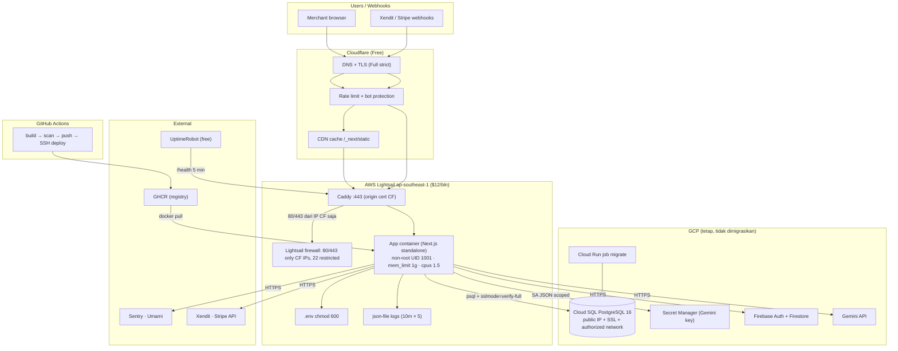

# PayDash — AWS Low-Cost Deployment Plan (≤ US$30/bulan)

> **Status:** Audit read-only selesai · Desain hemat (Lightsail + Cloudflare + DB existing GCP) · Belum ada resource dibuat
> **Target biaya:** ideal **US$15–25/bulan** (AWS saja) · maksimum **US$30/bulan** tanpa justifikasi kuat
> **Sumber bukti:** `docs/DEPLOY_GCP.md`, `docs/DEPLOY_GCP_PRACTICES.md`, `docs/DEPLOYMENT_SUMMARY.md`, `docs/QUEUES.md`, `docs/STACK.md`, `docs/AI_JOURNAL_CLOUD_RUN.md`, `apps/web/src/server/ai-journal/secrets.ts`, `apps/web/src/server/firebase/admin.ts`, `apps/web/src/app/api/health/route.ts`, `Dockerfile`, `Dockerfile.migrate`, `compose.yaml`, `.github/workflows/ci.yml`
> **Dokumen terkait:** `AWS_MIGRATION_PLAN.md` = jalur upgrade Stage 3–4 (ECS Fargate + RDS + ALB) bila metrik membuktikan kebutuhan.

---

## 1. Executive Summary (termasuk output Operating Rules §30)

### CURRENT STATE (bukti audit)

| Item | Fakta | Bukti |
|---|---|---|
| Aplikasi | Next.js 16 **standalone**, monolith stateless, `PORT=3000`, container **non-root** (UID 1001), health `/api/health` (selalu 200, `db: ok/error`) | `Dockerfile`, `next.config.ts` |
| Hosting | GCP **Cloud Run** Gen2, `asia-southeast2` (Jakarta) | `docs/DEPLOY_GCP.md` §4/§6 |
| Database | GCP **Cloud SQL PostgreSQL 16**, `db-f1-micro`, **private IP only** (`--no-assign-ip`), backup 02:00, **PITR OFF** | `docs/DEPLOY_GCP.md` §2, `docs/DEPLOY_GCP_PRACTICES.md` §2.2 |
| Migrasi DB | **Cloud Run job** in-VPC, `Dockerfile.migrate`, `prisma migrate deploy` (idempotent) | `Dockerfile.migrate` |
| Secrets | GCP **Secret Manager** — Gemini key dibaca runtime via `SecretManagerServiceClient` (ADC); Firebase Admin via `FIREBASE_SERVICE_ACCOUNT_JSON` | `secrets.ts`, `firebase/admin.ts` |
| External SaaS | Firebase Auth + Firestore + Gemini + Sentry + Umami + Xendit + Stripe | `package.json`, ADR-0029 |
| Redis / Queue / S3 / Cron | **TIDAK ADA** — webhook inline + dedupe Postgres; Redis/queue eksplisit ditunda | `docs/QUEUES.md`, `docs/STACK.md` |
| CI | GitHub Actions (`ci.yml`: typecheck/lint/test/build/e2e) | `.github/workflows/ci.yml` |
| Custom domain | Belum ada (live `*.run.app`, placeholder `pay.example.com`) | `DEPLOYMENT_SUMMARY.md` |

### COST DRIVERS (apa yang sebenarnya menghabiskan uang)

1. **GCP Cloud SQL** ±$10–13/bln (compute `db-f1-micro` ≈$8 + storage/backup ≈$2–4) — biaya existing, **di luar budget AWS**.
2. **Compute aplikasi** — di AWS akan diganti satu **Lightsail $12** (fixed price, predictable).
3. **Flat-cost traps yang DIHINDARI**: ALB (~$18) + NAT Gateway (~$47) + ECR/CloudWatch/Secrets Manager minimum charges — semua ini hilang dengan desain Lightsail.
4. **Add-on yang bisa bocor**: static IP terlepas ($3.6), snapshot 60GB ($3/bln), egress >2TB (tidak realistis di trafik awal).

### WHAT CAN REMAIN ON GCP (jangan dimigrasikan tanpa alasan biaya)

| Dependency | Keputusan | Alasan |
|---|---|---|
| **Cloud SQL PostgreSQL** | **TETAP DI GCP (Opsi A utama)** | Sudah berjalan, managed, backup otomatis. Migrasi ke RDS = +$20–35/bln dan risiko cutover tanpa kebutuhan. **Syarat:** ukur latency + egress dulu (lihat §10 & Phase 5) — constraint wajib dari user. |
| **Cloud Run job (migrasi)** | **TETAP** | Sudah bekerja in-VPC ke Cloud SQL private IP; pay-per-use (≈$0). |
| **Secret Manager (Gemini key)** | **TETAP** | App membaca via API GCP — jalan di Lightsail dengan SA JSON scoped (`secretAccessor` hanya untuk `GEMINI_API_KEY`). Nol perubahan kode. |
| **Firebase Auth + Firestore + Gemini** | **TETAP** | SaaS eksternal; egress gratis dalam kuota 2TB Lightsail. |
| **Cloud Run (app GCP)** | **DIBIARKAN IDLE** sebagai rollback | Set `--min-instances=0` → biaya $0, tetap siap menerima traffic bila rollback DNS. |
| **Sentry** | **TETAP** | Sudah terpasang di app; gratis (tier awal). |

### MINIMUM AWS ARCHITECTURE

```
Cloudflare (free: DNS, TLS Full-strict, CDN, rate-limit, bot protection)
        │  hanya IP Cloudflare yang boleh ke origin
        ▼
AWS Lightsail ap-southeast-1 (Singapore) — $12/bln, 2 vCPU/2GB/60GB/2TB
        ├── Caddy (reverse proxy, origin cert Cloudflare, health check)
        ├── App container (Next.js standalone, non-root, mem_limit 1g)
        └── (tanpa Redis, tanpa worker — webhook inline)
        │  DATABASE_URL → Cloud SQL public IP + SSL (authorized network = IP Lightsail)
        ▼
GCP Cloud SQL (tetap) · GCP Secret Manager (Gemini) · Firebase/Gemini/Sentry (tetap)
```

### EXPECTED MONTHLY COST (AWS saja)

| Komponen | Bln |
|---|---|
| Lightsail 2vCPU/2GB/60GB (Singapore) | $12 |
| Static IP (attached) | $0 |
| Cloudflare Free | $0 |
| Domain (amortisasi) | ~$1 |
| GHCR (image) | $0* |
| Monitoring (UptimeRobot/healthchecks.io free) | $0 |
| Backup (GCP-side, existing) | $0–3 |
| **TOTAL AWS** | **≈$13–16** |

*Syarat: image ≤ 500MB (quota private GHCR free) — verifikasi ukuran; fallback ECR (500MB/bln gratis) tanpa biaya tarik intra-region.

**Total lintas-cloud** (realistis yang Anda bayar): Lightsail $12–16 + Cloud SQL existing ±$10–13 ≈ **$23–29/bln**. Ini justru argumen terkuat mempertahankan DB di GCP: memindahkan DB ke AWS (Lightsail Managed PG $15) menaikkan total menjadi ~$28–31/bln di ujung atas target.

### RISKS (ringkas; detail §23)
Cross-cloud latency/egress (wajib diukur) · DB private IP harus dibuka public (authorized-network + SSL, trade-off security) · single point of failure satu box (diminimalkan dengan rebuild runbook + registry + DB managed) · Lightsail tidak punya IAM role (hindari AWS API dari box) · PITR GCP OFF.

### IMPLEMENTATION PLAN (ringkas; detail §29 Phase 0–10)
Phase 0 Audit (✅) → 1 Lightsail → 2 Security → 3 Docker → 4 App → 5 DB connectivity + **ukuran latency** → 6 Cloudflare → 7 CI/CD → 8 Observability → 9 Backup → 10 Validation. Production cutover hanya setelah staging hijau dan latensi DB terbukti.

---

## 2. Current Architecture (GCP)

Sama seperti §1 CURRENT STATE. Poin yang menentukan desain:

- **Satu container stateless** — tidak butuh orkestrasi; satu server kecil cukup.
- **Tanpa Redis/queue/cron/object-storage** — tidak ada komponen yang memaksa arsitektur multi-instance.
- **DB di GCP dengan IP privat** — konsekuensi: app AWS tidak bisa langsung menjangkau; harus salah satu dari (a) public IP + authorized networks + SSL, (b) pindah DB, (c) proxy in-GCP (over-engineering, ditolak).
- **Build-time env** (`NEXT_PUBLIC_FIREBASE_*`) harus dibakar saat build → build dilakukan di CI, bukan di server.

---

## 3. Existing GCP Dependencies (yang dipertahankan)

| Dependency | Peran | Cara akses dari Lightsail | Perubahan kode |
|---|---|---|---|
| Cloud SQL PostgreSQL | Database utama | Public IP + SSL + authorized network (Lightsail static IP) | 0 (hanya `DATABASE_URL` + `sslmode`) |
| Cloud Run job `paydash-migrate` | Migrasi Prisma | Tidak diubah (jalan in-VPC GCP) | 0 |
| Secret Manager | Gemini API key | SA JSON scoped (`secretmanager.secretAccessor` hanya GEMINI_API_KEY) via `GOOGLE_APPLICATION_CREDENTIALS` | 0 |
| Firebase Auth + Firestore | Auth + journal storage | Internet (HTTPS), SA JSON yang sama | 0 |
| Gemini API | LLM | via Secret Manager (di atas) | 0 |
| Sentry | Error + traces | Internet | 0 |
| Umami | Analytics | Internet | 0 |
| Cloud Run app GCP | **Standby rollback** | Set `min-instances=0` → $0 | 0 |

**Aturan:** tidak ada dependency yang dipindah hanya demi "AWS native".

---

## 4. Cheapest Viable AWS Architecture

**Keputusan utama dan jawaban "apakah ada cara lebih murah?"**

| Pertanyaan | Jawaban | Alternatif yang dipertimbangkan & ditolak |
|---|---|---|
| Compute apa? | **Lightsail $12 (2vCPU/2GB/60GB)** — fixed price, 2TB transfer, tidak ada biaya ALB/NAT/vCPU-per-jam | EC2 t3.small on-demand ≈$15 + EBS + transfer (lebih mahal); t4g.small reserved 3th ≈$6/bln lebih murah tapi butuh komitmen + static IP + transfer charge; **Lightsail = paling sederhana dengan harga terkunci** |
| Region? | **ap-southeast-1 (Singapore)** | ⚠️ Lightsail **tidak punya region Jakarta** (ap-southeast-3); Singapore = terdekat ke DB GCP Jakarta → latensi lebih kecil daripada region lain |
| Reverse proxy? | **Caddy** (config 10 baris, auto-reload, health check) | Nginx (lebih verbose); Traefik (berlebihan) |
| CDN/WAF/DNS? | **Cloudflare Free** — jangan CloudFront + AWS WAF Day-1 (biaya + kompleksitas) | CloudFront (~$0–2 + konfigurasi lebih rumit) ditolak selama Cloudflare memenuhi |
| DB? | **TETAP GCP Cloud SQL** (Opsi A) — syarat: latensi terukur | Opsi B: Lightsail Managed PostgreSQL $15/bln (lihat §10) — hanya bila latensi/egress terbukti buruk atau public-IP ditolak kebijakan |
| Redis? | **TIDAK ADA** (app tidak butuh) | Container Redis lokal hanya jika app nanti butuh cache kecil (§11) |
| Registry? | **GHCR** (sudah di ekosistem GitHub, tanpa biaya egress) | ECR = fallback bila quota/size image bermasalah |
| Secrets di server? | `.env` chmod 600 (cheapest) | SSM Parameter Store = butuh IAM static key di box (risiko) — ditolak Day-1; Secrets Manager ($0.40/secret) ditolak Day-1 |
| Deployment? | GitHub Actions + SSH + `docker compose` | CodeDeploy/ECS = biaya & kompleksitas tidak perlu |

---

## 5. Mermaid Diagram



---

## 6. Monthly Cost Estimate (detail + guardrail)

| Komponen | Harga | Catatan |
|---|---|---|
| Lightsail $12 plan | **$12.00** | 2 vCPU / 2 GB / 60 GB SSD / 2 TB transfer (ap-southeast-1) |
| Static IP | $0.00 | Gratis selama terpasang; **$3.60/bln jika terlepas** (jangan lupa attach saat recreate) |
| Cloudflare Free | $0.00 | DNS, CDN, TLS, 3 rules rate-limit, bot fight mode |
| Domain | ≈$1.00 | Amortisasi $10–12/thn (registrar bebas; DNS di Cloudflare) |
| GHCR | $0.00 | Private quota 500 MB (GitHub Free) — **cek ukuran image**; bila >500 MB: slim image atau ECR (500 MB/bln gratis) |
| UptimeRobot / healthchecks.io | $0.00 | Free tier cukup (monitor 5-min, alert email/telegram) |
| Backup config (GCS bucket existing) | $0.00 | Encrypted tar kecil (<1 MB) ke GCS project existing |
| AWS Budgets | $0.00 | 2 budget (forecast + actual) gratis |
| **TOTAL AWS** | **≈$13–16/bln** | Di bawah target ideal $15–25 |

**Di luar budget AWS (existing, tidak berubah):** Cloud SQL ±$10–13/bln.
**Total lintas-cloud ≈ $23–29/bln.**

### Jika desain melebihi $30/bln → STOP (sesuai aturan)
Skenario yang bisa menembus dan mitigasinya:

| Pemicu over-budget | Mengapa diperlukan | Alternatif lebih murah | Trade-off |
|---|---|---|---|
| Pindah DB ke Lightsail Managed PG (+$15) | Hanya bila latensi cross-cloud gagal tes | Opsi A (pertahankan GCP) selama mungkin; atau `activation-policy=NEVER` di GCP saat idle (storage-only ≈$3–4) | DB mati saat idle = app tidak usable — tidak disarankan untuk payment |
| Snapshot Lightsail 60GB (+$3/bln) | DR instance | Ambil snapshot hanya sebelum perubahan besar, hapus setelahnya; DR utama = rebuild dari registry + dump DB (runbook) | RTO rebuild lebih lambat |
| Egress > 2 TB | Trafik sangat tinggi | Saat itu terjadi, Stage 3 (ECS) sudah relevan dan budget direvisi | — |
| Upstash Redis (+$5–10) | Rate-limit terdistribusi | Cloudflare rate-limit rules (free) untuk path publik | Kurang granular per-user |

---

## 7. Networking

| Item | Desain |
|---|---|
| Origin IP | Static IP Lightsail (attach permanen ke instance) |
| Firewall Lightsail | IPv4+IPv6: **80/443 hanya dari daftar IP Cloudflare** (`https://www.cloudflare.com/ips/` — update berkala), **22 hanya dari IP rumah/kantor + toleransi IP runner CI bila perlu**, sisanya deny. ICMP opsional |
| OS firewall (ufw) | Lapisan kedua opsional — Lightsail firewall sudah cukup; ufw = defense-in-depth (SHOULD) |
| TLS | Cloudflare **Full (strict)** → origin harus menyajikan sertifikat valid → pakai **Cloudflare Origin Certificate (15 thn)** dipasang di Caddy |
| Header client IP | Cloudflare mengirim `CF-Connecting-IP` → Caddy meneruskannya; app rate-limit/by-IP (jika ada) membaca header ini |
| Ports ideal | 22 (restricted) · 80 · 443 — tidak ada port DB/Redis publik |
| IPv6 | Lightsail firewall mendukung; tidak wajib Day-1 |

---

## 8. Lightsail Configuration

```bash
# 1. Instance
aws lightsail create-instances --instance-name paydash-prod \
  --availability-zone ap-southeast-1a \
  --blueprint-id ubuntu_24_04 --bundle-id medium_2_0   # $12: 2vCPU/2GB/60GB
# 2. Static IP attach
aws lightsail allocate-static-ip --static-ip-name paydash-ip
aws lightsail attach-static-ip --static-ip-name paydash-ip --instance-name paydash-prod
# 3. Firewall (80/443 hanya Cloudflare IPs; 22 restricted)
#    Konsol → Networking → IPv4/IPv6 rules (atau aws lightsail put-instance-public-ports)
```

Setup OS (sekali):

```bash
ssh -i lightsail.pem ubuntu@<ip>
# security baseline
sudo sed -i 's/^#\?PasswordAuthentication yes/PasswordAuthentication no/' /etc/ssh/sshd_config.d/*.conf
sudo sed -i 's/^#\?PermitRootLogin.*/PermitRootLogin no/' /etc/ssh/sshd_config.d/*.conf
sudo systemctl restart ssh
sudo apt-get update && sudo apt-get install -y unattended-upgrades ca-certificates curl
sudo dpkg-reconfigure -plow unattended-upgrades   # automatic security updates ON
```

Jangan install: node di host, npm di host, monitoring agent berat, control panel. Hanya: Docker + Compose + Caddy + (opsional) jq.

---

## 9. Docker Deployment

File baru di repo: `infra/lightsail/compose.prod.yaml` + `infra/lightsail/Caddyfile`.

```yaml
# infra/lightsail/compose.prod.yaml
services:
  app:
    image: ghcr.io/noiz354/pay-dash/web:${IMAGE_TAG:-latest}
    restart: unless-stopped
    init: true
    env_file: /opt/paydash/.env        # chmod 600, root-only
    mem_limit: 1g
    cpus: 1.5
    user: "1001:1001"                  # non-root (sudah default di Dockerfile)
    read_only: true
    tmpfs:
      - /tmp:size=64m,uid=1001
    healthcheck:
      test: ["CMD", "curl", "-fsS", "http://localhost:3000/health"]
      interval: 10s
      timeout: 5s
      retries: 5
      start_period: 30s
    logging:
      driver: json-file
      options: { max-size: "10m", max-file: "5" }

  caddy:
    image: caddy:2-alpine
    restart: unless-stopped
    ports: ["80:80", "443:443"]
    volumes:
      - ./Caddyfile:/etc/caddy/Caddyfile:ro
      - ./origin-cert.pem:/etc/caddy/origin-cert.pem:ro
      - ./origin-key.pem:/etc/caddy/origin-key.pem:ro
      - caddy_data:/data
      - caddy_config:/config
    mem_limit: 128m
    logging:
      driver: json-file
      options: { max-size: "10m", max-file: "3" }

volumes:
  caddy_data:
  caddy_config:
```

```caddyfile
# infra/lightsail/Caddyfile
{
    admin off
}
pay.example.com {
    encode zstd gzip
    tls /etc/caddy/origin-cert.pem /etc/caddy/origin-key.pem
    header Strict-Transport-Security "max-age=63072000; includeSubDomains; preload"
    reverse_proxy app:3000
    log {
        output stdout
        format json
    }
}
```

Catatan:
- **Tanpa worker container** — webhook diproses inline (bukti `docs/QUEUES.md` ladder step 1). Worker/Redis container ditambahkan hanya bila app berubah.
- `IMAGE_TAG` dari CI = git SHA (immutable). `latest` tidak pernah dipakai untuk prod.
- Docker daemon host: `log-driver json-file` default + rotation di atas; `docker system prune -f` dijadwalkan mingguan (hanya image dangling/berhenti — **jangan** `prune -a --volumes` otomatis).

---

## 10. Database Strategy

### Opsi A — PERTAHANKAN GCP Cloud SQL (default, sesuai constraint user)

**Fakta kunci yang harus diatasi:** Cloud SQL saat ini **private-IP only** — dari AWS tidak routable. Dua sub-opsi:

| Sub-opsi | Cara | Trade-off |
|---|---|---|
| **A1 — Public IP + authorized networks + SSL** (rekomendasi) | Enable public IP di Cloud SQL; authorized network = static IP Lightsail `/32`; app pakai `sslmode=verify-full` + `server-ca.pem` (unduh dari Cloud SQL) | Membuka DB ke internet — dibatasi hanya 1 IP milik Anda + SSL wajib. Security posture berubah, didokumentasikan & diterima eksplisit |
| A2 — Biarkan private, app tetap di GCP | Tidak jadi migrasi | Di luar scope (user meminta AWS) |

**Prerequisit yang WAJIB sebelum cutover (constraint user):**

1. **Ukur latency** — dari instance Lightsail ke Cloud SQL: `psql` connect + 100 query loop → catat p50/p95. Estimasi awal Singapore↔Jakarta ≈ 10–30 ms RTT (perlu verifikasi; bisa lebih rendah karena jaringan backbone kedua cloud di kota berbeda).
2. **Ukur egress** — traffic DB = request kecil; egress GCP (respons) $0.12/GB — di volume dashboard awal ≈ sen. Verifikasi dari Cloud Billing selama 1–2 minggu staging.
3. **Gate keputusan:** p95 round-trip DB < 25–30 ms → lanjut Opsi A. > 50 ms atau gagal verifikasi → evaluasi Opsi B. (Antara 30–50 ms: lanjut + pertimbangkan `pgbouncer` nanti, LATER.)

**Security hardening Opsi A1:** SSL mode `ENCRYPTED_ONLY` di Cloud SQL (tolak koneksi non-SSL), SCRAM-SHA-256 (sudah ada), user `paydash_app` (bukan `postgres`), authorized network hanya IP Lightsail, audit `pg_stat_activity` berkala.

### Opsi B — Full AWS (fallback bila A gagal tes)

| Pilihan | Harga | Verdict |
|---|---|---|
| **Lightsail Managed PostgreSQL** ($15/bln, 1GB/40GB) | +$15 → total AWS ≈$28 | **Pilihan fallback terbaik**: private network ke instance Lightsail (tanpa public IP!), backup otomatis 7 hari, failover manual. Harga total masih ≤ $30 |
| RDS db.t4g.micro single-AZ | ≈$15–20 + egress + ALB tidak perlu | Lebih mahal & kompleks dari Lightsail Managed; hanya untuk Stage 3 |
| PostgreSQL lokal container | $0 | **DITOLAK untuk data payment/ledger** (risiko disk failure = kehilangan ledger; melanggar prinsip "managed untuk SaaS/payment") |

**Verdict:** jalankan Opsi A selama memenuhi gate latensi/biaya — sesuai constraint user: jangan migrasikan PostgreSQL hanya agar terlihat "full AWS". Opsi B adalah jalur yang sudah diukur dan siap diambil.

---

## 11. Storage Strategy

- **Tidak ada S3 Day-1** — app tidak punya file persistence server-side (upload KYC masih UI-only; bukti `kyc-upload.tsx`, `docs/STACK.md` menunda S3/R2).
- **Saat dibutuhkan (LATER):** Cloudflare **R2** (10 GB gratis, S3-compatible API, tanpa biaya egress) atau S3 dengan presigned URL. Hindari kredensial AWS static di Lightsail (tidak ada IAM role di Lightsail) → R2 token scope-sempit lebih aman.
- **Backup file** (§15) ke bucket GCS project existing (sudah punya SA) — bukan S3 baru.
- **Redis lokal:** hanya jika app nanti butuh cache kecil — `redis:7-alpine`, `maxmemory 128mb`, `maxmemory-policy allkeys-lru`, **bukan source of truth** (boleh hilang/restart tanpa kehilangan transaksi).

---

## 12. Secrets

Urutan pilihan (termurah → termahal) dan keputusan:

| Metode | Keputusan | Alasan |
|---|---|---|
| GitHub Actions Secrets | ✅ **CI/deploy**: `SSH_KEY`, `GHCR_TOKEN`, build-time `NEXT_PUBLIC_*` | Sudah terenkripsi, gratis, OIDC/token repo |
| `.env` di server (chmod 600, owner root) | ✅ **Runtime app**: `DATABASE_URL`, `BETTER_AUTH_SECRET`, `XENDIT_*`, `STRIPE_*`, `SENTRY_DSN`, `PAYMENTS_PUBLIC_ORIGIN`, SA JSON | Cheapest; risiko = akses root box (sudah key-only). Didokumentasikan; migrasi ke SSM/Secrets Manager hanya bila butuh rotasi otomatis |
| GCP Secret Manager (existing) | ✅ **Gemini key tetap di sini** — app membaca via SA JSON scoped | Nol perubahan kode; secret tidak pernah di .env box |
| SSM Parameter Store | ❌ Day-1 — butuh static IAM key di box (lebih berisiko dari .env chmod 600 untuk kasus ini) | LATER bila rotation/compliance |
| AWS Secrets Manager | ❌ Day-1 — $0.40/secret/bln tanpa kebutuhan rotasi otomatis | LATER |

Aturan: tidak pernah hardcode secret di repo (verified bersih; hanya placeholder), `.env` server dikecualikan dari semua commit, backup `.env` hanya dalam bentuk terenkripsi.

---

## 13. CI/CD

Pipeline (file baru: `.github/workflows/deploy-lightsail.yml`):

```
push main / tag
  → CI (existing ci.yml): typecheck → lint → test → build → e2e
  → Deploy job:
      docker/build-push-action → ghcr.io/noiz354/pay-dash/web:${GITHUB_SHA::7}
        build-args: NEXT_PUBLIC_APP_URL, NEXT_PUBLIC_FIREBASE_* (dari GH vars)
      trivy-action scan (CRITICAL = gagal)
      SSH ke Lightsail (webfactory/ssh-agent, key dari GH Secrets):
        export IMAGE_TAG=${GITHUB_SHA::7}
        docker compose -f infra/lightsail/compose.prod.yaml pull
        docker compose -f infra/lightsail/compose.prod.yaml up -d --wait
        curl -fsS https://pay.example.com/ready   # smoke test
      → status deployment ke GH Deployment + notif
```

- **Immutable tag** = git SHA. Rollback: `IMAGE_TAG=<sha lama> docker compose up -d` (satu perintah, <30 dtk).
- **Migrasi DB:** tetap via **Cloud Run job GCP** (jalankan sebelum/ sesudah rollout sesuai kebijakan backward-compatible; skema additive-first).
- **Zero-downtime Day-1:** `up -d --wait` mengganti container setelah healthcheck hijau; downtime realistis 5–15 dtk (restart single container) — di bawah target <30 dtk dan acceptable untuk early-stage.
- **Registry:** GHCR (quota 500 MB private — cek `docker image ls` size; bila >500 MB: slim image (hapus dev deps di runner) atau ECR).

---

## 14. Observability (murah)

| Layer | Tool | Biaya |
|---|---|---|
| Application logs | pino JSON (sudah ada) → stdout → docker json-file (rotasi 10m×5) | $0 |
| Error/tracing | **Sentry existing** (traces sample 0.1) | $0 |
| Liveness eksternal | **UptimeRobot free** — GET `https://pay.example.com/health`, interval 5 min, alert setelah 2 gagal berturut | $0 |
| Readiness internal | Caddy + Docker healthcheck ke `/health` | $0 |
| Infra (CPU/RAM/disk) | Cron lokal 5-min → kirim heartbeat ke healthchecks.io (free) — `disk>70%` warning, `>85%` critical; `docker ps` status; load avg | $0 |
| Request ID | `X-Request-Id` dari Caddy (`header_down`/`request_id`) → diteruskan ke app; Sentry sudah memberi trace id per transaksi | $0 |
| Dashboard | **Tidak Day-1** — Grafana/Prometheus = LATER bila dibutuhkan | — |

**Perubahan kode kecil (PR terpisah):** tambah `GET /health` (liveness proses, selalu 200) dan `GET /ready` (503 bila DB/`config` gagal) di `apps/web/src/app/`. `/api/health` existing tetap untuk kompatibilitas. `/health` **tidak** boleh bergantung semua third-party API.

---

## 15. Backup

| Data | Strategi | Lokasi |
|---|---|---|
| Database | **Cloud SQL automated backup (02:00, existing)** + **aktifkan PITR** (SHOULD — ledger finansial; tambahan biaya storage saja ±$1–3) | GCP |
| Restore drill | Adaptasi `scripts/dr-restore-drill.mjs` → jalankan via Cloud Run job bulanan (pattern sudah terbukti di repo) | GCP |
| Config + .env | `tar` → enkripsi `age` → upload ke bucket GCS private (project existing) setiap perubahan; retention 30 hari | GCS |
| Image aplikasi | Tidak perlu backup — immutable di GHCR | GHCR |
| Instance DR | Snapshot Lightsail hanya sebelum perubahan besar (hapus setelahnya; $0.05/GB/bln) | AWS |

Prinsip: backup **tidak** disimpan hanya di server yang sama.

---

## 16. Security Baseline

| Item | Implementasi |
|---|---|
| SSH | Key-only, `PasswordAuthentication no`, `PermitRootLogin no` |
| Firewall | Lightsail: 22 restricted, 80/443 **hanya IP Cloudflare**, sisanya deny |
| Automatic updates | `unattended-upgrades` ON |
| TLS | Cloudflare Full (strict) + origin cert Caddy |
| Container | non-root UID 1001 (existing), `read_only` FS + tmpfs /tmp, `mem_limit`/`cpus` |
| Secrets | §12 — .env 600, tidak di Git, SA GCP scope-sempit (1 secret, 1 project) |
| DB | SSL enforced, authorized network 1 IP, user app non-superuser |
| App | Header keamanan + CSP + HSTS sudah di `next.config.ts`; `AI_JOURNAL_ALLOW_TEST_AUTH=false` |
| Cloudflare | Bot Fight Mode, rate limit `/api/auth/*` & `/api/webhooks/*` (3 rules free), min TLS 1.2 |
| Audit | CloudTrail tidak relevan untuk Lightsail (bukan API-heavy); audit = log akses SSH (journald) + Caddy access log JSON |

---

## 17. Cost Guardrails

```bash
# AWS Budgets (gratis): alert via email
# 1) Forecast budget  $20  → WARNING
# 2) Actual budget     $25  → CRITICAL
# 3) Actual budget     $30  → HARD ATTENTION (stop & evaluasi)
```

- Lightsail adalah fixed-price → breach hampir selalu dari **add-on bocor**: static IP terlepas ($3.6/bln), snapshot mengendap ($0.05/GB/bln), extra disk. **Checklist bulanan** (5 menit): 1) static IP attached? 2) snapshot tak terpakai dihapus? 3) instance yang seharusnya idle dihapus (staging)? 4) budget alert hidup?
- GCP side: pastikan Cloud Run app set `min-instances=0` (fallback $0), job migrasi tidak berjalan rutin tanpa alasan.

---

## 18. Failure Scenarios

| Skenario | Dampak | Recovery | RTO |
|---|---|---|---|
| Instance Lightsail mati/hang | App down | Reboot (console/API); bila hardware failure → buat instance baru dari runbook (compose + image GHCR + .env restore) | 5–30 min |
| Disk penuh (log/docker) | App error | Alert disk 85% → `docker system prune`, audit `du`; log sudah dirotasi | <15 min |
| DB GCP unreachable (cross-cloud) | App up tapi error DB | `/ready` merah → alert; cek GCP status & authorized network (IP Lightsail berubah?) | Sesuai GCP |
| IP Lightsail berubah | DB menolak koneksi | Static IP terpasang → hanya berubah jika dilepas; update authorized network di Cloud SQL | <10 min |
| Deploy buruk | Bug release | `IMAGE_TAG=<sha lama> docker compose up -d` | <5 min |
| Cloudflare down | Domain tidak resolve | Traffic langsung ke origin IP (DNS fallback manual) — jarang; pantau status CF | 15–60 min |
| Gemini/Firebase/Sentry outage | Journal/observability degradasi | Graceful degradation di app; dashboard inti (payment) tetap jalan | — |
| OOM container | App crash loop | `restart: unless-stopped` + mem_limit 1g membatasi; cek `dmesg` & log; naikkan instance bila berulang (threshold §20) | <1 min |
| Box compromised | — | Rebuild dari nol (runbook), rotasi SEMUA secret (DB password, SA, GH deploy key) | 1–2 jam |

---

## 19. Rollback Strategy

1. **Image rollback** (utama): `IMAGE_TAG` pin → `docker compose up -d` → `< 5 min`.
2. **Whole-platform rollback** (cutover gagal): DNS Cloudflare → balik ke URL Cloud Run GCP (yang dipertahankan dengan `min-instances=0`, biaya $0) → **2–4 minggu window**.
3. **DB rollback**: PITR GCP (setelah diaktifkan) / snapshot sebelum migrasi berisiko.
4. **Deployment rollback**: GH Actions re-run job deploy dengan tag lama (satu klik).

---

## 20. Upgrade Thresholds (trigger berbasis metrik)

| Trigger (sustain ≥ 3 hari) | Aksi |
|---|---|
| CPU p95 > 70% ATAU RAM > 80% | **Stage 2:** Lightsail $24 (4GB/80GB) — resize in-place, downtime beberapa menit |
| Disk > 70% | Audit + cleanup; > 85% berulang → upgrade disk (Lightsail) |
| p95 API latency > 500 ms | Profiling (Sentry traces, query DB); bila penyebab = CPU → Stage 2; bila = DB cross-cloud → pgbouncer atau Opsi B |
| OOM / container restart berulang | Naikkan mem_limit sementara → Stage 2 |
| Availability single box = business risk | **Stage 3:** Cloudflare → ALB → **ECS Fargate** → **RDS** (rujuk `AWS_MIGRATION_PLAN.md` §4–§6) |
| Cache loss tak tertahankan / perlu koordinasi multi-instance | Redis managed (ElastiCache/Upstash) — baru saat multi-instance |
| RTO/RPO DB tak terpenuhi lagi | RDS Multi-AZ / Aurora |

**Stage 4** (multi-service, autoscaling, SQS) hanya setelah Stage 3 terbukti dibutuhkan oleh metrik — jangan implementasi lebih awal.

---

## 21. Migration Plan (ringkas; detail fase di §29)

1. Ukur dulu (latency & egress DB cross-cloud) sebelum cutover — **constraint utama user**.
2. Bangun Lightsail + Cloudflare paralel, staging penuh di domain `staging.pay.example.com`.
3. DB tetap GCP; koneksi diuji dari staging ≥ beberapa hari.
4. Cutover DNS → window rollback 2–4 minggu (Cloud Run GCP standby $0).
5. GCP app dimatikan bertahap setelah validasi stabil.

---

## 22. Validation Checklist

- [ ] `curl https://pay.example.com/health` → 200 (dari luar, via Cloudflare)
- [ ] `curl https://pay.example.com/ready` → 200 + `db: ok`
- [ ] TLS: cert Cloudflare valid; origin Full (strict) tidak error; SSL Labs ≥ B
- [ ] Origin hanya menerima 80/443 dari IP Cloudflare (tes: akses IP langsung ditolak)
- [ ] Latensi DB: p50/p95 tercatat, < gate §10 (dokumentasikan angka)
- [ ] Login Better Auth + Firebase sign-in berfungsi di domain baru
- [ ] API kritikal: balance, ledger, payout release (TEST MODE) — via e2e Playwright
- [ ] Webhook Xendit/Stripe: kirim + replay → dedupe (409/no-op)
- [ ] Migrasi Prisma via Cloud Run job hijau (idempotent)
- [ ] Restart container → health pulih < 1 min; restart instance → app pulih otomatis
- [ ] Rollback image: deploy tag lama → smoke hijau (< 5 min)
- [ ] Backup: PITR aktif; restore drill dijalankan; config backup terenkripsi ter-upload
- [ ] Disk/cpu alert bekerja (uji dengan `fallocate` sementara di staging)
- [ ] `SECRET_STORE_MODE=kms` aktif; escape hatch test-auth OFF

---

## 23. Risks

| # | Risiko | Mitigasi |
|---|---|---|
| 1 | **Latensi cross-cloud DB** (SG↔Jakarta) lebih tinggi dari estimasi | WAJIB ukur sebelum cutover; gate keputusan §10; fallback Opsi B siap |
| 2 | **Cloud SQL public IP** (Opsi A1) = permukaan serangan baru | Authorized network 1 IP + SSL enforced + user non-superuser + audit koneksi |
| 3 | **Single point of failure** (1 box, 1 region) | Rebuild runbook + image di registry + DB managed; RTO 5–30 min diterima eksplisit untuk early-stage; Stage 3 bila bisnis menuntut |
| 4 | **Lightsail tanpa IAM role** → kredensial static bila pakai AWS API dari box | Desain menghindari AWS API dari box (R2/GCS untuk storage, GHCR untuk image) |
| 5 | **Disk 60GB penuh** (image + logs) | Rotasi log, prune terjadwal, alert disk, upgrade disk |
| 6 | **PITR GCP masih OFF** | Aktifkan (SHOULD → wajib sebelum cutover payment live) |
| 7 | **GHCR quota 500MB** | Cek ukuran image; slim (hapus devDeps runner) atau ECR |
| 8 | **Dependensi Gemini/Firebase lintas-cloud** | Sudah seperti kondisi GCP; degradasi UI bila journal gagal; pantau Sentry |
| 9 | **Deploy via SSH dari CI** (IP runner dinamis) | Port 22 dengan key-only cukup aman; opsional: izinkan hanya rentang IP GitHub Actions (Actions IP ranges API) |
| 10 | **TEST MODE only (Xendit)** | Aktivasi LIVE diuji di staging dengan `SECRET_STORE_MODE=kms` sebelum prod |

---

## 24. Final Verdict

**LAYAK DIEKSEKUSI.** Desain ini memenuhi ketiga syarat user:

1. **Benar-benar usable** — monolith Next.js standalone yang sudah production-ready dijalankan di server $12 dengan reverse proxy + TLS + CI/CD yang sama dengan pola sekarang.
2. **Secure enough untuk early-stage SaaS** — key-only SSH, firewall hanya IP Cloudflare, container non-root read-only, DB SSL + authorized network, secret terenkripsi.
3. **Biaya terkendali** — AWS ≈$13–16/bln (di bawah target ideal), total lintas-cloud ≈$23–29/bln, dengan guardrail $20/$25/$30 dan jalur upgrade Stage 2–4 berbasis threshold metrik.

**Dua keputusan paling penting** (keduanya menjawab "apakah ada cara lebih murah?"): (a) **database tetap di GCP** selama pengukuran latency/egress lolos gate — tidak migrasi demi estetika "full AWS"; (b) **semua komponen flat-cost AWS dihindari** (ALB/NAT/ECR wajib/CloudWatch/Secrets Manager) karena satu instance kecil + Cloudflare free menggantikan fungsinya di skala ini.

**UNKNOWN / NEEDS VERIFICATION:** latensi aktual SG→Jakarta · ukuran image Docker final · status PITR · kesediaan membuka public IP Cloud SQL · volume traffic aktual.

---

## 29. Implementation Phases (Phase 0–10)

| Phase | Objective | Commands/Files | Implementation | Verification | Rollback | Risk | Cost impact |
|---|---|---|---|---|---|---|---|
| **0 Audit** | ✅ Selesai | `AWS_LOW_COST_DEPLOYMENT.md` | — | — | — | LOW | $0 |
| **1 Lightsail foundation** | Instance + static IP | `aws lightsail create-instances … medium_2_0` (ap-southeast-1) | Buat instance Ubuntu 24.04, attach static IP, tag `paydash-prod` | SSH masuk, `free -h` 2GB, disk 60GB | Delete instance | LOW | **+$12/bln** |
| **2 Security** | SSH/firewall | `/etc/ssh/sshd_config.d/*`, Lightsail firewall rules | Key-only, no root, unattended-upgrades, 80/443 CF-only, 22 restricted | Tes login password ditolak; akses IP langsung ditolak | Revert rules | LOW | $0 |
| **3 Docker runtime** | Docker + Compose + Caddy | `docker-ce`, `compose.prod.yaml`, `Caddyfile`, origin cert CF | Install Docker, daemon log rotation, `caddy:2` dengan cert origin, healthcheck `/health` | `docker ps` sehat; `curl -k https://localhost` → halaman app placeholder/404 terkontrol | `docker compose down` | LOW | $0 |
| **4 Application deployment** | App jalan di AWS | image GHCR, `.env` (0600), `IMAGE_TAG=sha` | `docker compose up -d --wait`; pasang SA JSON GCP scoped (Secret Manager + Firebase) | `/health` 200, `/ready` 200 (`db: ok` via staging tunnel), e2e smoke | Tag lama | MEDIUM | $0 |
| **5 Database connectivity** | **Ukur cross-cloud** | `psql` + loop 100 query; Cloud Billing GCP | Opsi A1: public IP + authorized network + SSL + `server-ca.pem`; **jalankan pengukuran ≥ 3 hari** dari staging | p50/p95 < gate §10; egress cost terukur | Hapus public IP (balik private) | **HIGH (keputusan)** | $0–3 (PITR) |
| **6 Cloudflare** | DNS + proxy + SSL | Zona CF, record `staging.pay.example.com`, Full (strict), bot fight, rate-limit rules | CNAME origin, origin cert dipasang di Caddy, WAF rules 3 pcs | `curl` via CF 200; SSL Labs ≥ B; log Caddy hanya berisi IP CF | DNS OFF (grey cloud) | LOW | $0 |
| **7 CI/CD** | Deploy otomatis | `.github/workflows/deploy-lightsail.yml`, GH Secrets (`SSH_KEY`, token) | Build+scan+push GHCR → SSH → compose pull/up → smoke `/ready` | Push commit → deploy hijau otomatis; rollback tag teruji | Disable workflow | MEDIUM | $0 |
| **8 Observability** | Health + uptime + logs + Sentry | UptimeRobot `/health` 5-min; cron disk/heartbeat → healthchecks.io; Sentry env `production-aws` | Pasang monitor, alert email; uji alert disk di staging | Alert terkirim saat uji | Hapus monitor | LOW | $0 |
| **9 Backup** | DB/config backup | PITR ON; script `backup-config.sh` (tar+age→GCS); drill restore bulanan via Cloud Run job | Jadwalkan; jalankan drill 1×; verifikasi checksum (pattern `dr-restore-drill.mjs`) | Restore drill PASS | Hapus job | LOW | $0–3 |
| **10 Production validation** | Smoke + rollback test + cutover | Domain `pay.example.com` → CF → Lightsail | Jalankan checklist §22 penuh di staging; cutover DNS; pantau 48 jam; window rollback 2–4 minggu (Cloud Run GCP `min-instances=0` standby) | Semua checklist hijau; SLO hijau 48 jam | DNS → Cloud Run GCP | MEDIUM (post-cutover) | $0 |

**Operating rule ditaati:** tidak ada infrastructure yang dibuat sebelum audit + dokumen ini disetujui; setiap phase punya rollback; cutover production tidak terjadi sebelum staging tervalidasi (Phase 10 gate).
