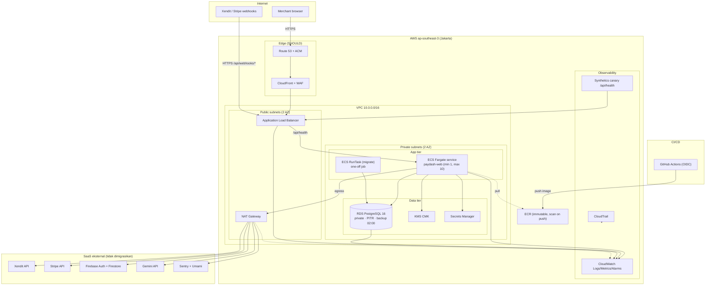

# PayDash — AWS Migration & Architecture Plan

> **Status:** Audit selesai (read-only) · Dokumen desain + rencana migrasi · Belum ada resource AWS yang dibuat
> **DECISION UPDATE (2026-09-14):** Database produksi kini diarahkan ke **Lightsail Managed PostgreSQL** (bukan RDS) untuk fase awal — runbook: `infra/aws/DATABASE_MIGRATION.md`. RDS tetap jalur Stage 3 bila workload menuntut fitur di luar Lightsail (replica, parameter grup lanjutan, PITR > 7 hari).
> **Sumber bukti:** `docs/DEPLOY_GCP.md`, `docs/DEPLOY_GCP_PRACTICES.md`, `docs/DEPLOYMENT_SUMMARY.md`, `docs/DEPLOY_GCP_FIREBASE_PLAN.md`, `docs/AI_JOURNAL_CLOUD_RUN.md`, `docs/STACK.md`, `docs/QUEUES.md`, `docs/adr/0029-cloud-run-gemini-journal.md`, `SLO_SLI_ERROR_BUDGET.md`, `DR_RESTORE_REPORT.md`, `Dockerfile`, `Dockerfile.migrate`, `compose.yaml`, `cloudbuild.migrate.yaml`, `.github/workflows/ci.yml`, `apps/web/*`
> **Prinsip:** evidence-based — setiap komponen AWS dipilih berdasarkan kebutuhan workload yang terbukti, bukan translasi 1:1 nama service.

---

## 1. Executive Summary

PayDash adalah **dashboard operasi payment gateway** (Next.js 16 standalone, Prisma/PostgreSQL, Xendit + Stripe, Better Auth, AI journal Gemini via Firebase) yang saat ini berjalan di **GCP Cloud Run** (`asia-southeast2`, URL live `paydash-web-723420820074.asia-southeast2.run.app`).

**Temuan audit utama:**

1. Deployment GCP ada dan berjalan, tetapi **seluruh infrastruktur dibuat via perintah `gcloud` manual** dalam runbook — tidak ada Terraform/Pulumi/Helm/K8s di repo. Ini adalah gap #1 yang diperbaiki AWS plan ini (full IaC).
2. Workload adalah **monolith Next.js tanpa Redis, tanpa queue, tanpa object storage, tanpa cron berjalan** — webhook diproses inline dengan dedupe di Postgres (`WebhookDelivery` unique index, `DurableOperation.idempotencyKey`). Maka baseline AWS **tidak membutuhkan** ElastiCache, SQS, atau S3 di Day-1 (anti over-engineering).
3. Dependensi Google **tetap tinggal**: Firebase Auth + Firestore + Gemini API (SaaS eksternal). Ini bukan bagian yang dimigrasikan — app di AWS tetap memanggil Google APIs (sama seperti kondisi sekarang).
4. DB produksi GCP adalah `db-f1-micro` **dengan PITR dimatikan** (keputusan biaya) — untuk ledger finansial, AWS plan menyalakan PITR.
5. Custom domain belum ada (masih `*.run.app`) — AWS plan menjadikan custom domain + HTTPS sebagai **MUST**.

**Target AWS yang direkomendasikan (baseline minimal production-ready):**

```
Route 53 → ACM(TLS) → CloudFront (SHOULD) → WAF (SHOULD)
         → ALB (public) → ECS Fargate (private) → RDS PostgreSQL (private, single-AZ + PITR)
Secrets: Secrets Manager + KMS CMK | Images: ECR (immutable + scan) | CI/CD: GitHub Actions + OIDC
Observability: CloudWatch Logs/Metrics/Alarms + Synthetics + Sentry (tetap)
IaC: Terraform (remote state S3 + DynamoDB lock) | Isolasi: 2 AWS account (prod / non-prod)
```

**Verdict awal:** workload ini **cocok untuk ECS Fargate** (bukan EKS) — satu service stateless, health check sudah ada (`/api/health`), image immutable-ready. Estimasi small-prod **± USD 110–140/bulan** (setara Cloud Run + Cloud SQL GCP saat ini, dengan PITR dan observability lebih lengkap).

---

## 2. Existing GCP Architecture (berdasarkan bukti)

### 2.1 Service GCP yang TERBUKTI digunakan

| Komponen | Service GCP | Bukti di repo |
|---|---|---|
| Web app (Next.js 16 standalone) | **Cloud Run** Gen2, Direct VPC, region `asia-southeast2`, `PORT=3000`, min-instances=1, max=10, concurrency 80, timeout 300s | `docs/DEPLOY_GCP.md` §4/§6, `Dockerfile` (`EXPOSE 3000`, `USER nextjs` UID 1001) |
| Database | **Cloud SQL PostgreSQL 16**, private IP only, `db-f1-micro` (edition enterprise), SCRAM-SHA-256 + IAM auth, backup 02:00, **PITR OFF**, storage auto-increase | `docs/DEPLOY_GCP.md` §2, `docs/DEPLOY_GCP_PRACTICES.md` §2.2 |
| Secrets | **Secret Manager** (`:latest` di-runtime, rotasi tanpa redeploy) | `docs/DEPLOY_GCP.md` §3, `apps/web/.env.gcp.example` |
| Envelope encryption provider-secret | **Cloud KMS** (`SECRET_STORE_MODE=kms`, AES-256-GCM) | `apps/web/src/server/secrets/store.ts`, `.env.example` |
| Container registry | **Artifact Registry** (repo `paydash`, tag commit-SHA) | `docs/DEPLOY_GCP.md` §5 |
| Build | **Cloud Build** (`cloudbuild.migrate.yaml` + `gcloud builds submit`) | `cloudbuild.migrate.yaml`, `docs/DEPLOY_GCP.md` §5 |
| Migrasi DB | **Cloud Run Jobs** (`paydash-migrate`, `Dockerfile.migrate`, `prisma migrate deploy` idempotent) | `Dockerfile.migrate`, `docs/DEPLOY_GCP.md` §6a |
| WAF (payment gateway) | **Cloud Armor + Cloud Load Balancing** di depan Cloud Run (aturan XSS/SQLi/RCE) — **tertulis di runbook, attachment via Console; status aktual perlu verifikasi** | `docs/DEPLOY_GCP.md` §8 |
| Auth journal | **Firebase Auth** (Google sign-in) + **Firestore** (isolasi `users/{uid}/interactions`) | `firestore.rules`, `docs/adr/0029`, `docs/DEPLOY_GCP_FIREBASE_PLAN.md` |
| AI | **Gemini API** (key diambil runtime dari Secret Manager, model fallback ladder) | `apps/web/src/server/ai-journal/secrets.ts`, ADR-0029 |
| Observability | **Sentry** (`@sentry/nextjs`, trace sample 0.1) + **OTel** (`@vercel/otel`, `serviceName: xendit-app`) + **pino** + Umami; Cloud Logging/Monitoring implisit dari Cloud Run; uptime check 2-min + alert 5xx>1% **tertulis sebagai rencana** | `sentry.server.config.ts`, `apps/web/instrumentation.ts`, `docs/DEPLOY_GCP.md` §9 |
| CI | **GitHub Actions** (typecheck/lint/test/build/e2e Playwright) + **Workload Identity Federation** (OIDC) untuk deploy | `.github/workflows/ci.yml`, `docs/DEPLOY_GCP.md` §7 |
| Health check | `/api/health` → `{status, db}` (200 selalu, `db: ok/skipped/error`) | `apps/web/src/app/api/health/route.ts` |

### 2.2 Yang TIDAK ditemukan buktinya (jangan diasumsikan ada)

| Komponen | Status | Bukti |
|---|---|---|
| Redis / Memorystore | **TIDAK ADA** — eksplisit ditunda | `docs/QUEUES.md`: "Until then, no Redis required"; `docs/STACK.md`: BullMQ+Redis di Deferred |
| Queue (Pub/Sub / Cloud Tasks) | **TIDAK ADA** — webhook inline + dedupe Postgres | `docs/QUEUES.md` ladder step 1 |
| Object storage aplikasi (Cloud Storage / Firebase Storage) | **TIDAK ADA** — upload KYC hanya UI (input file, tanpa server-side storage) | `apps/web/src/components/kyc/kyc-upload.tsx`, `docs/STACK.md` (S3/R2 di Deferred) |
| Cron berjalan (Cloud Scheduler) | **BELUM** — reconciliation tercatat sebagai pekerjaan masa depan | `docs/QUEUES.md`: "Reconciliation (cron) … alert on drift" |
| Custom domain / Cloud DNS | **TIDAK ADA** — live di `*.run.app`, `PAYMENTS_PUBLIC_ORIGIN=https://pay.example.com` placeholder | `apps/web/.env.gcp.example`, `docs/DEPLOYMENT_SUMMARY.md` |
| GKE / K8s / Helm | **TIDAK ADA** | repo scan: tidak ada manifest |
| Terraform / Pulumi | **TIDAK ADA** — semua infra via `gcloud` CLI di runbook | repo scan |
| Workflow deploy otomatis | **TIDAK ADA di repo** — hanya `ci.yml`; `deploy-gcp.yml` hanya sketsa di `docs/DEPLOY_GCP.md` §7 | `.github/workflows/` hanya berisi `ci.yml` |
| CDN (Cloud CDN) | **TIDAK ADA** | tidak ditemukan referensi |

### 2.3 Karakteristik workload yang menentukan desain AWS

- **Monolith stateless** (standalone output) — 1 service, tidak ada service-to-service internal.
- **Ledger finansial**: 32 model Prisma; tabel kritis `DurableOperation`, `WebhookDelivery`, `AuditEvent` dengan unique index dedupe; SLO/SLI terdefinisi (`payment-success` 99.5%, `payout-success` 99%, `webhook-processing` 99.9%, dll.) — `SLO_SLI_ERROR_BUDGET.md`.
- **Egress keluar yang wajib**: Xendit API, Stripe API, Firebase Auth/Firestore, Gemini, Sentry, Umami → **NAT diperlukan** (tidak bisa diganti penuh oleh VPC endpoints).
- **Container sudah non-root** (UID 1001), security headers + CSP + HSTS sudah ada di `next.config.ts`.
- **Build-time vs runtime env**: `NEXT_PUBLIC_*` harus dibakar saat build (Firebase config), sisanya runtime.
- **Health**: `/api/health` mengembalikan 200 bahkan saat DB down (`db:error`) — untuk ALB health check ini OK, tetapi perlu endpoint yang lebih ketat untuk readiness (lihat §9).
- **Test mode**: app berjalan dengan Xendit **TEST key** (`xnd_development_…`) — aktivasi LIVE ditolak app kecuali `SECRET_STORE_MODE=kms` dengan KMS backend.

---

## 3. GCP → AWS Mapping

| Existing GCP | Fungsi | Kandidat AWS | **Pilihan akhir** | Alasan |
|---|---|---|---|---|
| Cloud Run (Gen2) | Compute serverless container | ECS Fargate / App Runner / Lambda | **ECS Fargate** | Butuh VPC + private RDS + banyak secret runtime + health check + rolling deploy + min-instance (halaman payment tidak boleh cold-start). App Runner lebih simpel tapi kurang matang untuk kombinasi private subnet + Secrets Manager + KMS + banyak env; Lambda tidak cocok untuk Next.js long-running server. ECS Fargate = paritas Cloud Run terbaik tanpa mengelola node. |
| Cloud SQL PostgreSQL 16 | Database relasional | RDS PostgreSQL / Aurora PostgreSQL | **RDS PostgreSQL 16 (single-AZ + PITR)** | Beban terbukti kecil (`db-f1-micro` di GCP); 32 tabel, 1 app. Aurora menambah biaya + kompleksitas tanpa kebutuhan. RDS plain dengan Multi-AZ ditunda (RTO diterima; lihat §12). |
| Secret Manager | Secret runtime + rotasi | Secrets Manager / SSM Parameter Store | **AWS Secrets Manager** | Mendukung rotasi, KMS CMK sendiri, audit via CloudTrail — paritas GCP. SSM Parameter Store hanya untuk konfigurasi non-secret (URL, mode). |
| Cloud KMS | Envelope encryption provider-secret | AWS KMS | **KMS CMK** (`alias/paydash-provider`) | App memakai `SECRET_STORE_KMS_KEY_ID` — 1:1 fungsional dengan Cloud KMS. |
| Artifact Registry | Container registry | ECR | **ECR** (immutable tags + scan on push) | Paritas; plus *enhanced scanning* menutup gap "dependency/image vulnerability scanning". |
| Cloud Build | Build image | CodeBuild / GitHub Actions | **GitHub Actions** (sudah ada) + `docker build` | CI sudah di GitHub Actions (`ci.yml`); menambah CodeBuild = komponen ekstra tanpa nilai. GH Actions → `aws-actions/*` → ECR → deploy ECS. |
| Cloud Run Jobs (migrate) | Migrasi DB satu-kali | ECS RunTask / Lambda | **ECS RunTask satu-kali** (reuse `Dockerfile.migrate`) | Pola sama: container in-VPC, `prisma migrate deploy` idempotent. RunTask memakai image & SG yang sama → konsisten. |
| Cloud Armor + LB | WAF | AWS WAF (di ALB/CloudFront) | **AWS WAF — SHOULD** | Runbook GCP menuliskan aturan XSS/SQLi/RCE; AWS WAF managed rules (Core + SQLi + XSS) + rate-limit path webhook. Status Cloud Armor di GCP sendiri "perlu verifikasi" → implementasi nyata di AWS. |
| Firebase Auth + Firestore | Auth journal + penyimpanan thread | (tetap Firebase) / Cognito+DynamoDB | **TETAP Firebase** (SaaS eksternal, tidak dimigrasikan) | Migrasi ke Cognito/DynamoDB = rewrite besar tanpa kebutuhan bisnis. App di AWS tetap memanggil Google APIs (sama seperti hari ini). Dicatat sebagai lock-in + dependensi lintas-cloud di §17. |
| Gemini API | LLM | (tetap Gemini via Secret Manager) | **TETAP** | Key pindah dari GCP Secret Manager → AWS Secrets Manager; API Google tetap. |
| Sentry / OTel / pino / Umami | APM + log | (tetap Sentry) + CloudWatch | **Sentry tetap** + CloudWatch Logs/Metrics | Tidak membangun APM baru; CloudWatch menyerap log container + metrik infra. OTel exporter → Sentry/CloudWatch (SHOULD, lihat §10). |
| Cloud Logging / Monitoring | Observability infra | CloudWatch + Alarms + Synthetics | **CloudWatch** | Paritas alami. Uptime check GCP (rencana) → CloudWatch Synthetics canary (SHOULD). |
| (tidak ada di GCP) Memorystore | — | ElastiCache | **TIDAK DIPAKAI (LATER)** | Tidak ada Redis di GCP → tidak ada kebutuhan cache di AWS. Menambah ElastiCache Day-1 = biaya ±$15–30/bln tanpa konsumen. Dipasang hanya saat `docs/QUEUES.md` ladder step 2–3 dieksekusi (BullMQ/rate-limit). |
| (tidak ada) Pub/Sub/Cloud Tasks | — | SQS/EventBridge | **TIDAK DIPAKAI (LATER)** | Webhook inline + dedupe Postgres terbukti cukup untuk volume rendah. SQS masuk saat proses >1s / butuh retry (per ladder yang sama). |
| (tidak ada) Cloud Scheduler | — | EventBridge Scheduler | **LATER** | Reconciliation cron belum diimplementasikan di app. Saat diimplementasi: EventBridge Scheduler → ECS RunTask (Fargate one-off). |
| (tidak ada) Cloud Storage app | — | S3 | **LATER** | Upload KYC masih UI-only. S3 dipasang saat ada file server-side (KYC docs, CSV exports). |
| (tidak ada) Cloud DNS/custom domain | — | Route 53 + ACM | **MUST (baru)** | Payment dashboard wajib custom domain + TLS publik. Gap GCP ditutup di AWS. |
| (tidak ada) Cloud CDN | — | CloudFront | **SHOULD** | Cache `/_next/static` + WAF di edge; free tier 1TB cukup untuk small prod. Ditunda ke Phase 10 agar baseline tetap minimal. |
| Serverless VPC Access (Direct VPC) | Konektivitas private | Subnet private + NAT + VPC endpoints | **NAT Gateway (1) + endpoints (S3, ECR, Secrets Manager, CloudWatch Logs)** | Fargate butuh egress ke internet (Xendit/Stripe/Firebase/Gemini/Sentry) → NAT wajib; traffic AWS-internal diarahkan via endpoints agar murah & private. |
| Workload Identity Federation (GitHub OIDC) | Deploy tanpa static key | GitHub OIDC → IAM role | **OIDC `aws-actions/configure-aws-credentials`** | Pola sama persis; tidak ada AWS access key hardcoded. |
| Cloud Run service account | Least-privilege runtime | ECS task role + task execution role | **2 role terpisah** (execution: ECR/Secrets/Logs; task: KMS/Secrets/Firestore-eksternal-tidak-perlu-IAM) | Prinsip least privilege porting langsung. |

---

## 4. Proposed AWS Architecture

```
Internet (merchant browsers, Xendit/Stripe webhooks)
        │  HTTPS :443
        ▼
┌──────────────────────────────┐
│ Route 53 (alias)             │   pay.example.com → CloudFront/ALB
└──────────────┬───────────────┘
               ▼
┌──────────────────────────────┐
│ CloudFront + ACM + WAF (SHOULD)│  cache /_next/static, WAF managed rules, TLS1.2+
└──────────────┬───────────────┘
               ▼
┌──────────────────────────────┐
│ ALB (public subnets, 2 AZ)   │  listener :443 → target group :3000
└──────────────┬───────────────┘  health: /api/health, interval 30s, 5xx→unhealthy
               ▼
┌──────────────────────────────┐
│ ECS Fargate (private subnets) │  service paydash-web, min 1 / max 4-10 tasks
│ 0.5 vCPU / 1 GB per task     │  non-root UID 1001, awslogs, secrets via Secrets Manager
└──────┬──────────────┬────────┘
       │              │
       ▼              ▼
┌────────────┐  ┌─────────────────────────┐
│ RDS Postgres│  │ KMS CMK + Secrets Manager│
│ 16 private │  │ (provider-secret store)   │
│ single-AZ  │  └─────────────────────────┘
│ PITR + backup
└────────────┘
       ▲ (egress: NAT Gateway)
Xendit · Stripe · Firebase · Gemini · Sentry · Umami  (SaaS eksternal, tidak dimigrasikan)
       ▲
Migration job: ECS RunTask satu-kali (Dockerfile.migrate, in-VPC)
```

Keputusan desain kunci (dengan justifikasi anti-over-engineering):

1. **ECS Fargate, bukan EKS** — 1 service stateless; EKS menambah kontrol-plane ($73/bln), node, dan beban operasional tanpa manfaat.
2. **Tanpa ElastiCache, tanpa SQS, tanpa S3 di Day-1** — tidak ada konsumen di codebase (bukti §2.2).
3. **RDS single-AZ** — PITR + snapshot sebagai lapisan recovery; Multi-AZ ditunda sampai RTO bisnis menuntut < ±5 menit (biaya DB naik ~2x).
4. **Satu NAT Gateway** — egress volume kecil (API calls); menerima risiko AZ failure pada egress (didokumentasikan, §17).
5. **CloudFront di Phase 10** — baseline Phase 5 adalah Route 53 → ALB langsung; CloudFront ditambahkan saat caching/edge-WAF terbukti bernilai.

---

## 5. Mermaid Architecture Diagram



---

## 6. Networking Design

| Item | Desain | Alasan |
|---|---|---|
| Region | **ap-southeast-3 (Jakarta)** — fallback ap-southeast-1 | Merchant Indonesia (locale default `id`, i18n en/id), paralel dengan `asia-southeast2` GCP. |
| VPC CIDR | `10.0.0.0/16` | Ruang cukup untuk 3 env jika satu account dipakai dulu (atau tiap account 1 VPC). |
| Subnet | 2 AZ × (public `/24` + app private `/24` + data private `/24`) | AZ kedua untuk ALB/ECS hampir gratis dan menghilangkan SPOF compute; RDS/NAT tetap single-AZ. |
| Route table | Public → IGW; App/Data private → NAT (0.0.0.0/0) + VPC endpoints | Egress aplikasi wajib (SaaS eksternal). |
| Internet Gateway | Ya (1) | Untuk ALB inbound + NAT. |
| NAT | **1 NAT Gateway** di 1 AZ | ± $47/bln (ap-southeast-3). Alternatif murah: **fck-nat / NAT instance EC2 t4g.nano (±$4–8/bln)** — trade-off: SPOF + throughput terbatas, cocok untuk **dev/staging**, tidak direkomendasikan untuk production payment. VPC endpoints TIDAK menggantikan NAT karena egress utama ke API eksternal (Xendit/Stripe/Firebase/Gemini). |
| VPC endpoints | Gateway: S3 · Interface: ECR (api+dkr), Secrets Manager, KMS, CloudWatch Logs, STS | Traffic AWS-internal tidak lewat NAT → hemat egress + private + predictable. |
| ALB placement | Public subnet, SG hanya :443 dari 0.0.0.0/0 (atau CloudFront prefix jika dipasang) | — |
| ECS placement | Private subnet, SG `app`: inbound :3000 hanya dari SG ALB; egress sesuai kebutuhan | — |
| RDS placement | Private subnet data tier, SG `db`: inbound :5432 hanya dari SG `app` dan SG `migrate`; **no public access, no public IP** | — |
| NACL | Tidak dipakai (default allow) — SG sudah cukup; NACL hanya jika ada kebutuhan defense-in-depth eksplisit (LATER) | Simplicity. |
| Network ACL / WAF | WAF di ALB (SHOULD): managed rules `Core` + `SQLi` + `XSS`; rate-limit `/api/webhooks/*`; geo-match opsional | Paritas Cloud Armor yang didokumentasikan GCP. |

---

## 7. Security Design

### 7.1 Yang sudah ada di codebase (dipakai ulang)

- Container **non-root** UID 1001 (`Dockerfile` runner) → tetap `USER nextjs`.
- Security headers: CSP, HSTS (`includeSubDomains; preload`), `X-Frame-Options DENY`, `nosniff`, `Referrer-Policy` (`next.config.ts`) — tetap berlaku di ECS.
- Dual-control, tenant isolation matrices, idempotency (`DurableOperation`), dedupe webhook (`WebhookDelivery` unique index), `x-callback-token` verification — sudah teruji.
- `SECRET_STORE_MODE=kms` dengan KMS backend → porting ke AWS KMS CMK.

### 7.2 Desain AWS

| Area | Implementasi |
|---|---|
| IAM least privilege | **Task execution role**: `ecr:GetDownloadUrlForLayer/BatchGetImage`, `logs:CreateLogStream/PutLogEvents`, `secretsmanager:GetSecretValue` (hanya ARN secret tertentu), `kms:Decrypt` (hanya CMK tertentu). **Task role**: `kms:Encrypt/Decrypt` (provider-secret store), `secretsmanager:GetSecretValue`, `ssm:GetParameter` (config). Tanpa wildcard. |
| Deploy IAM | GitHub OIDC (`token.actions.githubusercontent.com`, sub claim = repo:ref) → role deploy dengan izin ECR push + ECS update + RunTask — **tanpa static access key**. |
| Secrets | Secrets Manager: `DATABASE_URL`, `BETTER_AUTH_SECRET`, `SENTRY_DSN`, `XENDIT_SECRET_KEY`, `XENDIT_WEBHOOK_TOKEN`, `STRIPE_SECRET_KEY`, `STRIPE_WEBHOOK_SECRET`, `GEMINI_API_KEY`, `SECRET_STORE_KMS_KEY_ID`, `FIREBASE_SERVICE_ACCOUNT_JSON`. `NEXT_PUBLIC_*` (publik) → SSM Parameter Store atau GitHub vars untuk build-time. |
| Rotasi | Xendit/Stripe = secret pihak ketiga → rotasi = buat versi baru + rolling restart ECS (pola sama dengan GCP `:latest`). AWS Secrets Manager rotation Lambda untuk key pihak ketiga umumnya **tidak otomatis** — dokumentasikan runbook; otomasi penuh = LATER. |
| Encryption at rest | RDS (default CMK `aws/rds`; CMK custom opsional), ECR (default), Secrets Manager (KMS), S3 (SSE-S3 default + Block Public Access ON), CloudWatch Logs (default). |
| Encryption in transit | TLS 1.2+ di ALB (ACM), TLS ke RDS (default), TLS ke semua API eksternal (HTTPS), VPC endpoints (HTTPS). |
| Network | SG ketat (lihat §6), RDS tanpa public access, no SSH/bastion (migrasi & query via ECS RunTask in-VPC — pola sama dengan GCP). |
| ECR | **Immutable tags** + **scan on push (enhanced)** → blokir deploy dari image dengan temuan CRITICAL (gagalkan pipeline). |
| WAF | Managed rules Core/SQLi/XSS + rate limit webhook (SHOULD, Phase 10). |
| Audit | CloudTrail ON (management events gratis, simpan ke bucket terpisah; S3 data events untuk bucket berisi artefak = SHOULD). |
| App-level | `AI_JOURNAL_ALLOW_TEST_AUTH=false`, `AI_JOURNAL_ALLOW_ENV_GEMINI_KEY=false` di prod (escape hatch dinonaktifkan). |

### 7.3 Hasil scan kredensial di repository

- **Tidak ditemukan secret produksi asli** yang ter-hardcode (scan pola `xnd_*`, `sk_live/sk_test`, `AIza*`, `AQ.*`, private key blocks): yang ada hanya placeholder (`xnd_development_xxxxxxxx`, `sk_test_xxxxxxxx`).
- **Ditemukan: Firebase web API key publik** ter-commit di `docs/DEPLOY_GCP_FIREBASE_PLAN.md` — ini key *public* untuk browser (bukan secret), tapi praktik baiknya dipindah ke env-only; Firebase console tetap harus membatasi Authorized domains.
- **Catatan dari `docs/DEPLOY_GCP_PRACTICES.md` §4**: Gemini API key pernah ter-paste di chat → **rotasi wajib saat cutover** (key baru masuk Secrets Manager AWS).
- `.gitignore`/`.dockerignore` sudah mengecualikan `.env*` (kecuali `.env.example`/`.env.gcp.example`/`.env.production`), `xendit-key/`, `*.pem`/`*.key` — praktik ini dipertahankan; **pertimbangkan menghapus pengecualian `.env.production`** karena file itu tidak ada dan berisiko.

---

## 8. Database / Storage / Cache Architecture

### 8.1 Database (RDS PostgreSQL 16)

| Parameter | Dev | Staging | Production (small) |
|---|---|---|---|
| Instance | `db.t4g.micro` (stop saat idle) | `db.t4g.small` | `db.t4g.small` → `db.t4g.medium` |
| Storage | 20 GB gp3 (autoscale) | 20 GB gp3 | 50 GB gp3 + autoscaling |
| Multi-AZ | Tidak | Tidak | **Tidak (defer)** — aktifkan bila RTO < 5 min dibutuhkan |
| Backup otomatis | 7 hari | 7 hari | **30 hari, window 02:00 lokal** (paritas kebiasaan GCP) |
| PITR | Ya | Ya | **Ya** (perbaikan dari GCP yang OFF — ledger finansial butuh RPO menit, bukan jam) |
| Deletion protection | Tidak | Ya | **Ya** |
| Public access | Tidak | Tidak | Tidak |
| Parameter | `password_encryption=scram-sha-256` (paritas GCP) | idem | idem + `log_min_duration_statement=250ms` |
| Koneksi app | user `paydash_app` (bukan `postgres`) via Secrets Manager | idem | idem |

**Strategi migrasi DB (GCP → AWS):**
1. `pg_dump` dari Cloud SQL (via Cloud Run job/`cloud-sql-proxy`) dengan `--format=custom --no-owner --no-acl`.
2. Restore ke RDS via ECS RunTask container (`pg_restore`) — bukan dari laptop (private subnet).
3. Lalu jalankan `prisma migrate deploy` sebagai verifikasi idempoten (no-op bila skema sama).
4. Verifikasi checksum tabel kritis (`DurableOperation`, `WebhookDelivery`, `AuditEvent`) — pola verifikasi sudah ada di `scripts/dr-restore-drill.mjs`.

**Aturan rollout schema (diadopsi dari praktik repo):**
- Migration **backward-compatible**: additive-first; kolom/tabel lama dihapus ≥1 release setelah semua instance memakai versi baru.
- Pisahkan **schema migration** (RunTask sebelum deploy) dari **application rollout** (update service) dari **data migration** (batch script, bila besar).
- `prisma migrate deploy` (idempotent) — tidak pernah `prisma db push` di prod (aturan eksplisit di runbook GCP §6a).
- Backup snapshot manual **sebelum** migrasi berisiko (destructive/backfill).

### 8.2 Storage (S3) — LATER

Belum ada kebutuhan server-side (upload KYC masih UI-only). Saat dibutuhkan: bucket `paydash-prod-uploads` + KMS SSE + Block Public Access + lifecycle policy + presigned URL via task role. **Jangan dibuat sekarang.**

### 8.3 Cache (ElastiCache) — LATER

Tidak ada Redis di codebase. Saat `docs/QUEUES.md` ladder naik (BullMQ/rate-limit/reconciliation): ElastiCache `cache.t4g.micro`/`cache.t4g.small` single-node di data tier, SG `cache` hanya dari SG `app`, AUTH token via Secrets Manager. **Jangan dibuat sekarang** (cost trap ±$15–30/bln idle).

---

## 9. CI/CD Flow

### 9.1 Pipeline (GitHub Actions, extends `ci.yml` yang sudah ada)

```
git push main (atau tag release-*)
  → CI job (existing): typecheck → lint → test → prisma generate → build → e2e Playwright
  → Deploy job (baru, hanya main/tag):
      configure-aws-credentials (OIDC, role deploy, env-specific)
      docker buildx build (build-time NEXT_PUBLIC_* dari GitHub vars/SSM)
      tag = git SHA pendek + tanggal (immutable; tidak pernah "latest" saja)
      ECR push (scan on push — gate: gagalkan bila ada CRITICAL)
      register task definition baru (revision immutable)
      1. ECS RunTask migrasi (Dockerfile.migrate) → tunggu exit 0   ← schema dulu
      2. update-service force-new-deployment                       ← rollout app
      3. wait services-stable (health check ALB hijau)
      4. smoke test: curl /api/health + api kritis + e2e smoke (Playwright)
  → Rollback: aws ecs update-service --task-definition <revision sebelumnya>
```

### 9.2 Persyaratan production deployment (semua terpenuhi)

| Persyaratan | Implementasi |
|---|---|
| Deployment status | GitHub Checks + `services-stable` waiter; notifikasi Slack/GH status |
| Immutable image tag | ECR immutable tag = `${GITHUB_SHA::7}` (opsional + `release-YYYYMMDD` untuk rollback manual) |
| Rollback | Task definition revision lama tetap ada → `update-service` ke revision sebelumnya; image lama tidak pernah dihapus otomatis |
| Migration handling | RunTask migrasi **sebelum** rollout; exit code ≠ 0 → pipeline gagal, service tidak disentuh |
| Health check | ALB health check `/api/health` (interval 30s, healthy 3, unhealthy 2) + grace period 60s |
| Readiness verification | Smoke test otomatis: `/api/health` (200 + db:ok), `/api/auth/get-session` (200), halaman payment utama, dedupe webhook (replay → 409/no-op) |
| Keamanan pipeline | OIDC short-lived credential; secret hanya di Secrets Manager; `permissions: id-token: write, contents: read` |

> Catatan readiness: `/api/health` saat ini mengembalikan 200 walau `db:error` (desain disengaja agar liveness ≠ readiness). Untuk ALB target group ini memadai; **SHOULD**: tambahkan endpoint `/api/ready` yang 503 saat DB/Redis down, dipakai untuk target group + ECS healthcheck — perubahan kecil di `apps/web/src/app/api/health/route.ts`.

---

## 10. Observability

### 10.1 Infrastructure (CloudWatch — gratis hingga ambang, murah setelahnya)

| Metrik | Sumber | Alarm (§11) |
|---|---|---|
| CPUUtilization / MemoryUtilization | ECS + `awsvpc` metrics (memori butuh cwagent sidecar atau Container Insights — **SHOULD**, bukan default) | Ya |
| RunningTaskCount / Service CPU | ECS service metrics | Ya |
| Task restart / crash count | `TaskSet` events + log filter `FATAL` | Ya |
| DatabaseConnections / CPUUtilization / FreeStorageSpace | RDS | Ya |
| Redis memori | ElastiCache — **N/A sampai Redis dipasang** | N/A |
| ALB RequestCount / TargetResponseTime / HTTPCode_Target_5XX_Count | ALB | Ya |
| NAT BytesOut / ErrorPortAllocation | NAT Gateway | Ya (cost trap) |
| Disk/storage | ECS ephemeral (20 GB default Fargate) via cwagent; RDS FreeStorageSpace | Ya |

### 10.2 Application

- **Sentry tetap** (error + traces, sample 0.1) — APM utama, tanpa biaya baru.
- **OTel** (`@vercel/otel`, sudah terpasang) → ekspor OTLP ke Sentry atau ADOT/CloudWatch (SHOULD; konfigurasi endpoint env — di GCP juga belum dikonfigurasi).
- **pino structured logs** → stdout → awslogs driver → CloudWatch Logs (log group per service, retention 30d, `skip-destroy`).
- **Request/correlation ID**: Sentry sudah menyediakan trace ID per transaksi; **SHOULD** tambahkan `X-Request-Id` middleware yang di-propagate ke log pino (gap kecil yang sama di GCP).
- **Latency aplikasi**: `lib/sla.ts` bands (sudah ada) → metrik custom; p50/p95/p99 dari ALB `TargetResponseTime` (persentil via CloudWatch math/EMF — LATER dashboard).
- **Umami** tetap untuk analytics produk.

### 10.3 Business (SLO/SLI — sudah didefinisikan di `SLO_SLI_ERROR_BUDGET.md`)

| SLO | Sumber | Akses AWS |
|---|---|---|
| `payment-success` 99.5% / `payout-success` 99% | `DurableOperation` query | Ekspor metrik custom (EMF/pino metric) → CloudWatch — **SHOULD** |
| `webhook-processing` 99.9% | `WebhookDelivery.processingStatus` | idem |
| `reconciliation-cleanliness` 99.5% | fungsi `reconciliationCleanliness()` | idem (saat cron diimplementasikan) |
| `ambiguous-resolution` 99% | `agedUnknownOperations()` | idem |
| `api-availability` 99.5% — **NOT_INSTRUMENTED di app** | — | **Gap ditutup AWS**: ALB metrics + Synthetics canary + alarm. |

Signup/login, active orgs, payment/webhook failure counts: emit custom metrics dari track/analytics wrapper (`lib/analytics.ts`) ke CloudWatch — **SHOULD**.

---

## 11. Alerting (CloudWatch Alarms)

| # | Alert | Metrik | Threshold | Duration | Severity | Kemungkinan penyebab | Tindakan pertama |
|---|---|---|---|---|---|---|---|
| 1 | Service unavailable | Synthetics canary `/api/health` | success < 100% | 2 runs | **CRITICAL** | Crash task, misconfig ALB, DB total down | Cek ECS stopped reason + ALB target health |
| 2 | Elevated 5xx | ALB `HTTPCode_Target_5XX_Count` | > 1% request (atau > 5/5min) | 5 min | **CRITICAL** | Bug release, DB down, webhook burst | Sentry issue + rollback ke revision sebelumnya |
| 3 | High p95 latency | ALB `TargetResponseTime` p95 | > 1500 ms | 10 min | WARNING | DB lambat, cold start, API eksternal lambat | Cek RDS CPU + Sentry traces + Xendit/Stripe status |
| 4 | ECS task crash loop | Service `RunningTaskCount` vs desired + log filter | restart > 3 dalam 10 min | 5 min | **CRITICAL** | Env/secret salah, migrasi belum jalan, OOM | `describe-tasks` stopped reason + log task terakhir |
| 5 | CPU saturation | ECS `CPUUtilization` | > 85% | 10 min | WARNING | Trafik naik / infinite loop | Scale out / cek trace hot path |
| 6 | Memory saturation | ECS `MemoryUtilization` (cwagent) | > 85% | 10 min | WARNING | Memory leak / buffer besar | Restart task, cek heap, naikkan memori |
| 7 | RDS connection exhaustion | `DatabaseConnections` | > 80% max_connections | 5 min | **CRITICAL** | Connection leak / pool miskonfig | Cek `pg_stat_activity`, pool size app |
| 8 | DB storage hampir habis | RDS `FreeStorageSpace` | < 10 GB atau < 10% | 15 min | WARNING | Pertumbuhan tabel/audit | Naikkan autoscaling max, arsipkan baris lama |
| 9 | DB CPU tinggi | RDS `CPUUtilization` | > 85% | 15 min | WARNING | Query mahal / missing index | `log_min_duration_statement` → explain → index |
| 10 | Redis memori tinggi | ElastiCache `DatabaseMemoryUsagePercentage` | > 85% | 10 min | WARNING | **N/A sampai Redis dipasang** | — |
| 11 | Queue backlog | SQS `ApproximateNumberOfMessagesVisible` | > threshold per queue | 10 min | WARNING | **N/A sampai SQS dipasang** (ladder step 2) | — |
| 12 | Failed deployment | GH Actions deploy job / RunTask migrasi | exit ≠ 0 atau services-stable timeout | — | **CRITICAL** | Migrasi gagal, image rusak | Logs migrasi; service lama masih jalan (rollout baru setelah gate hijau) |
| 13 | Failed backup | RDS `BackupRetentionPeriodStatus` / event `RDS-EVENT-0002` | backup fail | — | WARNING | Snapshot gagal | Cek RDS events, jalankan snapshot manual |
| 14 | Certificate expiration | ACM `DaysToExpiry` | < 30 hari | 1 hari | WARNING | ACM auto-renew gagal (validasi DNS) | Cek DNS CNAME + resend validation |
| 15 | Cost anomaly | Billing alarm (opsional) | budget breach | — | INFO | NAT/log trap | Cost Explorer drill-down |

---

## 12. Backup & DR

**Konteks:** GCP saat ini: backup otomatis 02:00, PITR OFF, restore drill terbukti di level prosedur (PGlite) — `DR_RESTORE_REPORT.md`. AWS memperbaiki RPO dengan PITR ON.

| Skenario | RPO | RTO | Prosedur recovery |
|---|---|---|---|
| Database corruption | ≤ 5 min (PITR) | ~30–60 min | Restore PITR ke instance baru (`restore_db_instance_to_point_in_time` via Terraform), tukar endpoint app (reboot service), verifikasi checksum tabel kritis (skrip `dr-restore-drill.mjs` diadaptasi ke RDS) |
| Accidental deployment | 0 | < 10 min | `update-service` ke task-def revision sebelumnya; image lama ada di ECR (immutable) |
| Deleted S3 object | — | — | **N/A** (S3 belum dipakai); saat dipakai: versioning + lifecycle + MFA delete opsional |
| Application outage (region AZ failure) | 0 | ~10 min | ALB/ECS multi-AZ → task baru di AZ sehat; RDS single-AZ = risiko: restore snapshot/PITR ke AZ lain (RTO 30–60 min) — **inilah alasan Multi-AZ = kandidat upgrade pertama** |
| Corrupted container image | 0 | < 10 min | Rebuild dari git (build reproducible) atau rollback ke tag sebelumnya |
| Compromised secret | 0 | < 60 min | Rotate secret via Secrets Manager, rolling restart; revoke key pihak ketiga di dashboard Xendit/Stripe; audit CloudTrail untuk pemakaian mencurigakan |
| Region failure | — | — | **Tidak dirancang multi-region** (sesuai prinsip; biaya + kompleksitas tidak dibenarkan untuk skala ini). Mitigasi: backup cross-region opsional (salin snapshot ke ap-southeast-1, +$ storage) — LATER |

**Kebijakan backup:** otomatis harian (retention 30d prod), snapshot manual sebelum migrasi berisiko, drill restore **dijadwalkan** (EventBridge → RunTask, bulanan, reuse `dr-restore-drill.mjs` dengan target RDS) — menjadikan drill yang sudah ada sebagai prosedur rutin, bukan dokumen.

---

## 13. Cost Estimate

> Estimasi USD/bulan, region ap-southeast-3, harga on-demand. **Verifikasi dengan AWS Pricing Calculator sebelum eksekusi** — angka pembulatan.

| Komponen | Dev (traffic rendah) | Small prod (±1k–10k DAU) | Growth (100k DAU) |
|---|---|---|---|
| ECS Fargate (0.5 vCPU/1 GB × 1–2 tasks; prod 1 GB+autoscale) | $14–20 | $20–45 | $90–180 (3–8 tasks) |
| RDS PostgreSQL (t4g.micro / small / m6g.large+replica) | $12–15 (stop saat idle) | $30–60 (t4g.small–medium) | $150–300 |
| ALB | $18 | $19–22 | $25–40 |
| NAT Gateway + egress | $47–50 | $50–60 | $80–150 |
| CloudFront (0 TB free tier pertama) | — | $0–2 | $15–40 |
| S3 | — | $0–1 | $5–10 |
| ECR | <$1 | $1–2 | $5–10 |
| Secrets Manager (~10 secrets + API calls) | $4 | $4–6 | $6–8 |
| CloudWatch Logs (30d, ~1–5 GB ingest) | $2–5 | $5–15 | $30–80 |
| WAF (SHOULD) | — | $7–12 | $15–25 |
| Synthetics canary (10-min) | — | $2–4 | $2–4 |
| Route 53 | $0.5–1 | $0.5–1 | $1–2 |
| CloudTrail (management, gratis) | $0 | $0 | $0–3 |
| **Total ±** | **~$55–65** | **~$110–140** | **~$420–750** |

**Cost traps yang ditandai:**

| Trap | Mitigasi |
|---|---|
| **NAT Gateway** ($47 flat + $/GB) | Satu NAT saja; VPC endpoints untuk AWS services; fck-nat hanya untuk dev; egress aplikasi sudah kecil (API calls) |
| **Verbose CloudWatch Logs** | `log_min_duration_statement`, retention 30d, log level prod = info, jangan log full response payment |
| **Cross-AZ traffic** ($0.01–0.02/GB) | ALB multi-AZ tapi RDS single-AZ → traffic app↔DB tetap dalam AZ bila task di AZ yang sama (SG + prefer same-AZ bila memungkinkan; terima biaya kecil ini) |
| **Oversized RDS** | Mulai `t4g.small`; naik hanya dengan bukti metrik; storage autoscale mulai 50 GB |
| **Aurora / Multi-AZ / EKS yang tidak perlu** | Tidak dipasang (keputusan eksplisit §4) |
| **Idle ALB** | Tidak ada opsi "scale to zero" yang murah → untuk dev: gunakan 1 env non-prod saja atau shut down saat tidak dipakai |
| **Excessive metrics / Container Insights** | Container Insights opsional ($ per pod); mulai dengan cwagent terbatas atau EMF custom metrics saja |
| **High internet egress** | CloudFront cache `/_next/static`; compresi; jangan stream file besar dari origin |
| **CloudWatch Synthetics frekuensi tinggi** | 10–15 menit interval cukup (bukan 1 menit) |

---

## 14. Terraform / IaC Structure

**Keputusan:** Terraform (preferensi user) + remote state S3 + DynamoDB lock. Ini perbaikan terbesar vs GCP (di sana semua via `gcloud` CLI manual — tidak reproducible).

```
infra/
  bootstrap/                 # one-time: state bucket + lock table (dibuat manual, didokumentasikan)
  environments/
    dev/                     # main.tf → modules dengan ukuran minimal
    staging/
    production/              # ukuran small-prod; lokasi state & var terpisah
  modules/
    network/                 # VPC, subnets, IGW, NAT, route tables, endpoints
    ecs/                     # cluster, task definition, service, autoscaling (target tracking CPU)
    alb/                     # ALB, target group, listener :443 (ACM), SG
    rds/                     # instance, subnet group, parameter group, backup/PITR, SG
    secrets/                 # Secrets Manager skeleton (nilai diisi via CI/manual, BUKAN di TF)
    kms/                     # CMK + alias + key policy
    iam/                     # task role, execution role, deploy role (OIDC GitHub), migrate role
    monitoring/              # alarms (§11), log groups, canary, dashboard
    route53/                 # zone + record (opsional: CloudFront)
```

Aturan:
- **Remote state wajib** untuk prod (S3 + DynamoDB lock) — dev boleh local state selama solo.
- Secrets: Terraform membuat *resource* secret (placeholder) — **nilai aktual tidak pernah di TF/di repo**; diisi via `aws secretsmanager put-secret-value` saat bootstrap atau CI.
- `terraform plan` = bagian dari PR review (pipeline `tf plan` pada PR, `tf apply` pada merge main).
- Tidak ada resource manual kecuali bootstrap (state bucket + lock + OIDC provider GitHub).
- Image tag masuk sebagai variable (`image_tag = github.sha`) dari pipeline.

---

## 15. Migration Strategy (bertahap)

| Phase | Objective | Files/Resources | Implementation | Verification | Rollback | Risk |
|---|---|---|---|---|---|---|
| **0 — Audit** | ✅ SELESAI — bukti terkumpul di dokumen ini | `AWS_MIGRATION_PLAN.md` | — | — | — | LOW |
| **1 — AWS foundation** | Account prod + non-prod (Organizations opsional), Terraform bootstrap, network module | `infra/bootstrap/*`, `infra/modules/network/*` | OIDC GitHub, state bucket, VPC+subnet+IGW+NAT+endpoints | `tf plan` bersih; reachability test | `tf destroy` | LOW |
| **2 — Container registry** | ECR + IAM deploy | `infra/modules/ecs/*` (registry), `infra/modules/iam/*` | ECR immutable + scan; workflow build/push image (tanpa deploy) | Image push + scan result | Hapus repo | LOW |
| **3 — Application deployment (AWS)** | ECS + ALB + RDS jalan paralel GCP, URL internal `*.internal.example.com` | `infra/modules/{ecs,alb,rds}/*`, `infra/environments/staging/*` | Terraform apply; migrasi DB test-restore (§8.1); RunTask migrate; service deploy; smoke test | §16 checklist penuh di staging | Hapus env staging | MEDIUM |
| **4 — Database/cache/storage** | Data cutover DB | `infra/aws/DATABASE_MIGRATION.md` | **Keputusan 2026-09-14: target = Lightsail Managed PostgreSQL** (bukan RDS). `pg_dump`/`pg_restore` Cloud SQL → Lightsail PG + `prisma migrate deploy` + checksum verifikasi; ElastiCache/S3 **tidak dibuat** (LATER) | Checksum `DurableOperation/WebhookDelivery/AuditEvent` identik | Restore ulang dari dump baru | MEDIUM |
| **5 — DNS/traffic** | Custom domain | `infra/modules/route53/*` | Beli domain, ACM cert, record `pay.example.com` → ALB staging dulu, lalu prod AWS | HTTPS + `/api/health` via domain; webhook test Xendit/Stripe ke domain baru | Kembali ke `*.run.app` GCP (DNS TTL 300) | MEDIUM |
| **6 — Observability** | CloudWatch penuh | `infra/modules/monitoring/*` | Alarms §11, canary, dashboard; Sentry env baru; metrik SLO custom (SHOULD) | Alarm uji (inject 5xx di staging) | Hapus alarm | LOW |
| **7 — Staging validation** | Paritas perilaku vs GCP | — | Load test ringan, e2e Playwright ke domain staging AWS, webhook replay, rollback drill | Semua hijau ≥ beberapa hari | — | MEDIUM |
| **8 — Production cutover** | Traffic pindah | DNS | Data final sync DB (short maintenance window untuk ledger consistency), DNS → AWS, update `PAYMENTS_PUBLIC_ORIGIN` + Firebase authorized domains + webhook URL dashboard | SLO hijau 24–48 jam; business metrics normal | DNS balik ke GCP | **HIGH** |
| **9 — Rollback window** | Jaga GCP 2–4 minggu | — | GCP tetap dibayar & bisa menerima traffic balik; prosedur rollback DB (restore dump AWS→GCP) terdokumentasi | Drill rollback DB sekali | — | MEDIUM |
| **10 — Optimize cost** | CloudFront+WAF, reserved capacity, matikan GCP | `infra/modules/alb` (WAF), CloudFront module | Savings Plans Fargate (setelah 1 bulan metrik stabil), RI RDS, fck-nat dev, hapus resource GCP | Cost Explorer turun sesuai §13 | Revert konfigurasi | LOW |

> **Aturan:** production traffic tidak pindah sebelum staging AWS tervalidasi (Phase 7 hijau). GCP tidak dimatikan sebelum Phase 9 selesai.

---

## 16. Validation Checklist

**Infrastruktur:**
- [ ] DNS resolve `pay.example.com` → ALB/CloudFront; sertifikat ACM valid (SSL Labs ≥ B)
- [ ] HTTPS dipaksa (redirect :80→:443), HSTS header terkirim
- [ ] ALB target group healthy (semua task)
- [ ] `/api/health` → 200 + `db: ok`; `/api/ready` (setelah SHOULD diimplementasi) → 200
- [ ] Login Better Auth + Firebase sign-in berfungsi (domain baru di Authorized domains)
- [ ] API kritikal: balance, ledger, payout release (TEST MODE) berfungsi
- [ ] Operasi DB: write + read + transaction (via e2e)
- [ ] Redis: **N/A** (dikonfirmasi tidak terpasang); S3: **N/A**; queue/worker: **N/A** (inline webhook verified)
- [ ] Webhook Xendit/Stripe: kirim + replay → dedupe (409/no-op)
- [ ] Restart container: kill task → ECS ganti otomatis → health pulih < 1 menit
- [ ] Rollback deployment: update-service ke revision lama → smoke test hijau
- [ ] Secret runtime terbaca; `SECRET_STORE_MODE=kms`; escape hatch test-auth OFF
- [ ] Backup otomatis jalan + PITR aktif; restore drill bulanan ter-eksekusi
- [ ] CloudTrail mencatat aktivitas; tidak ada akses root/key static
- [ ] Alarm uji terpicu (injeksi 5xx di staging)

**Keamanan:**
- [ ] RDS tanpa public access; SG hanya dari app tier
- [ ] ECR scan tanpa CRITICAL; image tag immutable
- [ ] Tidak ada AWS access key di repo/CI (OIDC only)
- [ ] S3 Block Public Access ON (saat S3 dipakai)

---

## 17. Risks

| # | Risiko | Dampak | Mitigasi |
|---|---|---|---|
| 1 | **Dependensi lintas-cloud Firebase/Gemini** (tetap di Google) — outage/egress dari AWS | Journal tidak berfungsi; biaya egress | Terima (paritas kondisi GCP saat ini); fallback journal nonaktif dengan UI degradasi; pantau latency via Sentry |
| 2 | **RDS single-AZ** (keputusan biaya) | RTO 30–60 min saat AZ failure | PITR ON + snapshot; Multi-AZ = upgrade pertama bila bisnis menuntut RTO < 5 min |
| 3 | **Satu NAT Gateway** | Egress mati bila AZ-nya gagal | ALB/ECS tetap menerima traffic (multi-AZ) tapi API eksternal gagal → alarm NAT; fck-nat standby atau NAT ke-2 bila terbukti perlu |
| 4 | **Belum ada queue** — webhook inline | Di volume tinggi: latency + risiko timeout provider | Ikuti `docs/QUEUES.md` ladder; SQS+worker ECS dipasang **sebelum** volume menjadi masalah (trigger: proses > 1s atau retry dibutuhkan) |
| 5 | **Gemini/Firebase key pernah terekspos di chat** | Penyalahgunaan key | Rotasi semua key saat cutover; batasi Authorized domains; monitoring usage |
| 6 | **`db-f1-micro` → `t4g.small` sizing** belum terbukti di beban nyata | Under/over-provisioning | Metrik CloudWatch bulan pertama → adjust; autoscaling storage & task count |
| 7 | **Cutover DB** (Phase 8) riskiest | Data inconsistency bila ditulis dua tempat | Maintenance window pendek + final sync + checksum; rollback window 2–4 minggu |
| 8 | **NEXT_PUBLIC_* build-time** | Salah env → salah config Firebase di runtime | Build per environment dengan vars CI-scoped; test di staging dulu |
| 9 | **Prisma client generation pitfall** (dokumentasi GCP §3.8–3.9) | Runtime `did not initialize` | Dockerfile sudah benar (copy node_modules dari builder); jaga regresi via smoke test |
| 10 | **Lock-in vendor** | AWS + Firebase/Gemini tetap | Semua infra via Terraform; app tidak memakai API AWS proprietary (IAM/SDK hanya di infra) |
| 11 | **TEST MODE only** (Xendit) | Aktivasi LIVE belum diuji end-to-end | Uji aktivasi LIVE di staging dengan SECRET_STORE_MODE=kms sebelum prod |
| 12 | **Single point: deploy pipeline belum ada di repo** (sketsa saja) | Deploy manual berulang | Workflow deploy baru (Phase 2–3) adalah bagian deliverable, bukan opsional |

---

## 18. MUST / SHOULD / LATER

| Kelas | Item |
|---|---|
| **MUST** | HTTPS (ACM + redirect) · custom domain (Route 53) · private RDS (no public) · IAM least-privilege (task/execution/deploy roles, OIDC) · Secrets Manager + KMS · backup + PITR · CloudWatch logs + alarms (§11) · health check ALB · ECR immutable + scan · deploy reproducible (Terraform + GH Actions) · migrasi idempotent sebelum rollout · rollback mekanisme · CloudTrail · non-root container (sudah ada) · isolasi env (account prod vs non-prod) · `SECRET_STORE_MODE=kms` di prod |
| **SHOULD** | AWS WAF (managed rules + rate-limit webhook) · CloudFront (cache `/_next/static`) · autoscaling ECS (target tracking) · `/api/ready` endpoint terpisah · memory metrics (cwagent) · X-Request-Id correlation · custom metrics SLO → CloudWatch · Synthetics canary · rotation runbook (Xendit/Stripe) · centralized dashboard CloudWatch · VPC flow logs · S3 data events CloudTrail |
| **LATER** | EKS · service mesh · multi-region · Aurora (atau RDS Multi-AZ bila RTO menuntut) · ElastiCache Redis (saat queue/rate-limit) · SQS + worker ECS (saat webhook > 1s) · S3 (saat upload server-side) · EventBridge Scheduler (saat reconciliation cron) · MSK/Kafka · otomasi rotasi penuh · backup cross-region |

---

## 19. AWS vs Existing GCP Comparison

| Area | Existing GCP | Proposed AWS | Advantage | Disadvantage |
|---|---|---|---|---|
| Simplicity | Cloud Run (sangat simpel) — tapi WAF/LB manual via Console | ECS Fargate + ALB — satu tingkat lebih eksplisit | Semua satu model mental VPC yang jelas; IaC menghapus langkah Console | ECS butuh pemahaman task def/SG dibanding Cloud Run yang nyaris nol-config |
| Monthly cost (small prod) | Cloud Run ($0 saat idle) + Cloud SQL f1-micro + Firestore ≈ **$25–60** (PITR OFF, observability minimal) | ≈ **$110–140** (PITR ON, ALB+NAT flat cost, canary) | Sering lebih mahal karena ALB+NAT adalah komponen flat; tapi dapat diskon Savings Plans/RI | **Lebih mahal** di skala kecil — harga "opsional" (WAF/CF/canary) bisa dilepas untuk mendekati $95 |
| Deployment complexity | `gcloud run deploy` satu perintah; migrasi via job | Terraform apply + GH Actions deploy job (lebih banyak komponen) | Reproducible, reviewable, tidak tergantung laptop | Kurva awal lebih tinggi |
| Scaling | Cloud Run scale-to-zero + autoscale otomatis | Fargate autoscale (min 1) | — | Tidak ada scale-to-zero murni (min 0 mungkin tapi cold-start payment page buruk → min 1 disengaja) |
| Observability | Sentry + Cloud Logging; uptime/alert hanya rencana | Sentry + CloudWatch penuh + alarms terdefinisi + canary | **Lebih lengkap dan terpasang** (gap GCP ditutup) | Setup awal lebih banyak |
| Security | Secret Manager + KMS + private Cloud SQL + WAF (rencana) | Secrets Manager + KMS + private RDS + WAF + ECR scan + CloudTrail | ECR scan + WAF benar-benar terpasang; account isolation | Firestore tetap di Google (sama) |
| Reliability | Cloud Run HA otomatis; Cloud SQL zonal; **PITR OFF** | ALB/ECS multi-AZ; RDS single-AZ; **PITR ON** | RPO jauh lebih baik untuk ledger finansial | RDS single-AZ = RTO lebih lambat (diterima, terdokumentasi) |
| Operational burden | Runbook CLI manual; tidak reproducible | Terraform + pipeline + alarms | Menurun drastis setelah Phase 6 | Butuh skill Terraform di tim |
| Vendor lock-in | GCP (Cloud Run/SQL/SM) + Firebase/Gemini | AWS (Fargate/RDS/SM) + Firebase/Gemini | Lock-in setara; app tetap portable karena container + Postgres + Prisma | Firebase/Gemini tetap lock-in (tidak bertambah) |

**Kesimpulan komparasi:** AWS plan **lebih mahal di skala kecil tetapi lebih lengkap** (IaC, PITR, WAF, alarms, scan image). GCP saat ini **lebih murah tapi rapuh** (infra manual, PITR OFF, WAF/alerts belum terpasang, project hackathon `gen-lang-client-*` yang oleh dokumen GCP sendiri disebut "bisa hilang"). Untuk **payment ledger**, kelengkapan AWS lebih bernilai daripada selisih ±$50/bln.

---

## 20. Final Production-Readiness Verdict

| Kriteria | Status |
|---|---|
| Aplikasi siap container (standalone, health, non-root, env terpisah build/runtime) | ✅ Terbukti di repo |
| Rencana infrastruktur evidence-based, tanpa over-engineering (tanpa EKS/Aurora/Redis/SQS/S3 yang tidak dibutuhkan) | ✅ Dokumen ini |
| Reproducibility (Terraform + CI/CD deploy) | ✅ Direncanakan (Phase 1–3) — **gap utama GCP ditutup** |
| Data safety (PITR + backup + drill restore rutin) | ✅ Direncanakan (Phase 4 + §12) |
| Observability + alerting terdefinisi | ✅ §10–§11 |
| Isolasi environment (2 account) | ✅ Direncanakan (Phase 1) |
| Cutover aman (staging first, rollback window) | ✅ Phase 7–9 |
| Blocker sebelum cutover | ⚠️ Key Gemini/Xendit **wajib dirotasi**; Xendit LIVE activation belum diuji; webhook callback URL belum dikonfigurasi di dashboard provider (warisan GCP) |

**Verdict: SIAP DIMULAI** — desain AWS production-ready dan lebih aman daripada kondisi GCP saat ini; eksekusi dimulai dari Phase 1 (Terraform foundation) tanpa mengganggu deployment GCP yang berjalan.

---

## Appendix A — UNKNOWN / NEEDS RUNTIME VERIFICATION

Item berikut **tidak dapat dibuktikan dari repository** dan harus diverifikasi sebelum/ saat migrasi:

1. Status aktual Cloud Armor/LB di GCP (runbook menulis "attach via Console" — apakah terpasang?).
2. Apakah uptime check & alert Cloud Monitoring GCP benar-benar dibuat (hanya tertulis sebagai rencana).
3. Apakah `deploy-gcp.yml` benar-benar ada di GitHub (di repo hanya `ci.yml`).
4. Volume traffic & DAU aktual (menentukan sizing RDS/task — angka §13 adalah asumsi).
5. Status aktivasi Xendit LIVE vs TEST MODE di dashboard provider.
6. Konfigurasi OTLP collector endpoint (OTel terpasang tapi endpoint belum dikonfigurasi).
7. Umami: apakah analytics aktif dipakai.
8. Status billing Gemini (429 prepayment depleted terdokumentasi) — apakah sudah di-topup.
9. Apakah reconciliation cron dijalankan di suatu tempat di luar repo.
10. Kepemilikan & konfigurasi domain `pay.example.com` (custom domain belum ada buktinya).

## Appendix B — Deliverables selanjutnya (setelah dokumen ini disetujui)

1. `infra/bootstrap/` + `infra/modules/network/` (Phase 1)
2. Workflow `.github/workflows/deploy-aws.yml` (Phase 2–3)
3. `infra/environments/{dev,staging,production}/` (Phase 3)
4. Runbook cutover DB + DNS (Phase 4–5, 8)
5. PR kecil di app: `/api/ready` endpoint (SHOULD §9)
