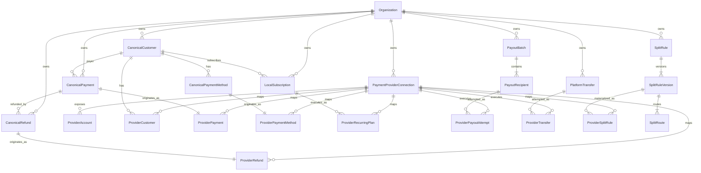

# Spec: Provider Domain

> Module ID: `provider-domain`  
> Initiative map: `docs/spec/payment-platform-capability-map.md`  
> Workflow: Addy Osmani `spec-driven-development` — Phase 1 Specify  
> Status: **IMPLEMENTED — FINAL VERIFICATION GATE**
>
> Date: 2026-09-03 (+07:00)
>
> Evidence: `docs/spec/provider-domain-verification-matrix.md`; ADR: `docs/adr/0027-provider-neutral-domain-persistence.md`

## Assumptions

1. PostgreSQL remains the production database and Prisma remains the application ORM.
2. Existing Better Auth tables remain the identity source; this module does not redesign authentication.
3. Organization and membership behavior is specified later by `organization-access`, but canonical records reserve organization ownership now.
4. Xendit and Stripe are the first providers; provider identity is extensible without adding a database enum migration for every future provider.
5. One organization may have multiple provider connections separated by provider and TEST/LIVE mode.
6. A canonical resource has one originating provider resource for its lifecycle; aggregations may combine providers but mutations never switch provider.
7. Financial amounts use exact database decimals plus ISO currency; JavaScript floating-point values are not the persistence authority.
8. Provider-specific payloads are not canonical truth and are not stored wholesale in ordinary JSON columns.
9. This specification defines entities, invariants and interfaces only. Connection lifecycle, encryption, RBAC, MFA and operations are owned by downstream modules.

## Objective

Create a provider-neutral canonical domain model that allows Xendit, Stripe and future payment providers to coexist without:

- coupling pages and application services to provider SDK models;
- pretending different providers have identical semantics;
- losing the originating provider of an existing payment/refund/payout;
- colliding provider resource IDs;
- mixing TEST, LIVE and MOCK data;
- using untyped JSON as the financial source of truth;
- duplicating local and provider-owned identities.

### Primary users

- merchant operators viewing and managing financial resources;
- finance/compliance users performing controlled operations;
- developers adding or maintaining provider adapters;
- support/audit users tracing a canonical resource to its provider resource.

### Success outcome

Every canonical financial resource can answer:

1. Which organization owns it?
2. Which provider connection and environment originated it?
3. What provider resource ID/reference maps to it?
4. What canonical status and amount/currency does the app guarantee?
5. What provider-specific status was last observed?
6. When and how was it synchronized?
7. Which follow-up adapter must handle refund/cancel/detail operations?

## Tech Stack

- Next.js 15 App Router
- TypeScript
- PostgreSQL
- Prisma 6
- Zod 4 at external and application boundaries
- Better Auth identity tables (existing; referenced later)
- Vitest for domain/schema tests
- Playwright for later cross-provider E2E flows
- `xendit-node@7.0.0` behind `xendit-adapter`
- Stripe SDK version to be selected and pinned by `stripe-adapter`

## Commands

Commands are verification targets for the eventual implementation phase; they are not run as implementation work during this specification gate.

```bash
# Install exactly from the lockfile
corepack pnpm install --frozen-lockfile

# Generate/check Prisma client after an approved schema change
corepack pnpm --dir apps/web prisma generate

# Validate Prisma schema
corepack pnpm --dir apps/web prisma validate

# Unit/integration tests
corepack pnpm --dir apps/web test

# Type and lint gates
corepack pnpm --dir apps/web typecheck
corepack pnpm --dir apps/web lint

# Build gate
corepack pnpm --dir apps/web build

# SDK boundary check
 grep -R 'from "xendit-node"\|from "stripe"' apps/web/src \
   --include="*.ts" --include="*.tsx"
```

Provider SDK imports must match their approved wrapper boundaries after Stripe is introduced.

## Project Structure

Expected target organization after downstream plans are approved:

```text
apps/web/
  prisma/
    schema.prisma                    # relational persistence model
    migrations/                     # reviewed forward migrations
  src/
    domain/payments/
      provider.ts                    # provider/mode/source value objects
      money.ts                       # exact money DTO and validation
      ids.ts                         # canonical/provider identifiers
      statuses.ts                    # canonical status vocabularies
      contracts.ts                   # canonical resource interfaces
    server/
      repositories/                  # provider-neutral persistence interfaces
      dal/providers/                 # provider connection/resource mapping DAL
      services/                      # later application orchestration
    lib/
      xendit.ts                      # existing Xendit SDK boundary
      stripe.ts                      # future Stripe SDK boundary
  e2e/                               # later multi-provider behavior

docs/spec/
  payment-platform-capability-map.md
  SPEC-provider-domain.md
```

Final paths are selected during Plan. This specification owns contracts and invariants, not exact file count.

## Domain Language

### Provider

An external payment system, initially `xendit` or `stripe`. Stored as a validated lowercase string to permit future providers without changing a database enum. Unsupported values are rejected by the active provider registry.

### Provider connection

An organization's configured relationship to one provider in one mode. Connection lifecycle and credentials belong to `provider-connections` and `provider-secrets`; this module defines only the identity referenced by resources.

### Canonical resource

An app-owned representation of business facts shared across providers, such as customer, payment, refund, payout batch or subscription.

### Provider resource mapping

The immutable association between a canonical resource and an external provider resource ID within a provider connection.

### Projection

The latest validated canonical view derived from provider reads/webhooks. A projection records freshness and provider status but is not a raw payload dump.

### Operation

An intended external write with idempotency/recovery state. Defined in `durable-operations`, referenced here but not implemented by this module.

## Canonical ERD



`Organization` is shown as a required owner but its membership schema is finalized by `organization-access`.

## Entity Specifications

### 1. PaymentProviderConnection

Identity fields reserved by this module:

```text
id                    cuid/uuid primary key
organization_id       required foreign key
provider              validated lowercase string
mode                  TEST | LIVE
status                owned by provider-connections
provider_account_id   nullable external account identifier
created_at
updated_at
```

Invariants:

- resources always reference a connection, not only a provider string;
- TEST and LIVE connections are distinct;
- active-connection uniqueness policy belongs to `provider-connections`;
- credentials are never columns on this canonical identity.

### 2. ProviderAccount

Maps organization/sub-merchant scope to an external account.

```text
id
connection_id
organization_id
local_account_subject_id   nullable until connected-accounts defines subject
provider_account_id
provider_account_type
canonical_status
provider_status
capabilities_summary
last_synced_at
created_at
updated_at
```

Unique identity:

```text
UNIQUE(connection_id, provider_account_id)
```

Provider account IDs are never accepted as authorization proof.

### 3. CanonicalCustomer and ProviderCustomer

```text
CanonicalCustomer
- id
- organization_id
- merchant_reference
- display_name
- email_normalized nullable
- app_status
- created_at / updated_at

ProviderCustomer
- id
- canonical_customer_id
- connection_id
- provider_customer_id
- provider_reference
- provider_status nullable
- last_synced_at
- created_at / updated_at
```

Constraints:

- `UNIQUE(organization_id, merchant_reference)`;
- `UNIQUE(connection_id, provider_customer_id)`;
- email is PII/contact data, not provider identity;
- one canonical customer may have mappings to both Stripe and Xendit;
- provider customer records are not merged solely by equal email.

### 4. CanonicalPayment and ProviderPayment

```text
CanonicalPayment
- id
- organization_id
- customer_id nullable
- merchant_reference
- amount decimal
- currency
- canonical_status
- payment_kind
- created_at / updated_at

ProviderPayment
- id
- canonical_payment_id UNIQUE
- connection_id
- provider_payment_id
- provider_product_id nullable
- provider_reference
- provider_status
- channel_category nullable
- channel_code nullable
- cashflow nullable
- settlement_status nullable
- fee_amount decimal nullable
- net_amount decimal nullable
- occurred_at
- provider_updated_at
- last_synced_at
```

Constraints:

- `UNIQUE(organization_id, merchant_reference)`;
- `UNIQUE(connection_id, provider_payment_id)`;
- one payment has one originating provider mapping;
- provider switching never changes that mapping;
- amount/currency are immutable after creation except through explicit correction policy;
- fee/net may remain nullable when provider semantics are not proven;
- unknown provider status never maps to canonical success.

### 5. CanonicalRefund and ProviderRefund

```text
CanonicalRefund
- id
- organization_id
- payment_id
- merchant_reference
- amount decimal
- currency
- reason_code nullable
- canonical_status
- created_at / updated_at

ProviderRefund
- id
- canonical_refund_id UNIQUE
- connection_id
- provider_refund_id
- provider_reference
- provider_status
- failure_code nullable
- provider_updated_at
- last_synced_at
```

Constraints:

- refund connection/provider must match the original payment;
- cumulative confirmed plus reserved/in-flight refunds cannot exceed the payment's approved refundable amount;
- database transaction/locking mechanics belong to `refunds` and `durable-operations`;
- `UNIQUE(connection_id, provider_refund_id)`.

### 6. CanonicalPaymentMethod and ProviderPaymentMethod

```text
CanonicalPaymentMethod
- id
- organization_id
- customer_id
- display_type
- display_label nullable
- canonical_status
- reusability nullable
- created_at / updated_at

ProviderPaymentMethod
- id
- canonical_payment_method_id UNIQUE
- connection_id
- provider_payment_method_id
- provider_customer_id nullable
- provider_status
- provider_type
- channel_code nullable
- masked_details_json
- provider_updated_at
- last_synced_at
```

Rules:

- masked details use a strict schema, not arbitrary raw provider payload;
- PAN, CVV, OTP and reusable authentication secrets are forbidden;
- provider/customer mapping consistency is validated;
- payment method stays attached to its originating provider.

### 7. LocalSubscription and ProviderRecurringPlan

```text
LocalSubscription
- id
- organization_id
- customer_id
- merchant_reference
- plan_key
- entitlement_status
- commercial_status
- amount decimal
- currency
- interval_definition
- started_at
- cancelled_at nullable
- created_at / updated_at

ProviderRecurringPlan
- id
- local_subscription_id
- connection_id
- provider_plan_id
- provider_reference
- provider_status
- schedule_summary
- version
- effective_from
- effective_to nullable
- provider_updated_at
- last_synced_at
```

Rules:

- local entitlement and provider execution status are distinct;
- provider plan replacement creates a new version/mapping rather than overwriting history;
- `UNIQUE(connection_id, provider_plan_id)`;
- one active provider plan per local subscription under an approved policy;
- a payment method reference must point to the same provider connection.

### 8. PayoutBatch, PayoutRecipient and ProviderPayoutAttempt

```text
PayoutBatch
- id
- organization_id
- merchant_reference
- name
- currency
- canonical_status
- scheduled_for nullable
- version
- created_at / updated_at

PayoutRecipient
- id
- batch_id
- recipient_reference
- name
- destination_ref
- amount decimal
- currency
- canonical_status
- created_at / updated_at

ProviderPayoutAttempt
- id
- recipient_id
- connection_id
- attempt_number
- provider_payout_id nullable
- provider_reference
- provider_status
- failure_code nullable
- estimated_arrival_at nullable
- last_synced_at
- created_at / updated_at
```

Rules:

- batch and recipients are app-owned;
- one recipient can have multiple attempts, but only one current attempt;
- one attempt belongs to one provider connection;
- attempt history is immutable except status projection fields;
- account destination secrets are not part of this general ERD and require encrypted storage design;
- idempotency fields belong to `durable-operations` but reference attempt ID;
- unique `(recipient_id, attempt_number)` and `(connection_id, provider_payout_id)` when non-null.

### 9. PlatformTransfer and ProviderTransfer

```text
PlatformTransfer
- id
- organization_id
- merchant_reference
- source_provider_account_id
- destination_provider_account_id
- amount decimal
- currency
- canonical_status
- created_at / updated_at

ProviderTransfer
- id
- platform_transfer_id
- connection_id
- attempt_number
- provider_transfer_id nullable
- provider_reference
- provider_status
- last_synced_at
- created_at / updated_at
```

Rules:

- source and destination must belong to a compatible provider/account topology;
- a transfer cannot silently cross providers;
- cross-provider movement requires two explicit operations through external settlement rails and is outside this entity;
- every live transfer is dual-controlled by downstream policy.

### 10. SplitRule, SplitRuleVersion, SplitRoute and ProviderSplitRule

```text
SplitRule
- id
- organization_id
- rule_key
- name
- lifecycle_status
- created_at / updated_at

SplitRuleVersion
- id
- split_rule_id
- version
- effective_from nullable
- retired_at nullable
- approval_status
- created_at

SplitRoute
- id
- split_rule_version_id
- route_reference
- destination_provider_account_id
- allocation_type (FLAT | PERCENT)
- flat_amount decimal nullable
- percent_amount decimal nullable
- currency

ProviderSplitRule
- id
- split_rule_version_id
- connection_id
- provider_split_rule_id
- provider_status
- last_synced_at
```

Rules:

- approved versions are immutable;
- exactly one of flat or percent is populated;
- route references are unique within a version;
- destination belongs to the same compatible provider context;
- provider materialization maps a specific immutable version;
- browser-supplied provider split IDs are never trusted.

## Cross-Cutting Value Objects

### Provider identity

```ts
type ProviderKey = string & { readonly __brand: "ProviderKey" };
type ProviderMode = "TEST" | "LIVE";
type DataSource = "MOCK" | "APP" | "PROVIDER";

type ProviderResourceRef = {
  connectionId: string;
  provider: ProviderKey;
  mode: ProviderMode;
  resourceType: string;
  resourceId: string;
};
```

### Money

Application boundary representation:

```ts
type Money = {
  amount: string;   // canonical decimal string, e.g. "10000.00"
  currency: string; // validated ISO-4217 code
};
```

Persistence uses `Decimal` with precision selected during Plan after supported currency/amount analysis. UI formatting converts only at presentation boundaries. Arithmetic uses decimal-safe operations.

### Sync metadata

```ts
type SyncState = {
  providerStatus: string;
  lastSyncedAt: string;
  staleAfter: string | null;
  source: "PROVIDER";
};
```

Raw payload storage is not part of canonical resources. If encrypted evidence payload retention is required, `webhook-ingress` defines a separate restricted store and retention policy.

## Canonical Status Principles

Each resource type owns a narrow canonical vocabulary during its module specification. This module establishes universal rules:

1. Provider status is retained separately from canonical status.
2. Unknown provider status maps to `UNKNOWN` or non-success safe state.
3. Terminal success is never inferred from HTTP success alone.
4. Status transitions are monotonic unless a resource explicitly supports reversal.
5. Reversal/cancellation/refund are distinct semantics.
6. Provider projectors cannot overwrite app-owned commercial/entitlement states.
7. Canonical status mappings are versioned/tested per adapter.

## Provider Ownership and Routing Rules

1. New resources select a provider using an approved organization capability/default policy.
2. Selection is persisted before the external write.
3. Existing resource detail, refund, cancel, retry/recovery and reconciliation use the persisted connection.
4. Disconnected/degraded connections remain referenced for history and recovery.
5. Provider connection deletion is prohibited while referenced; use lifecycle status instead.
6. IDs are unique only within `(connection_id, resource_type, provider_resource_id)` unless provider guarantees a broader namespace.
7. Cross-provider reports aggregate canonical projections while retaining provider dimensions.
8. Mock resources use explicit mock identity and cannot be mutated through live adapters.

## Repository Interfaces

Provider-neutral repository interfaces should expose intent, not ORM models:

```ts
interface PaymentRepository {
  findByIdForOrganization(organizationId: string, paymentId: string): Promise<CanonicalPayment | null>;
  findByProviderRef(ref: ProviderResourceRef): Promise<CanonicalPayment | null>;
  createPending(input: CreateCanonicalPayment): Promise<CanonicalPayment>;
  applyProjection(input: PaymentProjection, expectedVersion: number): Promise<CanonicalPayment>;
}
```

Rules:

- organization scope is required in every resource lookup;
- no generic unscoped `findById` in application services;
- optimistic version/check is required for projector updates;
- adapters return normalized DTOs and do not receive Prisma models;
- repository interfaces do not expose raw provider JSON.

## Code Style

A representative target style:

```ts
import { z } from "zod";

const ProviderResourceRefSchema = z.object({
  connectionId: z.string().min(1),
  provider: z.string().regex(/^[a-z][a-z0-9-]*$/),
  mode: z.enum(["TEST", "LIVE"]),
  resourceType: z.string().min(1),
  resourceId: z.string().min(1),
});

export type ProviderResourceRef = z.infer<typeof ProviderResourceRefSchema>;

export function parseProviderResourceRef(value: unknown): ProviderResourceRef {
  return ProviderResourceRefSchema.parse(value);
}
```

Conventions:

- domain terms are explicit; avoid generic `data`, `item`, `record` names at boundaries;
- schemas and types use the same vocabulary;
- provider names are lowercase keys; persisted lifecycle/status values are uppercase;
- Dates cross boundaries as ISO strings and persist as timestamps;
- money crosses boundaries as decimal strings and persists as Decimal;
- nullable means semantically absent/unknown; avoid magic empty strings;
- comments explain invariants and provider mismatch, not obvious syntax.

## Testing Strategy

### Domain unit tests

- provider key/mode/source validation;
- money and ISO currency validation;
- provider/canonical status separation;
- resource ownership/routing selection;
- unknown provider status safe handling;
- no cross-provider follow-up mutation;
- mock/test/live separation.

### Schema/repository integration tests

Use an isolated PostgreSQL test database when schema implementation begins:

- all uniqueness constraints;
- organization-scoped lookups;
- connection/resource referential integrity;
- provider connection cannot be deleted while referenced;
- payment/refund provider consistency;
- payment-method/customer/provider consistency;
- payout attempt numbering and uniqueness;
- immutable split-rule versions;
- decimal precision and currency handling;
- optimistic concurrency on projections.

### Contract tests

Each provider adapter must pass the same canonical contract suite plus provider-specific cases. Contract parity means consistent application semantics, not identical provider features.

### Property/invariant tests

High-value candidates:

- refund reservations never exceed refundable amount;
- allocations cannot violate split constraints;
- resource provider ownership never changes;
- only one current payout attempt per recipient;
- unknown statuses never become success;
- canonical amount round-trips without floating-point loss.

### E2E tests

Deferred to `provider-dashboard` and payment modules. This module provides fixtures/builders only after Plan approval.

## Boundaries

### Always do

- Scope canonical resources by organization.
- Store originating provider connection on every provider-backed resource.
- Validate provider IDs/statuses at boundaries.
- Use exact decimal persistence.
- Keep provider and canonical status separate.
- Preserve unknown values safely.
- Enforce invariants with database constraints where possible.
- Retain provider identity when aggregating.

### Ask first

- Add/change canonical entities or ownership.
- Store any raw provider payload.
- Change money precision.
- Permit multiple active provider mappings for a single resource.
- Permit cross-provider migration of an existing resource.
- Add polymorphic database associations without foreign keys.
- Add database enums that impede provider extensibility.

### Never do

- Store provider secrets in canonical tables.
- Use email as provider customer identity.
- Use provider resource ID without connection/provider scope.
- Merge TEST and LIVE resources.
- Use JavaScript float as financial persistence authority.
- Route follow-up operations using the organization's current default instead of resource origin.
- Treat unknown provider status as success.
- Store PAN, CVV, OTP or full reusable credentials.
- Make raw provider JSON the source of truth.

## Migration and Compatibility Constraints

Detailed migration belongs to Plan, but the specification requires:

1. Existing mock stores remain usable during incremental migration.
2. Mock seed IDs cannot collide with provider resource mappings.
3. Existing `LedgerEntry` is not silently redefined as the complete canonical payment model; migration/backfill requires an explicit mapping decision.
4. Existing Better Auth `User.role` cannot be treated as organization RBAC; `organization-access` owns replacement/migration.
5. New required foreign keys are introduced with staged nullable/backfill/enforce steps where existing data requires it.
6. Rollback never deletes provider identity or financial history.

## Success Criteria

- [ ] ERD entities and relationships are approved.
- [ ] Every provider-backed resource references a provider connection.
- [ ] Canonical and provider statuses are stored separately.
- [ ] TEST/LIVE/MOCK cannot be confused.
- [ ] Customer IDs distinguish app, merchant reference and provider IDs.
- [ ] Payment/refund provider consistency is enforceable.
- [ ] Batch/recipient/attempt payout mismatch is resolved.
- [ ] Local subscription and provider recurring plan are separate.
- [ ] Split rules are immutable/versioned locally.
- [ ] Platform transfers cannot silently cross providers.
- [ ] Money precision strategy avoids JavaScript floating-point persistence.
- [ ] Organization-scoped repository interfaces prevent unscoped lookup.
- [ ] Provider SDK models/raw payloads do not leak into canonical contracts.
- [ ] Schema invariants have identified unit/integration/property tests.
- [ ] Downstream modules can extend lifecycle/security without changing canonical ownership.

## Open Questions Requiring Human Decision

1. **Provider connections:** allow one active connection per organization/provider/mode, or multiple named connections for enterprise organizations? Recommendation: support multiple records but only one default per capability/account context.
2. **Canonical payment mapping:** enforce exactly one ProviderPayment per CanonicalPayment, or support a parent order with multiple payment attempts? Recommendation: introduce a separate app order/payment-intent concept later; one canonical payment represents one provider payment.
3. **Money precision:** support only IDR/USD initially or design Decimal precision for all Xendit/Stripe currencies now? Recommendation: design broadly now, capability manifests restrict launch currencies.
4. **Raw evidence retention:** retain encrypted webhook payloads for a short period, or store only redacted normalized payloads? Recommendation: encrypted restricted payload with short configurable retention plus long-lived normalized audit.
5. **Provider account hierarchy:** should master/platform account be represented as `ProviderAccount` alongside sub-accounts? Recommendation: yes, with explicit account type and no implicit global singleton.
6. **Customer unification:** may operators manually link two provider customers to one canonical customer? Recommendation: yes, through an audited merge/link workflow; never automatic by email.
7. **Resource deletion:** recommendation is soft lifecycle/retention only for financial/provider mappings. Confirm no hard delete from normal product workflows.

## Review Gate

Per Addy Osmani's workflow, human approval of this specification is required before Phase 2 Plan for `provider-domain`. No Prisma schema, migration, application code, task list or implementation plan has been created by this step.
